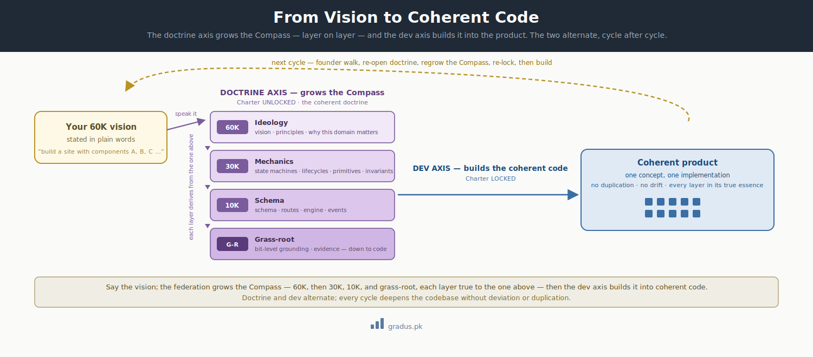

# Codebase Coherence

> *One canonical way to do each thing — enforced against the doctrine, not left to each agent's discretion. The codebase stays uniform as it grows, across sessions and across teams.*

**This is CompassAlpha's flagship — AI-powered code coherence.** Everything else in the framework exists to make it possible: a codebase that stays coherent as it grows, because an AI-agent federation builds every layer against one doctrine.

New here? This page explains how CompassAlpha keeps a codebase tidy and consistent when many AI agents (and many people) are all editing it — so the same job always gets done the same way, instead of everyone inventing their own version.

## TL;DR

In plain terms: when lots of contributors touch one codebase, they tend to solve the same problem in slightly different ways, and the code slowly turns into a mess. CompassAlpha stops that by making "the one right way to do each thing" an enforced rule, not a polite suggestion.

The hard problem in multi-agent (and multi-team) software work is not writing code — it is keeping a *growing* codebase **coherent**: one canonical way to do each thing, used everywhere, instead of N near-duplicate, subtly-divergent ways. CompassAlpha treats coherence as a **first-class, enforced property**, not a hope. The doctrine layer — the [Charter](constitution.md), its [Invariants](glossary.md#invariants), [Primitives](glossary.md#primitives), and per-component [Compasses](glossary.md#compass) — is the single source of truth; the federation reasons and builds **against** it, and the [provenance law](../01-axioms/provenance-law.md) forbids acting on memory instead of substrate. Doctrine → coherent code.

<small>*The single source of truth in practice: one canonical definition per concept, called by every component (left) — instead of divergent, duplicated copies that drift apart (right).*</small>

## Why this is a distinction

Hand several capable agents — or several teams — the same growing codebase with **no shared source of truth**, and each will, in good faith, solve the same problem its own way. Within weeks you have three charge functions, two date helpers, four subtly different auth checks — each correct in isolation, collectively a maintenance swamp. The agents' intelligence does not prevent this; nothing was telling them what the *one* canonical way is.

CompassAlpha's distinction is that **it does tell them — structurally, on disk, every time — and refuses to let them guess.** Coherence stops being a code-review afterthought and becomes a property the doctrine provisions up front.

## The coherence surface (what the doctrine provisions)

For any shared concept, the doctrine provisions — and the federation enforces — the *whole* surface, not just "what to build":

| The coherence question | Where the answer is provisioned |
|---|---|
| **Which canonical routine / primitive** must be used for this concept? | a [Primitive](glossary.md#primitives) — the one blessed definition, reused, never re-implemented |
| **Where and when** it is used (and where it must *not* be) | the relevant [Compass](glossary.md#compass) (30K mechanics · 10K schema/routes) |
| **What arguments** it accepts — the contract | the Primitive's signature, fixed in doctrine |
| **What caller-side sanitization** is required before the call | the Primitive's contract + the applicable [Invariants](glossary.md#invariants) |
| **What must never vary** anywhere in the codebase | the [Invariants](glossary.md#invariants) — the non-negotiables |

The outcome: **one canonical way per concept — no duplicated implementations, no vague "close enough" calls to the same idea.** Uniformity by construction.

## From a 60K vision to bit-level — how a Compass is grown

This is the part you can demo. (Throughout, "60K", "30K", "10K" and "grass-root" are altitudes — think of zooming in from a high-level view of the whole product down to the individual lines of code.) You supply the **60K ideology in plain words** — the vision, the principles, why the domain matters — and the federation **elaborates it downward**, one altitude at a time, each layer bound to the one above:

- **60K — Ideology** — your stated vision: principles, named theses, why this domain matters.
- **30K — Mechanics** — state machines, lifecycles, primitives, and invariants, derived from the ideology.
- **10K — Schema, routes, engine, events** — the concrete implementation surface.
- **Grass-root** — bit-level grounding and evidence, all the way down to code.

Both axes are run by the **AI tier-federation** (Mentor-1 · Mentor-2 · Doer), alternating cycle after cycle (the [charter posture](constitution.md) switch): the **doctrine axis** grows the Compass — turning the vision into the layered, coherent doctrine — and the **dev axis** then builds that Compass into **coherent code**, the product. At every step the AI builds against the one doctrine, so **coherence is enforced, not hoped for** — which is exactly the case for letting an AI federation do the work. Doctrine and dev are the two default axes, but the same coherence core anchors **any further axis you declare** (ops, QA, audit, and beyond) — the model is not limited to two.

Because every altitude derives from the single doctrine, the same concept is rendered **once, in its true essence, at every layer** — no gap between what was envisioned and what was built, and no duplicated implementations of the same idea. *Say the vision; get a coherent codebase grown from it.*

## How CompassAlpha enforces it

1. **Doctrine is the single source of truth.** One [Charter](constitution.md#the-doctrine-substrate-charter-compasses-and-axis-annexes); Primitives are the canonical contracts; Compasses localize each component's design *under* that Charter. There is exactly one place each concept is defined.
2. **The Doer builds against doctrine, not memory.** The [provenance law](../01-axioms/provenance-law.md) requires every load-bearing claim to cite substrate. An agent cannot quietly invent a second way, because it must point at the one definition on disk before acting.
3. **Primitives lock the definition; Compasses localize use.** A genuinely new shared concept is *lifted* into a Primitive (see [LIFT-WATCH](glossary.md#lift-watch)) so every component reuses it — rather than each component growing its own copy.
4. **Toolings and audit mechanize the check.** [Toolings and specialised agents](../03-tunables/invariants-toolings-agents.md) automate conformance — flagging a call that bypasses the canonical routine or a sanitization that's missing — so drift is caught, not discovered later.

## Why it compounds across teams

When many human teams build under the **one** Charter (see [the doctrine substrate](constitution.md#the-doctrine-substrate-charter-compasses-and-axis-annexes)), coherence is exactly what keeps their segments from diverging. Every team reuses the same Primitives; a cross-cutting change flows through a charter-level bump, never an ad-hoc per-team reinvention. Physical federation without enforced coherence is just distributed drift — the coherence layer is what makes the distribution safe.

## Coherence over time

Coherence is not only a point-in-time property; it has to survive the codebase's evolution. New requirements, new modules, and new rules enter through the **doctrine cycle** rather than ad hoc, so that today's canonical way stays canonical tomorrow. *(A formal intake pipeline for keeping doctrine and code coherent as both grow is on the [roadmap](../08-community/roadmap.md).)*

## How this connects

- **[Primitives](glossary.md#primitives) & [Invariants](glossary.md#invariants)** — the canonical definitions and the non-negotiables coherence is built on.
- **[Provenance law](../01-axioms/provenance-law.md)** — cite-by-substrate; the mechanism that forbids reinventing a concept from memory.
- **[The doctrine substrate](constitution.md#the-doctrine-substrate-charter-compasses-and-axis-annexes)** — one Charter, Compasses, axis annexes; the single-source-of-truth shape.
- **[Invariants, toolings & specialised agents](../03-tunables/invariants-toolings-agents.md)** — the mechanized conformance checks.

## Remember this

- **Coherence means: one right way to do each thing, used everywhere** — not many near-duplicate versions that slowly drift apart.
- **The doctrine on disk is the single source of truth.** Agents must build against it and cite it, so they can't quietly invent a second way of doing the same thing.
- **Say the vision in plain words; get a coherent codebase grown from it** — the AI federation fills in every layer down to the code, all bound to that one vision.
- New to the bigger picture? Start with [the mental model](mental-model.md) to see where coherence fits among CompassAlpha's core ideas.

---

## Next: [GitAI category →](gitai-category.md)
