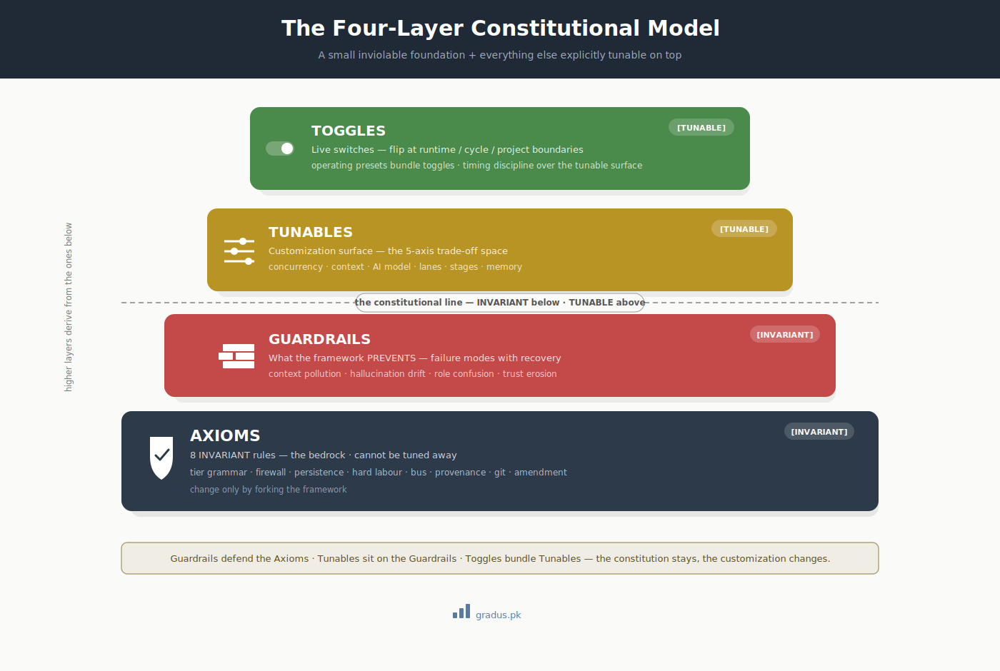
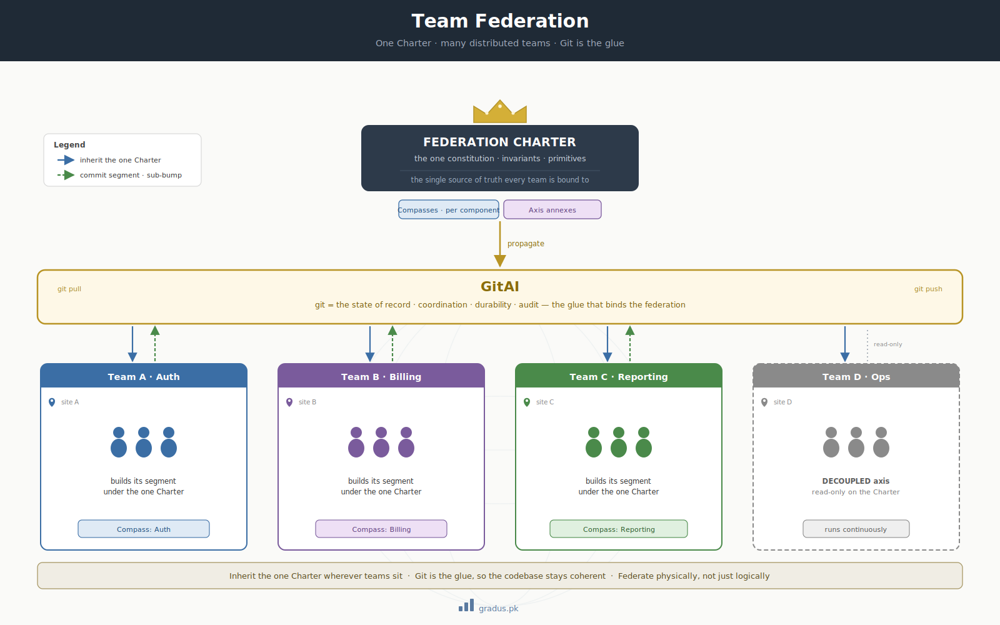
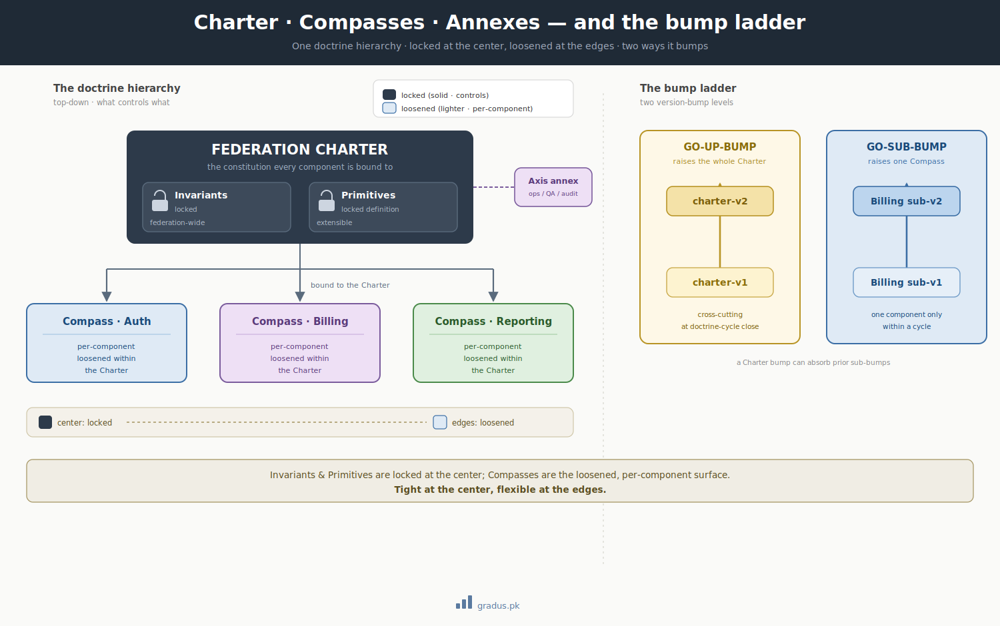

# The Constitution

> *Provisioned as a constitution: a small inviolable foundation + everything else explicitly tunable on top.*

CompassAlpha is structured constitutionally — like a written constitution for a polity. There's a small set of **inviolable principles** (axioms), a set of **protective rules** (guardrails), and then a wide surface of **decisions you make for your specific project** (tunables and toggles).

## The four-layer constitutional model

[](../assets/four-layer-model.svg)

**Higher layers DERIVE from lower layers.** Toggles bundle tunables. Tunables operate on top of guardrails. Guardrails defend the axioms. The axioms are the bedrock.

When you adopt CompassAlpha, you accept the axioms unchanged, you accept the guardrails as protection, and you make decisions on tunables + toggles for your specific project.

---

## Layer 1: The 7 Axioms (INVARIANT)

These rules **cannot be modified** without forking the framework. They define what CompassAlpha **is**.

| # | Axiom | One-line essence | Detail |
|---|---|---|---|
| 1 | **Tier grammar** | Mentor-1 / Mentor-2 / Doer per axis | [→](../01-axioms/tier-grammar.md) |
| 2 | **Firewall** | Confined, not banished. Mentors track only their granularity. | [→](../01-axioms/firewall.md) |
| 3 | **Persistence law** | Flush before disclose. State on disk + at origin BEFORE discussed. | [→](../01-axioms/persistence-law.md) |
| 4 | **Hard labour rule** | Mentors never touch substrate. Doer is the only labour tier. | [→](../01-axioms/hard-labour-rule.md) |
| 5 | **Bus protocol** | Inbox-in-destination-folder. Sender writes, founder pings, recipient pulls. | [→](../01-axioms/bus-protocol.md) |
| 6 | **Provenance law** | Cite by substrate. Never trust institutional memory unverified. | [→](../01-axioms/provenance-law.md) |
| 7 | **Git foundations** | `GIT_INDEX_FILE` + worktree + `commit-tree` per session. | [→](../01-axioms/git-foundations.md) |

Each axiom defends against one or more of the [four pathologies](framework-not-tool.md). If you try to weaken any axiom, you'll re-introduce the pathology it was preventing.

!!! warning "What 'invariant' means in practice"
    If you find yourself wanting to violate an axiom for short-term gain, **stop**. The axiom exists because that shortcut has been tried before and the consequence was costly. The framework's value is exactly in these constraints. If your project genuinely needs to violate an axiom, you're using the wrong framework — fork it or adopt a different one.

---

## Layer 2: Guardrails (PROTECTIVE)

These are the **failure modes the framework defends against**, with documented recovery patterns when failures occur anyway.

| Guardrail | Defends against | Detail |
|---|---|---|
| **Pollution containment** | Context bleed across tiers | [→](../02-guardrails/pollution-containment.md) |
| **Hallucination defense** | AI institutional-memory false-positives | [→](../02-guardrails/hallucination-defense.md) |
| **Stale snapshot detection** | Firewall leak (snapshot ≈ live) | [→](../02-guardrails/stale-snapshot-detection.md) |
| **Failure modes catalog** | 5 known classes + recovery | [→](../02-guardrails/failure-modes.md) |
| **Brief completeness** | Improvisation by Doers on incomplete briefs | [→](../02-guardrails/brief-completeness.md) |
| **Single-live-writer** | Cross-session clobber on shared state | [→](../02-guardrails/single-live-writer.md) |

Guardrails are NOT independent of axioms — they DERIVE from axioms. The single-live-writer guardrail derives from the firewall axiom. Stale snapshot detection derives from the firewall + persistence axioms.

---

## Layer 3: Tunables (CONFIGURABLE)

The customization surface. **Every tunable has a default, a range, and a documented trade-off.**

The five primary axes in tension (no combination optimizes all):

- ⏱ **SPEED** — wall-clock to deliverable
- 🧠 **INTELLIGENCE** — depth, correctness, coverage
- 💰 **COST** — tokens + founder cognitive load + maintenance
- ⚠ **RISK** — pollution, hallucination, drift, replay
- 📐 **PREDICTABILITY** — cycle/scope estimability

A conservative profile biases toward **intelligence + low-risk** (LAYGO concurrency, pure RELAY, fresh-per-slice, xhigh effort, strict provenance). Other project profiles want other bias points.

Tunable categories:

- [Axis declarations](../03-tunables/axis-declarations.md) — declaring your own axes
- [Concurrency modes](../03-tunables/concurrency-modes.md) — LAYGO / Pipelined / Parallel-independent / Parallel-doer
- [Context patterns](../03-tunables/context-patterns.md) — mentor lifecycle, doer scope, memory rate, verbosity
- [AI model choices](../03-tunables/ai-model-choices.md) — per-tier model selection
- [Work granularity lanes](../03-tunables/work-granularity-lanes.md) — 4 lanes (Doctrine / Phase 3 / Polish / Surgical)
- [Stage taxonomies](../03-tunables/stage-taxonomies.md) — per-axis lifecycle stages
- [Invariants + Toolings + Agents](../03-tunables/invariants-toolings-agents.md) — enrichment surfaces
- [Memory policy](../03-tunables/memory-policy.md) — inheritance + retention
- [Full parameter matrix](../03-tunables/full-parameter-matrix.md) — every tunable in one place

---

## Layer 4: Toggles (LIVE)

Toggles are tunables seen from the **timing** perspective: when can each one flip?

- **Runtime toggles** — flip mid-cycle (rare; usually escalation-class) → [→](../04-toggles/runtime-toggles.md)
- **Cycle toggles** — flip at cycle boundaries → [→](../04-toggles/cycle-toggles.md)
- **Project-lifecycle toggles** — flip only at project-wide seams → [→](../04-toggles/project-lifecycle-toggles.md)
- **Operating presets** — named bundles of toggles (Conservative · Throughput · Risk-averse · ...) → [→](../04-toggles/operating-presets.md)

---

## How the layers compose

A worked example: a conservative profile biased toward intelligence + low-risk.

```
LAYER 1 (axioms):     all 7 axioms in force (always — invariant)
LAYER 2 (guardrails): all 6 guardrails active (always — derived from axioms)
LAYER 3 (tunables):
                      concurrency = LAYGO
                      context_patterns = {fresh-per-slice doer, verbose digests, liberal memory}
                      ai_model = top-tier all tiers
                      lanes_enabled = {Doctrine Cycle, Phase 3, Polish, Surgical}
                      ...
LAYER 4 (toggles):    operating_preset = Conservative
                      (this bundles the LAYER 3 settings above)
                      rotation_cadence = "2-4 weeks preventive"
                      ...
```

Same axioms, same guardrails. Different project = different tunables + toggles. The constitution stays; the customization changes.

---

## The doctrine substrate: Charter, Compasses, and Axis annexes

[](../assets/team-federation.svg)

<small>*Team federation: a single Charter at the top, inherited by distributed teams **wherever they sit**, with **Git as the glue** that binds them into one coherent codebase — the essence of GitAI. Click to open full size.*</small>

The four layers above describe the **framework**. A specific federation's **doctrine** — the living constitution it actually governs by — is organized as a single hierarchy with **one source of truth**:

- **One federation Charter.** Each federation has exactly **one Charter** — its constitution. It is not split per team or per component; that single document is what every tier and every human cohort is bound to.
- **Components are Compasses.** Each component of the project gets its own **Compass** (the 60K/30K/10K deliverable, plus any variants) *under* the one Charter. "A charter per component" means, in practice, a per-component **Compass governed by the single Charter** — not a separate constitution per component.
- **Axes are annexes.** Each declared [axis](../03-tunables/axis-declarations.md) — build, doctrine, and any `DECOUPLED` Day-2 axis (ops, QA, audit) — registers as an **annex** under the same Charter: its declaration plus any axis-specific invariants and primitives. An axis never gets a competing charter.

This single-source-of-truth shape is what makes cross-team **codebase coherence** possible: one canonical place defines each concept, so there is no room for divergent or duplicated implementations of the same thing. It is also what lets a federation scale *physically* across many human teams (cohorts) without the codebase drifting — every team builds its segment under the one Charter.

### What each doctrine artifact controls — and loosens

The three named artifacts under the Charter each sit at a deliberate altitude, and each declares **what it locks down** versus **what it leaves open**:

| Artifact | Where it sits | Controls (locks down) | Loosens (leaves open) | Why it's there |
|---|---|---|---|---|
| **Invariants** | Charter · federation-wide | the rules that must hold everywhere, always — the non-negotiables | nothing — invariants are not tunable | define what can never break across the whole federation; the bedrock of coherence |
| **Primitives** | Charter · shared contracts | the one canonical definition of each shared concept (types, operations, vocabulary) every component reuses | a component's internal *use* of a primitive; new primitives may be proposed | prevent divergent re-implementations of the same concept — the mechanism of cross-team coherence |
| **Compass** | under the Charter · one per component | a single component's own doctrine (60K ideology · 30K mechanics · 10K schema) | per-component design latitude *within* the Charter | localize component-specific doctrine while staying bound to the one Charter |

This is the constitutional spirit applied to the doctrine itself: **Invariants are maximally controlled, Primitives lock the shared contracts yet stay extensible, and Compasses are the loosened, per-component surface** — tight at the center, flexible at the edges.

[](../assets/charter-bump-ladder.svg)

### Version bumps: GO-UP-BUMP vs sub-bump

Two bump levels keep the hierarchy honest:

| Bump | Scope | When |
|---|---|---|
| **GO-UP-BUMP** | the federation **Charter** (`charter-v<n+1>`) | a doctrine cycle closes and re-locks — cross-cutting / charter-level change |
| **sub-bump** (`GO-SUB-BUMP`) | a single **Compass** / entity (`sub-v<n+1>-<entity>`) | one component's doctrine is amended within a cycle |

A cohort team releases only against the **current chartered Compass**; any cross-cutting change must flow through a **GO-UP-BUMP**, never an ad-hoc release. That discipline is what prevents "someone had an idea and shipped" from fracturing a multi-team codebase.

---

## The "provisioned as a constitution" property

The founder's framing: *"toggles with every possible detail provisioned as a constitution."*

What this means concretely:

- **Every detail is explicitly named.** Nothing implicit. Tunables are catalogued (LAYER 3). Toggles are catalogued (LAYER 4). Invariants are catalogued (LAYER 1).
- **Every detail has a default.** New adopters can be functional without making every decision; the Conservative preset's defaults work for most cases.
- **Every detail is documented.** The reasoning behind each default is recorded. Trade-offs are explicit.
- **Every detail is auditable.** A new team member can trace any decision to its layer.
- **Every detail respects the layer hierarchy.** Tunables defer to guardrails defer to axioms. No upper layer overrides a lower one.

This is what makes CompassAlpha constitutional rather than ad-hoc.

---

## Reading the constitution

A practical order:

1. **Now**: skim this page (you're here)
2. **Next 30 minutes**: read all 7 axioms ([→](../01-axioms/))
3. **Next hour**: read all 6 guardrails ([→](../02-guardrails/))
4. **Next 2-3 hours**: skim the tunables (don't memorize) ([→](../03-tunables/))
5. **As needed**: refer to toggles when you need a specific switch ([→](../04-toggles/))

You don't need to memorize tunables and toggles — those are reference material. You DO need to internalize the axioms and guardrails — those govern every interaction.

---

## Versioning the constitution

The constitution evolves. Like real-world constitutions, it has amendment cycles — but unlike real-world constitutions, the procedure is itself documented.

- **Axioms**: changed only by forking the framework (rare; if ever)
- **Guardrails**: changed by community consensus + reference-implementation validation
- **Tunables**: extended frequently; existing tunables are stable
- **Toggles**: extended in lockstep with tunables

A reference federation's doctrine cycle (e.g. Charter v0.4 → v0.5) is itself the amendment process for the framework. Each cycle is documented in the [Changelog](../08-community/changelog.md).

---

## Next: [GitAI category →](gitai-category.md)
