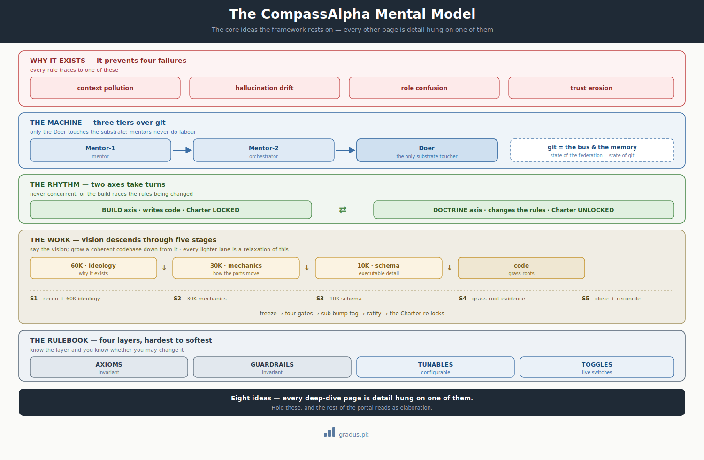

# The Mental Model

> *The core ideas the framework rests on. Once they're in your head, every other page is just detail hanging off them.*

CompassAlpha rests on eight ideas. Hold these, and every other page in the portal reads as detail hanging off one of them.

<small>***Why** the framework exists (four failures), **the machine** (three tiers over git), **the rhythm** (two axes alternating), **the work** (vision descending through five stages), and **the rulebook** (four layers, hardest to softest). Every deep-dive page is detail hung on one of these.*</small>

## The eight ideas

1. **Framework, not tool.** You bring your own AI agents, your own git, your own host. CompassAlpha guards *how they collaborate* — it is a constitution + conventions, not a runnable artifact. [→ Framework, not tool](framework-not-tool.md)

2. **It exists to stop four failures.** Context pollution · hallucination drift · role confusion · trust erosion. Every rule in the framework traces to preventing one of these — when a rule seems fussy, ask which failure it guards. [→ Guardrails](../02-guardrails/index.md)

3. **Three tiers, one toucher.** **Mentor-1** (mentor) → **Mentor-2** (orchestrator) → **Doer**. Only the Doer touches the substrate; mentors orchestrate and never do labour. This is what keeps the upper tiers' judgment clean. [→ Tier grammar](../01-axioms/tier-grammar.md)

4. **Two axes that take turns.** A **build axis** writes code while the rulebook is **LOCKED**; a **doctrine axis** changes the rulebook while it is **UNLOCKED**. They *alternate* — never at once, or the build races the very rules being changed. [→ Axis declarations](../03-tunables/axis-declarations.md)

5. **Vision descends into code.** Every doctrine artifact elaborates one altitude lower: **60K ideology → 30K mechanics → 10K schema → code.** Say a component's vision in plain words and the federation grows a coherent codebase down from it. [→ Codebase coherence](codebase-coherence.md)

6. **The heaviest lane is five stages.** A full doctrine cycle runs **S1 → S5** (substrate recon + ideology → mechanics → schema → grass-roots evidence → close). **Every lighter kind of work is a *relaxation* of this one** — learn it once, and the rest of the framework is subtraction. [→ Sample doctrine cycle](../06-adoption-patterns/sample-doctrine-cycle.md)

7. **Git is the bus and the memory.** State crosses tiers through git, and nothing load-bearing lives in chat. *State of the federation = state of git.* [→ Git foundations](../01-axioms/git-foundations.md) · [Persistence law](../01-axioms/persistence-law.md)

8. **Four layers, hardest to softest.** [**AXIOMS**](../01-axioms/index.md) (invariant) · [**GUARDRAILS**](../02-guardrails/index.md) (invariant) · [**TUNABLES**](../03-tunables/index.md) (configurable) · [**TOGGLES**](../04-toggles/index.md) (live switches). Know which layer a thing lives in and you know whether you may change it.

## Where each idea expands

| When you want… | Read |
|---|---|
| Why it's not a tool | [Framework, not tool](framework-not-tool.md) |
| The failures it was forged against | [Origin — why GitAI](origin-story.md) · [Guardrails](../02-guardrails/index.md) |
| The invariant rules in full | [The Constitution](constitution.md) · [Axioms](../01-axioms/index.md) |
| How vision becomes coherent code | [Codebase coherence](codebase-coherence.md) |
| The heaviest lane, worked end-to-end | [Sample doctrine cycle](../06-adoption-patterns/sample-doctrine-cycle.md) |
| Every term, defined | [Glossary](glossary.md) |

---

## Next: [Framework, not tool →](framework-not-tool.md)
