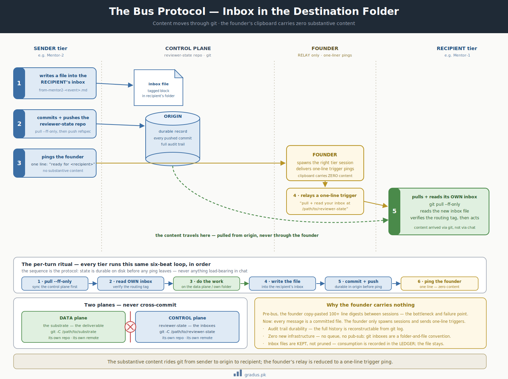
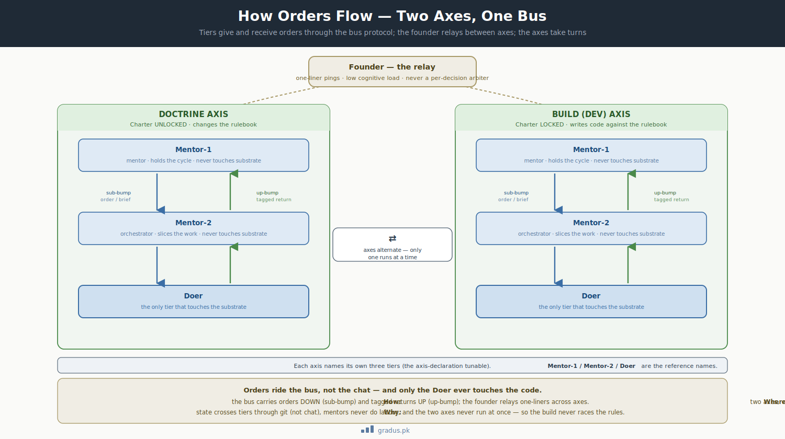

# Axiom 5: Bus Protocol

> *Inbox-in-destination-folder. Sender writes file into recipient's inbox; commits + pushes; pings founder. Recipient pulls + reads its own inbox.*

`[INVARIANT — the inbox-in-destination-folder model]` `[TUNABLE — exact path layout]`

This page explains how the AI agents in a federation pass messages to each other: instead of a human copying text between chat windows, each agent has a mailbox (an `inbox/` folder), and messages are dropped in as files that travel through git. Get this, and you understand how the whole federation stays coordinated without anyone playing telephone.

## TL;DR

When one agent needs to tell another something, it doesn't paste text into a chat — it writes a file into the other agent's mailbox and pushes it through git. Here's the precise version:

All inter-tier communication uses **inbox files in the recipient's folder**. The sender writes a file into the recipient's `inbox/`, commits + pushes the reviewer-state repo, and pings the founder. The founder sends a one-line trigger (`"pull + read your inbox at <path>"`) to the recipient session. The recipient pulls, reads its own inbox, acts.

**Content moves through git. The founder's clipboard carries zero substantive content.**




<small>*Content rides git from sender to origin to recipient; the founder's relay is reduced to a one-line trigger ping carrying zero substantive content.*</small>

## The rule

### The inbox-in-destination-folder model

Each tier has an `inbox/` subfolder inside its **own** judicial folder. The **sender** of an inbound writes the tagged block as a file in the **recipient's** inbox, commits + pushes, and pings the founder. The founder relays a one-line trigger to the recipient: *"pull + read your inbox."* Recipient pulls, reads its own inbox, acts.

### Path layout (default; tunable)

```
reviewer-state-repo/
├── tier-1-mentor/                                    ← Mentor-1 home
│   ├── inbox/                                       ← Mentor-1's inbox
│   │   └── <scope>/                                 ← per-scope sub-namespace
│   │       └── from-<sender-tier>-<event>.md
│   ├── (CLAUDE.md / LEDGER.md / LEFTOVERS.md / HANDOVER_LOG.md)
│   └── tier-2-orchestrator/                         ← Mentor-2 home
│       ├── inbox/                                   ← Mentor-2's inbox
│       │   ├── from-mentor1-<event>.md
│       │   └── from-doer-<slice>-<event>.md
│       ├── (CLAUDE.md / LEDGER.md / LEFTOVERS.md / HANDOVER_LOG.md)
│       └── <slice>/                                 ← per-slice sub-namespace
│           └── inbox/                               ← Doer's inbox for this slice
│               └── from-mentor2-brief.md
```

### Naming convention

`from-<sender-tier>-<event-class>[-<discriminator>].md`. Each filename is single-writer by construction. Examples:

- `from-mentor1-rulings.md`
- `from-mentor2-s2-brief.md`
- `from-doer-s2-digest.md`
- `from-mentor2-close-package.md`

### Write permissions (path-partitioned)

| Tier | May write to | Reads its inbox at |
|---|---|---|
| Mentor-1 | own folder + Mentor-2's inbox | own `inbox/<scope>/` |
| Mentor-2 | own folder + Mentor-1's inbox + Doer's inbox | own `inbox/` |
| Doer | substrate deliverable + Mentor-2's inbox | own slice `inbox/` |

### The per-turn ritual

Every tier turn follows this pattern:

1. `git -C <reviewer-state-repo> pull --ff-only` — sync + pick up new inbox files
2. Read own inbox. New files = work for this turn.
3. *(Doer only)* prepare worktree if needed
4. Do the tier's work
5. *(Doer only — data plane)* commit deliverable to substrate
6. Write outbound file into recipient's inbox (control plane)
7. Flush own judicial folder updates
8. `pull --ff-only` (fetch-before-push), then `git add` + `commit` + `push` to reviewer remote. Verify GH-sync 0/0.
9. Ping founder: *"ready for <recipient>"*
10. End turn

### The founder's role

Spawn the right tier session as needed; deliver one-line trigger pings. **Content moves entirely through git; the founder's clipboard carries zero substantive content.**

## The federation at work — orders across both axes

Both work axes run the same three tiers and the same bus. Orders flow *down* the tiers as **sub-bumps** (a brief or directive); tagged returns flow *up* as **up-bumps**; and the founder relays one-liner pings between axes. Only the Doer ever touches the substrate, and the two axes take turns — so the build never races the rules.



<small>*Orders ride the bus, not the chat. The bus carries orders down (sub-bump) and tagged returns up (up-bump); the founder relays one-liners across axes; only the Doer touches the substrate; the two axes never run at once. Each axis names its own three tiers — Mentor-1 / Mentor-2 / Doer are the reference names.*</small>

## Why this exists

### Reason 1: Founder cognitive load minimization

In pre-bus models, the founder relayed message content by copy-paste (sometimes 100+ lines per relay, many times per day). This was unsustainable: the founder became the bottleneck and the failure point.

With the bus protocol, the founder's clipboard carries **zero content**. Just one-line trigger pings. The founder's job collapses to:

- "Spawn a fresh CC session in this folder"
- "Tell this session: pull + read your inbox at <path>"

That's it. Maybe 1-3 pings per turn-equivalent. **Massive reduction in cognitive load.**

### Reason 2: Audit trail durability

Every inbox file is a persistent record. The federation's full communication history is reconstructable from git log. Compare:

- **Pre-bus (chat-relayed):** content in transient chat windows, lost on session end
- **Bus protocol:** every message is a committed file with timestamp, content, recipient

Compliance audit becomes trivial. Disaster recovery becomes git pull.

### Reason 3: Coordination without proprietary infrastructure

The federation needs a coordination layer. Options:

- A message queue (RabbitMQ, Kafka, SQS) — adds infrastructure complexity
- A pub-sub system — adds infrastructure
- A custom message bus — adds infrastructure
- **Git inboxes** — uses what's already there

The bus protocol picks the option with zero new infrastructure. Every project already has git. Adding inboxes is a folder-and-file convention.

### Reason 4: Universal across axes + lanes

The same bus protocol works for:

- Mentor-1 ↔ Mentor-2 ↔ Doer (build axis)
- Mentor-1 ↔ Mentor-2 ↔ Doer (doctrine axis)
- All four [work granularity lanes](../03-tunables/work-granularity-lanes.md)
- Cross-axis handoffs

One mechanism, many uses. The framework's coordination layer is simple by construction.

## What violating this looks like

### Violation 1: Direct paste-relay (carrying content in chat)

Founder pastes a 200-line digest from one tier session into another tier session. The content is now in chat, not in inbox. Multiple failure modes:

- Content lost on session end
- No audit trail
- Hard to reconstruct on rotation
- Founder cognitive load high

### Violation 2: Sender doesn't ping

Sender writes inbox file, commits + pushes, but doesn't ping the founder. The file sits in the recipient's inbox waiting. Recipient never wakes up because no trigger.

### Violation 3: Recipient doesn't pull

Founder pings recipient. Recipient reads its old inbox state without pulling. Acts on stale information.

Fix: every turn begins with `git pull --ff-only`. Mandatory.

### Violation 4: Cross-plane git mix

A Doer runs `git add ../substrate/file.md ../reviewer-state/file.md` in one command — mixing the substrate plane and the control plane. This violates the "two planes, never cross-commit" rule (see [git foundations](git-foundations.md)).

Fix: separate `git -C <repo>` calls for each plane.

## Implementation details

### Inbox file content structure

Every inbox file follows the marker discipline:

```markdown
[[FROM-SENDER-TIER→TO-RECIPIENT-TIER · <scope> · <event-class>]]

<substantive content>

- Findings
- Open questions
- Whatever the message conveys

[[/FROM-SENDER-TIER→TO-RECIPIENT-TIER]]
```

The opening tag is the routing marker. The recipient verifies the tag terminates at its own tier before ingesting. **Tag-gated ingestion** prevents misrouting.

[→ Hierarchy tags](../07-reference/hierarchy-tags.md) for the full marker spec.

### Two planes, never cross-commit

A Doer turn = TWO separate git operations:

1. **Data plane** (substrate deliverable): `git -C /path/to/substrate` operations
2. **Control plane** (inbox return + judicial flush): `git -C /path/to/reviewer-state` operations

These NEVER mix in one git command. A tier about to `git add` across the boundary HALTS. The two repos are structurally separate.

### Single-live-writer on judicial state

Each tier's judicial folder (LEDGER, LEFTOVERS, HANDOVER_LOG) is **single-live-writer**: only the owning tier writes there. Inbox subfolders are bounded multi-writer dropzones, with path-partitioned write permissions.

A rotation transfers jurisdiction. Out-of-jurisdiction overlap writers fetch-before-push and never clobber.

### Inbox files KEPT (not pruned)

Inbox files are persistent audit trail. They're NOT cleaned up after consumption. The recipient marks them "consumed" by recording the consumption in its own LEDGER (entry references the inbox file path); the file itself stays.

This eliminates the stale-PENDING-paste drift class — inbox files don't disappear with session reboots.

## Variations / tunables on top

| Tunable | Default | Range |
|---|---|---|
| Inbox naming convention | `from-<sender-tier>-<event>.md` | structured / freeform / hashed |
| Per-scope subfolder structure | nested by scope | flat / nested |
| Bus mode | bus (this axiom) | bus / pure-RELAY (founder paste-relay) / hybrid |
| Founder ping format | one-liner with path | one-liner / templated / system-generated |

[→ Persistent-Mentor-2 variant](../03-tunables/concurrency-modes.md) — `[CANDIDATE]`: a variant where Mentor-2 persists across slices and the Doer becomes a Mentor-2 sub-agent. Same bus protocol at the Mentor-1↔founder↔Mentor-2 boundary; sub-agent at Mentor-2↔Doer.

## How this connects to other axioms

- **[Tier grammar](tier-grammar.md)** defines who's who; bus protocol is how they talk.
- **[Firewall](firewall.md)** isolates contexts; bus protocol is the controlled communication channel.
- **[Hard labour rule](hard-labour-rule.md)** says mentors don't touch substrate; bus protocol is how they dispatch Doers.
- **[Persistence law](persistence-law.md)** says state on disk; inbox files ARE state on disk.
- **[Git foundations](git-foundations.md)** is the mechanical layer; bus protocol is the convention layer.

## The bus protocol's origin

Pre-bus, the reference federation used pure paste-relay: the founder copied long message blocks between tier sessions. This was unsustainable. A hybrid-delegated model was then tried (Mentor-1 spawns Mentor-2 as a sub-agent + Mentor-2 spawns the Doer as a sub-agent) — it failed on permission fatigue + the agent runtime's nested-spawn limit.

The bus protocol (inbox-in-destination-folder) emerged as the model that:

- Reduces the founder's relay to one-liner trigger pings
- Avoids the recursion limit (no sub-agent spawning)
- Creates a durable audit trail
- Works across all axes uniformly

It was refined with rules like:

- Sender ends jurisdiction at push
- Receiver legislates inbox persistence
- Founder is RELAY ONLY
- Naming discipline
- Inbox-tree integrity — `git add` every existing inbox file before commit

These refinements inform the framework's specification.

## Remember this

- **Messages are files, not chat.** A sender drops a file into the recipient's `inbox/` folder and pushes it through git. The human relaying things only sends a one-line "go check your inbox" — they never carry the actual content.
- **The mailbox model means nothing gets lost.** Every message is a committed file with a timestamp and a recipient, so the whole conversation history can be rebuilt from git at any time — no transient chat windows to vanish on a reboot.
- **No extra infrastructure needed.** You don't install a message queue or a server; you just agree on a folder-and-file convention, and git (which every project already has) does the carrying.
- **Two separate worlds, never mixed.** The actual work (the "substrate" — the real code) and the coordination messages live in different git repos and are committed separately, never in one command. This is one of the framework's core moving parts — see [the mental model](../00-foundation/mental-model.md).

---

## Next: [Axiom 6 — Provenance Law →](provenance-law.md)
