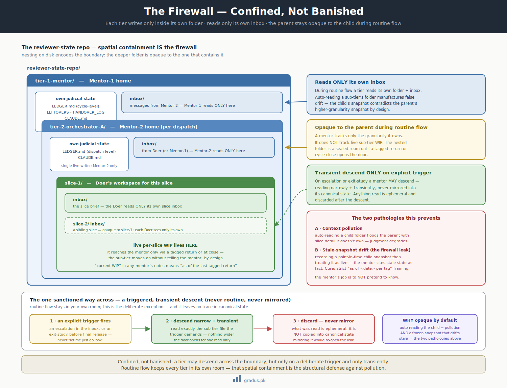

# Axiom 2: Firewall + State-Tracking Scope

> *Confined, not banished. Each tier writes only inside its own folder. Mentors track only their own granularity.*

`[INVARIANT]`

This page is about keeping each layer of the team in its own lane: an agent only writes inside its own folder, and a supervisor only tracks the kind of progress it's actually responsible for. You care because this is what stops a supervisor from drowning in detail it doesn't need — or worse, confidently reporting old, out-of-date information as if it were current.

## TL;DR

In plain terms: every agent gets its own workspace and isn't allowed to rummage through anyone else's. Supervisors keep notes only about the big-picture progress they own, and they always mark *when* they last heard news — so they never mistake a stale update for a live one.

Each tier in the federation operates within a **confined persistence domain** — its own folder, its own state files. Tiers can read across the boundary only on **deliberate trigger** (escalation, exit-study), never as routine flow. Mentors track only the granularity they own — never live sub-tier progress. **Recording a point-in-time sub-tier snapshot and then treating it as live is a firewall leak.**

This axiom is the structural defense against context pollution.




<small>*Spatial containment: each tier reads only its own folder and inbox; descending into a sub-tier's folder is a deliberate, triggered act — never routine.*</small>

## The rule (two parts)

### Part 1: Firewall — confined, not banished

Each tier writes **only** inside its own folder, never into another tier's folder. The mentor tier **never auto-reads** a sub-tier's folder during routine flow — auto-reading manufactures false drift because a sub-tier's CP-level snapshot contradicts the mentor's higher-granularity snapshot **by design**.

A mentor **may descend on a deliberate trigger** (escalation, exit-study before final release) — and then reads **narrowly + transiently, never mirrored** into the mentor's canonical state.

Symmetrically, a sub-tier never mirrors lower-tier session-state beyond the summaries it triages.

### Part 2: State-tracking scope — rule of law

A mentor tracks **only the granularity it owns**:

- **Mentor-1** tracks dispatch-level / cycle-level state — engaged → closed, plus the handoff snapshot. Does NOT track live per-CP / per-entity / per-slice WIP.
- **Mentor-2** tracks its dispatch + per-checkpoint / per-entity-close milestones — NOT live per-slice WIP inside the Doer.

Live sub-tier progress lives in the **sub-tier's own folder** and reaches the mentor **only via a tagged return or at close**.

**"Current WIP" in any mentor's notes means "as of the last tagged return," never "live."**

## The two pathologies this prevents

### Pathology A: Context pollution

If Mentor-1 auto-reads Mentor-2 folders during routine flow, Mentor-1's context absorbs:

- Slice-level detail Mentor-1 doesn't need
- Integration churn
- Dispatch ratifications already done
- Sub-tier's reasoning footprints

This makes Mentor-1's judgments degraded (cognitive overhead) and biased (saw the trees, lost the forest).

### Pathology B: Stale-snapshot drift (the firewall leak)

If a mentor records a snapshot of sub-tier WIP and then **treats it as live**, the mentor will:

- Make decisions based on stale state
- Surface stale information to the founder
- Appear authoritative while being wrong
- Drift further from reality with each conversation turn

**The sub-tier moves on without telling the mentor — by design.** That's the firewall working. The mentor's job is to NOT pretend to know.

## What violating this looks like

### Violation example 1: A mentor auto-reads a sub-tier's working folder

A Mentor-1 boots after a sub-tier cycle was already running. The mentor runs `ls <sub-tier-folder>/` to "catch up on what's happening." This auto-descends the firewall.

Result: the mentor's context pollutes with sub-tier detail it doesn't own; mentor judgment degrades; cycle-level state-tracking now mixed with entity-level.

Fix: the mentor reads only its own folder; the sub-tier cycle is opaque until cycle-close return.

### Violation example 2: A mentor records "module in-flight" then assumes it's still live

A Mentor-1 receives a tagged return reporting a module at stage S2a at time T. The mentor writes "module in-flight at S2a" in its LEDGER.

Time T+3 days: the module has progressed to S4. The mentor's LEDGER still says S2a. The mentor cites "module is at S2a" to the founder. **Firewall leak.**

Fix: the LEDGER must read "module last-known: S2a (as of YYYY-MM-DD per tag)." Never just "module at S2a."

### Violation example 3: Mentor descends to "help" sub-tier mid-dispatch

A Mentor-2 sees its Doer struggling. Mentor-2 opens the Doer's worktree to "help debug." Mentor-2's context now pollutes with slice detail.

Fix: Mentor-2 stays in its own folder. If Doer is struggling, Doer escalates per the [hard labour rule](hard-labour-rule.md) — the escalation gives Mentor-2 a clean summary in the inbox; Mentor-2 ratifies/adjudicates without descending.

## Implementation details

### Folder structure (where the firewall lives physically)

```
reviewer-state-repo/
├── tier-1-mentor/                    ← Mentor-1 home
│   ├── CLAUDE.md
│   ├── LEDGER.md                     ← Mentor-1's state (cycle-level)
│   ├── LEFTOVERS.md
│   ├── HANDOVER_LOG.md
│   ├── inbox/                        ← messages from Mentor-2
│   └── tier-2-orchestrator-A/        ← Mentor-2 home (per dispatch)
│       ├── CLAUDE.md
│       ├── LEDGER.md                 ← Mentor-2's state (dispatch-level)
│       ├── inbox/                    ← messages from Doer (or Mentor-1)
│       └── slice-1/
│           └── inbox/                ← Doer's brief
│       └── slice-2/
│           └── inbox/                ← Doer's brief
└── ...
```

**Mentor-1 routinely reads:** its own LEDGER, LEFTOVERS, HANDOVER_LOG, CLAUDE.md, inbox/. Plus the shared protocol files.

**Mentor-1 NEVER routinely reads:** tier-2-orchestrator-A/* contents (except its own inbox messages).

**Mentor-1 MAY transiently descend** to tier-2-orchestrator-A/ — on escalation or exit-study — and treats anything read as ephemeral.

### State-tracking discipline in notes

Every mentor's notes about sub-tier state include:

- Timestamp (when the snapshot was taken)
- Source (which tagged return)
- Explicit "as of" framing

Example LEDGER entry:

```markdown
## Sub-tier state (as of last tagged return)

| Sub-tier | Last return at | What they said | Tag |
|---|---|---|---|
| Mentor-2-Billing | 2026-05-26 14:00 | S2a started; expect 2 days | [[MENTOR-2→MENTOR-1 · Billing · S2a-started]] |
| Mentor-2-Reporting | 2026-05-26 18:30 | S5 close imminent | [[MENTOR-2→MENTOR-1 · Reporting · S5-WIP]] |
```

If the founder asks "where is Billing now?" the answer is "**Last tagged return said S2a-started on May 26**, no further return yet. Ask the Mentor-2 for an interim update if needed." Not "Billing is at S2a."

This subtle linguistic discipline prevents the firewall leak.

### Cross-axis isolation

The Mentor-1 of one axis (e.g. a build axis, rooted at `/.../CLAUDE.md`) and the Mentor-1 of another axis (e.g. a doctrine axis, rooted at its own stamped CLAUDE.md) are **independent threads**. They share the same reviewer-state repo and the same shared protocol but identify by their own stamped CLAUDE.md.

The build-axis Mentor-1 does not run while a doctrine cycle is engaged. The doctrine-axis Mentor-1 does not run between cycles. They alternate. Neither auto-reads the other's folder.

## Variations / tunables on top

| Tunable | Default | Range |
|---|---|---|
| Cross-tier visibility scope | own-folder only | own-only / parent-summary-allowed / full-visibility (anti-pattern) |
| Forensic descent frequency | only on escalation or exit-study | TBD if needed |
| Snapshot-vs-live linguistic discipline | strict "as of X" framing | strict / informal (degrades pollution defense) |

[→ Context patterns](../03-tunables/context-patterns.md) for the full set of visibility configurations.

## Remember this

- **Each agent stays in its own folder.** Writing into someone else's workspace, or routinely reading theirs, is off-limits — that boundary is what keeps everyone's thinking clear.
- **A supervisor only tracks what it owns.** It follows the big milestones, not the minute-by-minute work happening one level down.
- **"As of when" is everything.** Any note about a sub-team's progress is a snapshot from the last time they reported in — never assume it's still true right now. Pretending a stale snapshot is live is the one mistake this axiom exists to prevent.
- New here? This page is one piece of [the mental model](../00-foundation/mental-model.md) — start there if the tiers and folders feel abstract.

## How this connects to other axioms

- **[Tier grammar](tier-grammar.md)** establishes the three tiers; firewall isolates them.
- **[Persistence law](persistence-law.md)** ensures the on-disk state is the authoritative source mentors read.
- **[Hard labour rule](hard-labour-rule.md)** ensures mentors don't bypass the firewall by doing labour themselves.
- **[Bus protocol](bus-protocol.md)** is the *only* approved channel for inter-tier communication.

## Next: [Axiom 3 — Persistence Law →](persistence-law.md)
