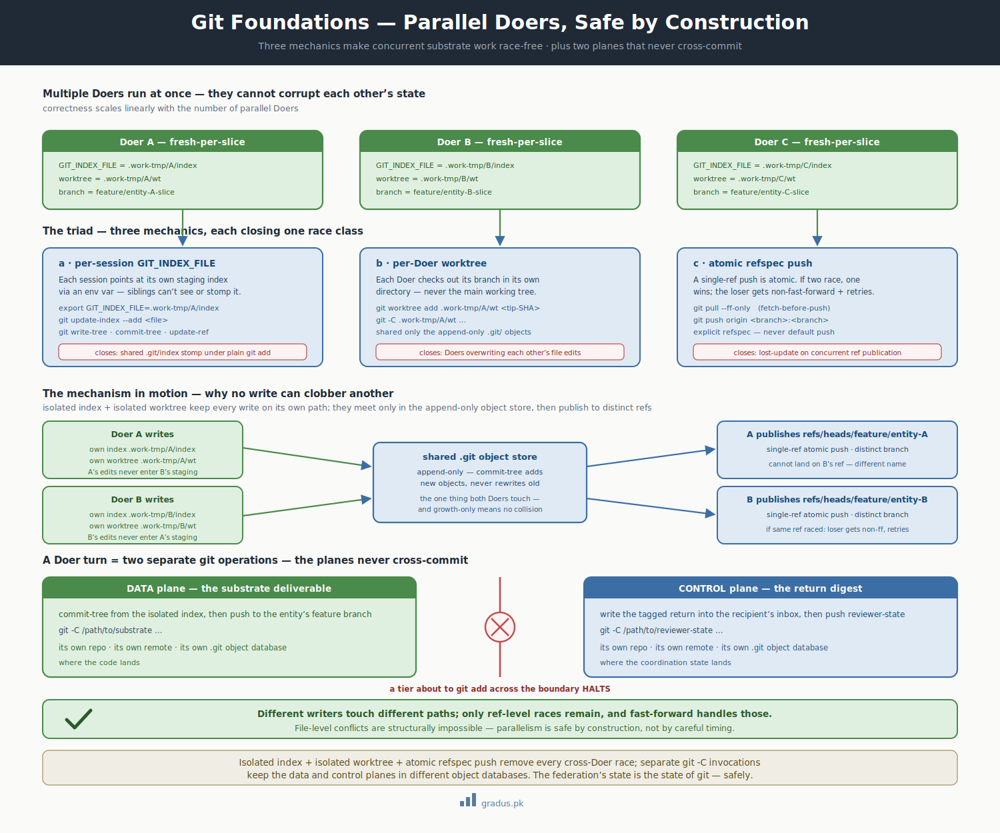

# Axiom 7: Git Foundations

> *`GIT_INDEX_FILE` per session + worktree route-around + `commit-tree` pattern. The technical triad that makes parallel-doer safe by construction.*

`[INVARIANT — these mechanics are non-negotiable]`

**In plain terms:** when several AI agents work on the same codebase at once, this page is the set of git tricks that keeps them from accidentally overwriting each other — so parallel work stays correct instead of quietly corrupting.

## TL;DR

**The short version:** CompassAlpha treats git itself as the single source of truth, and three specific git techniques are what make it safe for many agents to write at the same time. Here they are in detail.

CompassAlpha's claim that *"state of the federation = state of git"* rests on specific git-layer mechanics that make multi-tier + multi-axis + parallel-doer + sub-agent isolation actually possible. Without these mechanics, the framework would fail at first contact with concurrent work.

The triad: **`GIT_INDEX_FILE` per session + worktree per session + `commit-tree` plumbing**.




<small>*Race-safety by construction: isolated index, per-Doer worktree, and atomic refspec push let multiple Doers work in parallel without clobber — and the two planes never cross-commit.*</small>

## The rule (six commit-discipline mandates)

When a tier session does git operations, it follows these six mandates:

1. **`GIT_INDEX_FILE` per session** — set environment variable to a session-unique index path
2. **`git worktree` for any Doer touching substrate** — never run a Doer in the main working tree
3. **`commit-tree` (or equivalent plumbing) for commits** — `git add` + `git commit` is forbidden for tier work
4. **`git push` with explicit refspec** — default-push is forbidden
5. **`git pull --ff-only` before push** — never `--rebase`, never `merge` (would reorder commits across sessions)
6. **Separate `git -C <repo>` invocations for data plane vs control plane** — never mix in one shell command

These six rules ARE the commit discipline. Terse to state; load-bearing to enforce.

## The triad in detail

### 1. The `commit-tree` pattern (avoid `git add` + `git commit`)

```bash
# Set per-session index
export GIT_INDEX_FILE=/path/to/session-specific/index
```

This sets an environment variable (a value the running shell remembers) telling git to use a private staging file for this session instead of the repository's shared default. The staging area — git calls it the "index" — is where you list the changes that will go into your next commit; giving each session its own means two sessions can't trip over each other's lists.

```bash
# Stage changes into THIS index
git update-index --add <file>
```

This adds the named file to the private staging list you just set up. `update-index` is the low-level way to stage a file; it writes only into the index pointed at by `GIT_INDEX_FILE`, so the change is recorded in your isolated staging area and nowhere else.

```bash
# Write a tree object from the index
TREE_SHA=$(git write-tree)
```

This takes a snapshot of everything currently staged and saves it as a "tree" — git's stored picture of a directory at one moment. The `$( )` captures the snapshot's ID (a SHA, git's unique fingerprint for any stored object) into the `TREE_SHA` variable so the next command can refer to it.

```bash
# Create a commit object pointing to that tree
COMMIT_SHA=$(git commit-tree $TREE_SHA -p <parent-sha> -m "msg")
```

This creates the actual commit: it wraps the snapshot (`$TREE_SHA`) with a message (`-m`) and a link to the previous commit (`-p`, the parent), then captures the new commit's fingerprint into `COMMIT_SHA`. Building the commit directly like this avoids the shared-index side effects of the everyday `git commit`.

```bash
# Update the branch ref
git update-ref refs/heads/<branch> $COMMIT_SHA
```

This points the named branch at the commit you just made. A branch is simply a movable label pointing at one commit; `update-ref` moves that label to `$COMMIT_SHA`, so the branch now includes your new work.

```bash
# Push via explicit refspec
git push origin <branch>:<remote-branch>
```

This sends your branch up to the shared remote repository (`origin`). The `<branch>:<remote-branch>` part names exactly which local branch goes to which remote branch, so the upload targets one precise place and nothing else.

**Why NOT plain `git add` + `git commit`:** plain `git add` modifies `.git/index` (the shared default index file). Two parallel sessions calling `git add` simultaneously stomp on each other's stages. The contamination is **silent and confounds debugging** — commits look correct on the surface but contain sibling-session deltas.

**The mechanic:** `GIT_INDEX_FILE` is a per-process environment-variable pointer. Each session has its own staging area; siblings can't see or stomp on each other's state.

### 2. The worktree route-around (avoid the shared working directory)

```bash
# Each Doer gets its own worktree
git worktree add /path/to/substrate/.work-tmp/<entity>/<slice>/wt <cycle-tip-SHA>
```

This creates a separate working folder (a "worktree") checked out from the same repository, starting at the commit you name (`<cycle-tip-SHA>`). A worktree is a fully usable copy of the project files backed by the one repository, so each agent can edit its own folder without disturbing anyone else's.

```bash
# Doer runs with -C to that worktree
git -C /path/to/substrate/.work-tmp/<entity>/<slice>/wt status
```

This runs `git status` inside that worktree folder. The `-C <path>` flag tells git to act as if it were started in that folder, so the command reports on this agent's own working copy regardless of where the shell happens to be.

```bash
# Cleanup at clean close
git worktree remove /path/to/substrate/.work-tmp/<entity>/<slice>/wt
```

This deletes the worktree folder once the work is done and committed. Removing it through git (rather than just deleting the folder) keeps the repository's bookkeeping tidy, so leftover worktrees don't accumulate.

**Why NOT the main working tree:** if multiple Doers share `/path/to/substrate/`, they overwrite each other's file edits. The first Doer checking out a different branch clobbers the second's working state.

**The mechanic:** `git worktree` lets one repository have multiple branches checked out simultaneously in separate directories. Each Doer lives in its own directory, sharing only the `.git/` object database (append-only, concurrency-safe).

### 3. Refspec push (atomic single-ref publication)

`git push origin <branch>:<branch>` is **atomic for a single ref**. If two parallel sessions race, only one succeeds; the loser gets a `non-fast-forward` rejection and must `fetch + rebase + retry`. Race-safe by construction.

Explicit refspec (`branch:branch`) — rather than default `git push` — avoids accidentally pushing other refs and makes the operation unambiguous.

### 4. Fetch-before-push (cooperative multi-writer)

Before any push, the session runs `git pull --ff-only`. This catches updates from sibling parallel writers. If fast-forward isn't possible, the session pauses, reconciles, retries.

Combined with single-live-writer on judicial folders + path-partitioned inbox writes, **conflicts at the file level are structurally impossible** (different writers touch different paths); only ref-level races remain, which fast-forward handles.

### 5. The "two planes, never cross-commit" rule

A Doer turn = TWO separate git operations:

1. **Data plane** (substrate deliverable) — commit to substrate repo, via its own worktree + `commit-tree` + push to substrate feature branch
2. **Control plane** (return digest into recipient inbox) — commit to reviewer-state repo, push to reviewer-state remote

**These NEVER mix in one git command.** A tier about to `git add` across the boundary HALTS. The two repos are structurally separate (different directories, different remotes, different `.git/` databases). The Doer runs:

```bash
git -C /path/to/substrate ...          # data plane
```

This runs a git command against the substrate repository — the place where the actual work product lives. The `-C` flag pins the command to that specific repository folder so the deliverable is committed there and only there.

```bash
git -C /path/to/reviewer-state ...     # control plane
```

This runs a separate git command against the reviewer-state repository — the messaging side, where an agent files its report back to whoever is reviewing. Because it is a distinct command pointed at a distinct repository, the report can never accidentally land in the work-product repo.

This is the structural firewall: commits **cannot** cross-pollute because the git contexts are different.

## How these unlock parallel-doer

The combination enables [parallel-doer concurrency mode](../03-tunables/concurrency-modes.md):

- Multiple Doer sessions spawn simultaneously
- Each gets: own worktree under `.work-tmp/<entity>/<slice>/wt` + own `GIT_INDEX_FILE` + own scratch directory
- Each commits its deliverable via `commit-tree` from its isolated index + refspec push to its assigned substrate branch
- Each writes its return into the recipient inbox (different filenames per slice; inbox writes don't collide because path-partitioned)
- The orchestrator pulls + reads each Doer's return as it arrives; integration happens at orchestrator tier; the orchestrator never has to reason about Doer-level race conditions

Without these mechanics, parallel-doer would silently corrupt cross-Doer state. With them, **parallelism is safe by construction** — correctness scales linearly with the number of parallel Doers.

## What violating this looks like

### Violation 1: Plain `git add` from a Doer

A Doer uses `git add ./file.md && git commit -m "msg"` because it's "simpler." This Doer's commit silently includes any other Doer's pending changes that were also `git add`-ed to the shared index. Result: cross-contaminated commit.

### Violation 2: Running a Doer in the main worktree

Founder spawns a Doer with `cwd=/path/to/substrate` (the main substrate working tree). Doer edits files. Sibling Doer also edits files in the same directory. They overwrite each other.

### Violation 3: Push without explicit refspec

A tier runs `git push origin` (default). The push includes all matching refs — possibly clobbering tags or pushing local-only branches. The intended publication is unclear.

### Violation 4: `--rebase` or `merge` instead of `--ff-only`

A tier uses `git pull --rebase` before push. This reorders local commits onto the new tip. Across multiple parallel sessions, this scrambles commit timelines. Audit trail confused.

### Violation 5: Cross-plane mixing

A tier runs `git add /path/to/substrate/file.md /path/to/reviewer-state/file.md`. This stages files from two different repos into... actually this fails because they're different repos. But a confused tier might use a wrong working directory and end up committing reviewer-state to the substrate repo or vice versa.

**Fix:** ALWAYS use `git -C <repo>` explicitly. Never assume working directory.

## Implementation details

### Setting GIT_INDEX_FILE in a Doer session

When the orchestrator composes a Doer brief, it includes the index path:

```markdown
[[ORCHESTRATOR→DOER · entity/slice]]

YOU ARE: a Doer for entity X, slice Y.

OPERATIONAL PRECONDITIONS:
  branch:       feature/entity-X-slice-Y
  base HEAD:    abc123  (cycle-tip)
  GIT_INDEX_FILE:  /path/to/substrate/.work-tmp/X/Y/index
  worktree:     /path/to/substrate/.work-tmp/X/Y/wt
  exit tag:     (none for surgical) | polish-Y-v0.1 (for polish lane)

COMMIT DISCIPLINE: GIT_INDEX_FILE + commit-tree + explicit refspec push.

YOUR SLICE:
  ...
```

This is the [brief completeness rule](../02-guardrails/brief-completeness.md) applied to git operational preconditions.

### Auditing compliance with the discipline

A boot-time tooling can verify a Doer session has set `GIT_INDEX_FILE` correctly and is `cd`'d into a worktree (not the main tree) before allowing the session to proceed. This is a high-value first [specialised agent](../03-tunables/invariants-toolings-agents.md) for a new CompassAlpha project.

### Cleanup discipline

Worktrees and scratch directories accumulate if not cleaned. The framework specifies cleanup at clean slice close:

```bash
git worktree remove /path/to/substrate/.work-tmp/<entity>/<slice>/wt
```

This removes the agent's dedicated worktree folder through git, freeing it and updating the repository's record of active worktrees so none are left dangling.

```bash
rm -rf /path/to/substrate/.work-tmp/<entity>/<slice>/  # if scratch lives there
```

This deletes the leftover scratch folder and everything inside it. `rm` removes files, `-r` makes it descend into the folder, and `-f` skips the are-you-sure prompts — useful for clearing temporary working space once the slice is finished.

Sloppy projects leave `.work-tmp/` cluttered. Disciplined projects clean.

## Variations / tunables on top

The `[INVARIANT]` is the six mandates themselves. Variations:

| Tunable | Default | Range |
|---|---|---|
| Where to host `GIT_INDEX_FILE` | `.work-tmp/<entity>/<slice>/index` | configurable path; must be session-unique |
| Where to put worktrees | `.work-tmp/<entity>/<slice>/wt` | configurable; must be outside main working tree |
| Scratch retention policy | delete on clean close | delete-on-close / keep-N-recent / keep-all |
| Git push protocol | https or ssh | adopter choice |

## How this connects to other axioms

- **[Persistence law](persistence-law.md)** says state on disk + at origin; this axiom is the mechanical implementation.
- **[Firewall](firewall.md)** isolates contexts; this axiom isolates git operations at the file-system + index level.
- **[Bus protocol](bus-protocol.md)** moves messages through git; this axiom makes git operations safe.
- **[Hard labour rule](hard-labour-rule.md)** keeps mentors away from substrate; this axiom protects multiple Doers from each other.

## The single-writer anti-pattern's quiet retirement

Pre-CompassAlpha, a legacy anti-pattern used a long-running persistent in-repo single-writer session as the SOLE writer to the substrate. It existed because the GIT_INDEX_FILE + worktree mechanics weren't formalized yet, so multi-writer was unsafe.

It was a **correctness shield** against a missing mechanism.

With this axiom landed, the single-writer session is structurally obsolete. The mechanics make multi-writer safe by construction. The bus protocol + parallel-doer concurrency replaces it with discrete fresh-per-slice Doer spawns that can't contaminate each other.

The framework no longer needs the single-writer session because it no longer has the failure mode that pattern existed to prevent.

## Six mandates summary card

```
┌─────────────────────────────────────────────────────────────┐
│  Six mandates of CompassAlpha commit discipline             │
├─────────────────────────────────────────────────────────────┤
│  1.  GIT_INDEX_FILE=<unique-path>      per session         │
│  2.  git worktree add <path> <SHA>      for every Doer     │
│  3.  git commit-tree (or update-index   instead of git add │
│      + write-tree + commit-tree)         + git commit      │
│  4.  git push origin <branch>:<branch>  not default push   │
│  5.  git pull --ff-only                 before every push  │
│  6.  git -C <repo>                      separate planes    │
└─────────────────────────────────────────────────────────────┘
```

Stamp these onto every tier's boot file. Verify at T0. Audit at session start.

## Remember this

- When many agents share one codebase, the danger isn't loud crashes — it's *silent* clobbering: two agents stage or edit the same spot and quietly corrupt each other's work.
- The fix is isolation: each agent gets its own staging area (`GIT_INDEX_FILE`), its own working directory (a `git worktree`), and publishes through a precise, single-target push. They only ever share git's append-only object store, which is safe to share.
- "Two planes, never cross-commit" is a safety wall: the work-product repo and the messaging repo are kept physically separate so a commit can't leak from one into the other.
- These mechanics are what let parallel work scale without surprises — and they're the ground floor for [the mental model](../00-foundation/mental-model.md).

---

## Next: [Axiom 8 — Amendment Protocol →](amendment-protocol.md)
