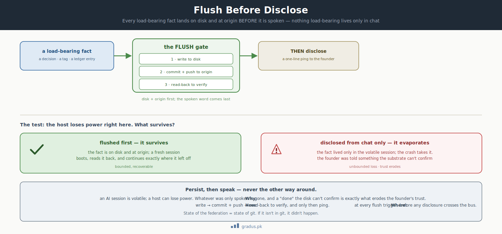

# Axiom 3: Persistence Law (the trust anchor)

> *Flush before disclose. State on disk + at origin BEFORE it is discussed with the founder. Nothing load-bearing in chat.*

`[INVARIANT]`

New here? This page explains the one habit that lets a human safely trust a team of AI agents: nothing important is "real" until it's saved to a file and confirmed — never just spoken in the chat. Get this, and you understand why the human running the show can relax instead of double-checking everything.

## TL;DR

In plain terms: an AI agent isn't allowed to tell you "I did it" until the change is actually saved, backed up, and re-read to confirm it stuck. Talk is cheap; the file is the truth.

Every load-bearing state change must be **written to disk + pushed to origin + read back** **before** it is discussed with the founder. This is the trust anchor — what lets the founder step back to a relay+lost+found role instead of micromanaging every interaction.

**If state isn't on disk, it doesn't exist.**



<small>*Persist, then speak. A load-bearing fact is written to disk, pushed to origin, and read back to verify — only then is it disclosed. If the host loses power, a flushed fact survives in git; one that lived only in chat evaporates, and a "done" the disk can't confirm is what erodes trust.*</small>

## The rule

### Flush-before-disclose

State is on disk + at origin BEFORE it is discussed/disclosed to the founder. **Nothing load-bearing in chat.**

### Layer A — Persistence validation (every flush)

A write is not "done" until:

```
1. WRITE the change to the canonical file.
2. READ-BACK the affected fields from disk.
3. CONFIRM the read matches intent.
```

A flush that has not been read back is treated as **not flushed**.

### Layer B — Handover validation (every cutover)

When tiers rotate (Mentor-N → Mentor-N+1), a two-party cross-check is required:

```
1. INCOMING tier self-administers the grounding battery
   (from LEDGER.md §"grounding answers") + must surface ≥1 ORIGINAL non-parroted observation.
2. OUTGOING tier scores against live artifacts + certifies no unflushed state.

Release only after BOTH pass. Logged in HANDOVER_LOG.md.
```

### Flush = write + commit + push + read-back

On hosts with abrupt power-down risk, **flush** means `git commit + push` to the state-of-record remote, not just file-write. Local disk is volatile; the remote is durable.

### Single-live-writer

Only the current live tier-holder writes the state-of-record repo while holding jurisdiction. A rotation transfers jurisdiction. Any out-of-jurisdiction overlap writer **fetches before push** and never clobbers the live writer.

## Why this is the trust anchor

The founder needs to **trust the federation's state**. Specifically, the founder needs to trust that:

- What they see on disk is what's true
- What an AI tier says is consistent with what's on disk
- They can be away from the keyboard without missing critical state changes

Without flush-before-disclose, these trust assumptions break:

- AI tier says "I did X" but X is only in chat, not on disk → founder reboots → X is lost → founder discovers the loss later → trust eroded
- AI tier makes a decision that's never persisted → founder makes a follow-up decision on a different assumption → conflict
- Founder steps away during a long conversation → comes back → AI tier's claims about "current state" don't match disk → confusion

With flush-before-disclose:

- AI tier says "I did X" only AFTER X is on disk + at origin + read back → founder can verify by checking disk → trust preserved
- Founder can step away during a turn and resume; state is guaranteed durable
- Power-down on the AI tier's host loses at most the current in-flight turn

**The persistence law is what makes the founder's narrow role possible.** Without it, the founder would need to be the persistence layer themselves.

## What violating this looks like

### Violation 1: AI tier reasons in chat, doesn't flush

A tier discusses a complex decision across 10 conversation turns, draws a conclusion, but never writes the conclusion to LEDGER.md. Then the session ends.

Result: the next tier session has no record of the decision. The reasoning is gone. Trust eroded.

### Violation 2: Tier writes locally, doesn't push

A tier writes a change to local disk. Host power-cycles before push. The change is lost.

Worse: the tier said "done" to the founder before push. The founder believes it's done; only later discovers it's gone.

### Violation 3: Tier asserts state without verifying disk

A tier says "the Billing compass is at v0.1.2" based on session memory. Founder asks "are you sure?" Tier confirms.

Reality: disk says v0.1.1; the v0.1.2 update was in-flight but the tier session crashed before push. Tier's confirmation was based on session memory, not disk verification.

Fix: tier should `git log` / `git show` to verify against disk before asserting.

## Implementation details

### The flush trigger taxonomy (T0-T7)

| # | Trigger | Action |
|---|---|---|
| **T0** | Boot | Read canonical state artifacts; verify mutual consistency; print START Status Grid; GH-sync check |
| **T0e** | Session end / standby-into-cutover | Print END Status Grid; final disk==understanding certification |
| **T1** | State change — GO relayed, checkpoint frozen, founder-call ruled, dispatch advanced | Flush to LEDGER.md + read-back |
| **T2** | Triage return — after handing back ratification/GO/freeze | Flush resulting state before standby |
| **T3** | End-of-turn sweep | Before ending any turn that advanced state, confirm the ledger reflects it. Unflushed state = incomplete turn. |
| **T4** | Context-health signal | Flush everything, initiate cutover prep |
| **T5** | Cutover / onboarding | Full Layer-B dual validation; append to HANDOVER_LOG.md |
| **T6** | Doctrine change | Update master / axis declaration / templates; version-bump |
| **T7** | CP-freeze | Onboard every leftover to LEFTOVERS.md BEFORE reporting freeze as ratification-ready |

[→ Flush triggers detail](../07-reference/flush-triggers.md)

### Commit-discipline at the git layer

`git commit + push` is not enough by itself. The framework specifies:

- Use `GIT_INDEX_FILE` (per-session staging index)
- Use `git commit-tree` (avoid `git commit` plain)
- Use explicit refspec push (`git push origin main:main`)
- Run `git pull --ff-only` before every push (fetch-before-push)

[→ Git foundations axiom](git-foundations.md) — these are the technical mechanics enabling persistence law.

### Read-back verification

After every write, the session must read back the change from disk:

```python
# Pseudo-code
write_change(file, content)
disk_content = read_from_disk(file)
assert disk_content == content, "Flush not confirmed"
log_to_ledger(file, "flushed at " + timestamp)
```

A session that writes without read-back has not flushed. End-of-turn (T3) requires confirming all writes are read-back-verified.

## Variations / tunables on top

| Tunable | Default | Range |
|---|---|---|
| Flush cadence | every flush trigger pushes | every-trigger / batched-end-of-turn |
| Power-down resilience model | volatile local; durable origin | volatile-local / durable-local |
| Read-back stringency | every write | every-write / sampled / disabled (anti-pattern) |
| HANDOVER_LOG depth | full | full / summarized after N rotations |

[→ Context patterns](../03-tunables/context-patterns.md) for related tunables on audit verbosity.

## How this connects to other axioms

- **[Tier grammar](tier-grammar.md)** establishes that each tier has state; persistence law makes that state authoritative.
- **[Firewall](firewall.md)** establishes who owns what state; persistence law ensures that state is durable.
- **[Provenance law](provenance-law.md)** is a higher form of persistence law — not just durability but verifiability.
- **[Git foundations](git-foundations.md)** are the mechanical implementation of the persistence law.

## The "trust anchor" framing

Why call it the trust anchor specifically?

The founder must extend trust to the federation. They must trust:

- That tier rotations don't lose state
- That what an AI tier says is true
- That decisions made yesterday are durable
- That power-downs don't corrupt the federation

This trust is not free. It's purchased by **strict adherence to flush-before-disclose**.

If the founder ever observes a violation — a claim that doesn't match disk, a state that wasn't pushed, a decision that evaporated — the trust contract is broken. The founder must then either:

1. Re-establish trust (requires repeated faithful demonstrations)
2. Withdraw the narrow-role posture and start micromanaging
3. Abandon the framework

Option 2 is what most AI-collaboration projects end up doing — and is exactly the cognitive load CompassAlpha is designed to spare the founder.

The persistence law is the contract that earns the trust.

## Remember this

- **If it isn't on disk, it didn't happen.** A claim that lives only in chat is not real state — and an agent must not report it as done.
- **Flush means write + push + read-back.** Saving locally isn't enough; the change goes to the durable remote, then gets re-read to confirm it actually landed.
- **This is what frees the human.** Because state is always durable and verifiable, the founder can step away and trust the federation instead of micromanaging it.
- New to the whole picture? See [the mental model](../00-foundation/mental-model.md) for how this law fits the rest of the framework.

---

## Next: [Axiom 4 — Hard Labour Rule →](hard-labour-rule.md)
