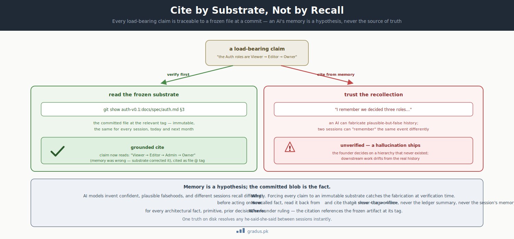

# Axiom 6: Provenance Law

> *Cite by substrate. Every load-bearing claim is traceable to substrate, not to memory or LEDGER recall.*

`[INVARIANT]`

This page explains a simple rule that keeps the whole system honest: before anyone — human or AI — acts on "I remember we decided X," they have to go check the actual files. You care because it's the main reason the framework doesn't quietly drift into things that never actually happened.

## TL;DR

In plain terms: don't trust memory, check the source. Every important claim has to point back to a real, committed file at a known point in time — not to what an AI "remembers."

Every load-bearing claim in the federation must be **traceable to substrate** — the project's actual codebase or doctrine source repo at a specific commit/tag. AI institutional memory ("I remember we decided X") is NEVER authoritative without substrate verification. This is the framework's structural defense against AI hallucination.



<small>*A claim checked against the frozen substrate (`git show <tag>:<file>`) becomes a grounded citation; a claim trusted from memory can ship a confident falsehood. Memory is a hypothesis; the committed blob is the fact.*</small>

## The rule

### Cite by substrate, not by recall

When citing an existing primitive, invariant, fact, or decision, the citation references **the frozen substrate artifact** (the committed file at the relevant tag), not the mentor's LEDGER summary or memory notes.

### AI institutional-memory is not authoritative

A tier's recall ("I remember we decided X") MUST be verified against the substrate before action. Memory recall is HYPOTHESIS, not FACT.

### Frozen-base provenance

In plain terms: if you edit a document by branching off an old version, you can silently lose changes that were made after that old version — including decisions the founder already made. So always branch off the last known-good frozen state, and double-check nothing got dropped.

A doctrine-axis revision rooted on a base predating the entity's build-axis doc-close tag silently drops deltas (scope reductions + founder rulings). Run ancestor-test + read-diff-reconcile @ the build-axis tag; verify against frozen-base-blob, not worktree checkout.

## Why this exists

### Reason 1: AI hallucination defense

AI models can fabricate plausible-but-false historical facts. A Mentor-1 might recall "we dropped soft-deletes in the Reporting module back in cycle 3" — except no such decision exists in any committed artifact. If acted upon, the federation drifts away from its actual history.

The provenance law forces every claim to be **verifiable against an immutable substrate**. Hallucinations get caught at verification time.

### Reason 2: Cross-tier memory consistency

Different tier sessions have different recall. Two successive sessions of the same Mentor-1 might "remember" the same event differently. Without provenance law, this creates intractable he-said-she-said drift.

With provenance law: both must cite substrate. Substrate is one truth. Conflict resolves immediately.

### Reason 3: Auditability and trust

For regulated environments (medical, financial, compliance-critical), the federation must demonstrate that every decision traces to an immutable source. Memory-based decisions can't pass audit; substrate-based decisions can.

The provenance law makes audit straightforward: every claim → substrate tag → frozen blob → verifiable.

### Reason 4: Survival across rotations

When tier instances rotate (Mentor-1-N → Mentor-1-N+1), institutional knowledge could die with the outgoing instance. With the provenance law:

- Decisions are recorded as substrate commits, not as session memory
- New tier instances learn the history by reading the substrate
- Continuity survives rotation

This is what enables CompassAlpha's preventive-rotation discipline.

## What violating this looks like

### Violation 1: Tier cites from memory without verification

A Mentor-1 tells the founder: "the Auth module's role hierarchy is Viewer → Editor → Owner — Auth's spec §3 defines this."

Reality: Auth's spec §3 defines Viewer → Editor → Admin → Owner (4 roles, not 3). The mentor recalled wrong.

Result: the founder makes a decision based on the wrong hierarchy. Downstream drift.

**Fix:** before citing, the mentor must `git show auth-v0.1:docs/spec/auth.md` (or similar) and verify the actual content.

### Violation 2: Tier asserts a previous decision that never happened

A Mentor-2 writes "Founder ruled item-3 = DEFER (per session 2026-05-15)" in a brief.

Reality: no such ruling exists in HANDOVER_LOG or any committed artifact. The mentor fabricated or misremembered.

**Fix:** every cited founder ruling must include a substrate reference (e.g., `HANDOVER_LOG entry @ commit abc123` or `LEDGER section X @ tag notifications-v0.3`).

### Violation 3: Cross-spec references drift over time

A spec doc at v0.1 cites a sibling spec doc: "see the Billing spec §10K for usage-limit enforcement."

The sibling spec is later amended to v0.2. The reference in the original doc now points to **stale content** unless explicitly re-pinned.

**Fix:** all cross-spec references must include the substrate tag at which the reference was made (e.g., `see billing-spec v0.1 §10K`).

### Violation 4: Worktree-vs-frozen confusion

A Mentor-2 operates on a worktree of the substrate that was checked out yesterday. Mid-cycle, the substrate's main branch advanced. The worktree is now stale.

The mentor ratifies a slice "matches latest substrate" — but matches worktree, not actual latest.

**Fix:** verify against `git show <tag>:<file>` for the relevant frozen tag, not the current worktree checkout.

## Implementation details

### Substrate citation format

When citing substrate, use one of these forms:

```
- file_path @ commit_sha
- file_path @ tag_name
- file_path § <section>  @ tag_name (for sections of a spec)
- ruling_id @ HANDOVER_LOG commit_sha
```

Examples:

- `docs/spec/auth.md @ arch-auth-v0.1`
- `packages/billing/src/charge.ts @ billing-v0.2`
- `billing-spec §10K @ arch-billing-v0.1`
- `RULING-1 ruled @ HANDOVER_LOG commit a1b2c3d (2026-06-03)`

### Verification before action

Before acting on a recalled fact:

```
1. State the claim explicitly ("I believe X")
2. Identify the substrate that should contain X
3. Read the substrate (e.g., git show <tag>:<file>)
4. Compare claim to substrate
5. If mismatch: claim was hallucination; correct
6. If match: proceed with action, citing substrate
```

This is mandatory for `[INVARIANT]`-class claims (architectural facts, primitives, invariants, founder rulings, prior decisions).

### Frozen-base anchor for amendments

For doctrine-axis revisions of existing spec docs:

- Identify the existing build-axis doc-close tag (the immutable last-good state)
- Use that tag as the ancestor for the revision
- Run ancestor-test: confirm the proposed revision's base IS an ancestor of the tag
- Read-diff-reconcile: read deltas against the frozen-base-blob; if any deltas are missing from the proposed revision, recover them explicitly

This prevents the silent-drop class of provenance failure.

### Memory file integrity

When updating a memory file (e.g., `memory/MEMORY.md`):

- Cite the substrate event that triggered the memory
- Cite the substrate file(s) that validate the memory's claims
- Date-stamp the memory entry

Memory becomes a curated index of substrate references, not a parallel source of truth.

## Variations / tunables on top

| Tunable | Default | Range |
|---|---|---|
| Verification strictness | strict (every load-bearing claim) | strict / spot-check / trusted (anti-pattern) |
| Substrate-citation depth | tag-level | tag-level / commit-level / file-line-level |
| Frozen-base anchor enforcement | mandatory for revisions | mandatory / advisory |
| Memory-file citation depth | substrate-event + substrate-file | minimal / full |

[→ Tunables overview](../03-tunables/tunables-overview.md) for the speed-vs-correctness trade-off on verification stringency.

## How this connects to other axioms

- **[Persistence law](persistence-law.md)** establishes that state goes to disk; provenance law specifies that on-disk state is also the **citation source**.
- **[Firewall](firewall.md)** prevents pollution of mentor context with sub-tier detail; provenance law ensures mentors don't compensate by hallucinating sub-tier detail from memory.
- **[Brief completeness](../02-guardrails/brief-completeness.md)** requires concrete values in briefs; provenance law applies the same principle to claims.
- **[Hallucination defense](../02-guardrails/hallucination-defense.md)** is the broader guardrail; this axiom is its load-bearing core.

## Remember this

- **Check the source, don't trust the memory.** Before acting on "I remember we decided X," go read the actual committed file. Memory is a guess until the source confirms it.
- **Point to a specific version.** A good citation names the file *and* the exact tag or commit, so it can't drift or be misremembered later.
- **This is how the system catches AI mistakes.** If an AI invents a plausible-but-false fact, requiring a source means the lie gets caught the moment someone looks.
- New here? See [the mental model](../00-foundation/mental-model.md) for how this axiom fits the bigger picture.

## Next: [Axiom 7 — Git Foundations →](git-foundations.md)
