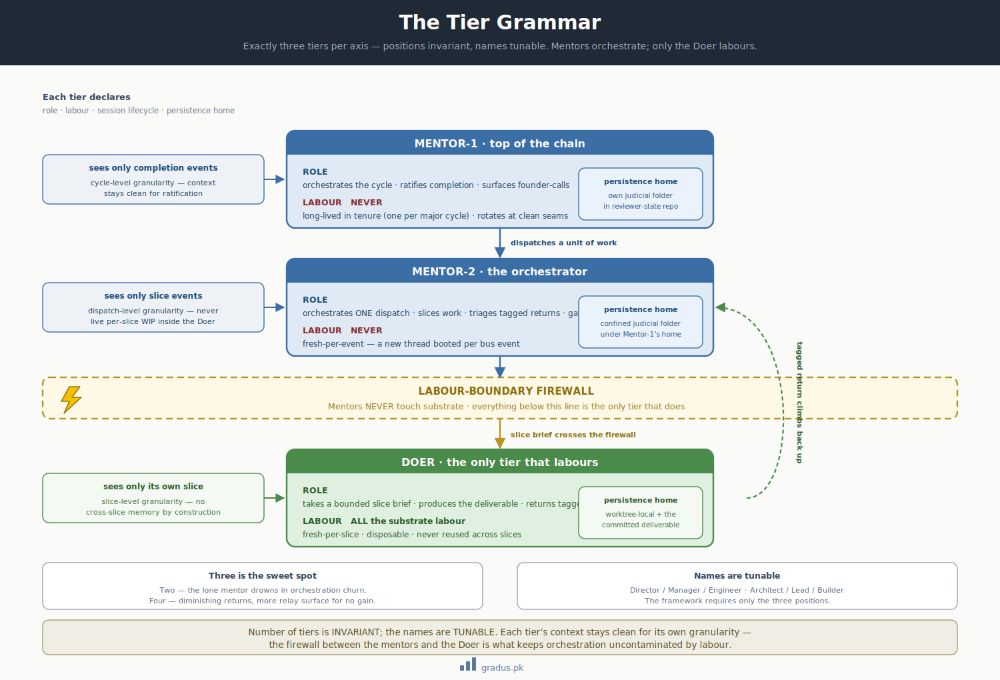

# Axiom 1: Tier Grammar

> *Three tiers per axis. Mentor-1 / Mentor-2 / Doer. Names tunable; positions invariant.*

`[INVARIANT — number of tiers]` `[TUNABLE — names]`

## TL;DR

CompassAlpha specifies **exactly three tiers per axis**: a top mentor, a middle orchestrator, and a doer at the bottom. The names are project-specific; the positions and their distinct responsibilities are inviolable. This is the foundational structural rule from which all other axioms derive.


[](../assets/tier-grammar-pyramid.svg)

<small>*The tier stack: mentors orchestrate and never touch substrate; the Doer does all substrate labour. The labour-boundary firewall sits between them.*</small>

## The rule

| Generic name | Role | Labour? | Session lifecycle | Persistence home |
|---|---|---|---|---|
| **Mentor-1** | Top of the chain; mentors at the granularity of the axis's unit of work; ratifies completion; surfaces founder-calls. | NEVER | Long-lived in tenure (one per major cycle); rotates at clean seams. | Own judicial folder (rooted in reviewer-state repo). |
| **Mentor-2** | Orchestrator of ONE unit of work (dispatch/entity/etc.); slices work into Doer-sized chunks; triages tagged returns; applies ratification gates. | NEVER | Per-dispatch. Fresh thread per event (see [bus protocol](bus-protocol.md)). | Own confined judicial folder under Mentor-1's home. |
| **Doer** | The only tier that touches substrate. Takes a bounded slice brief; produces the deliverable; returns tagged. | **ALL** the substrate labour | Fresh-per-slice; disposable; never reused across slices. | Worktree-local + the deliverable committed under commit-discipline. |

The names "Mentor-1", "Mentor-2", "Doer" are the framework's universal vocabulary. Each axis declares its own role names. The rules speak in terms of Mentor-1 / Mentor-2 / Doer; each axis's reader substitutes its own names.

## Why three tiers (not two, not four)

**Two tiers (mentor + doer)** is insufficient pollution containment. The single mentor absorbs both orchestration churn (slice triage, integration) and high-level ratification. This is the exact pattern CompassAlpha was created to avoid: a single agent context polluted by absorbing every detail.

**Four tiers** has diminishing returns. Orchestration is already contained in Mentor-2; adding a fourth tier multiplies the relay surface for marginal benefit.

**Three is the sweet spot:**

- Mentor-1 sees only completion events
- Mentor-2 sees only slice events
- Doer sees only its own slice

Each tier's context stays clean for its appropriate work granularity. `[INVARIANT]`

## Why the names are tunable

Different projects want different tier role names, drawn from whatever metaphor fits their culture. For example:

- **Director / Manager / Engineer** (corporate)
- **Architect / Lead / Builder** (construction)
- **Strategist / Coordinator / Specialist** (military)
- **General / Captain / Soldier** (military)

The framework requires only the **three positions**. Names map to your culture.

## What violating this looks like

### Violation 1: Mentor doing slice work

A Mentor-1 or Mentor-2 directly authors substrate (writes code, edits doctrine docs). This violates Axiom 1 ("NEVER labour") and is the direct mechanism by which mentor context pollutes.

**Illustrative incident:** a top mentor directly ran a recon Bash session during a module's preparation, accumulating substrate detail in mentor context. The findings were correct, but the method violated tier grammar. Result: a hardened version of the rule — mentor tiers never labour — encoded into the protocol.

### Violation 2: Doer accumulating across slices

A Doer session is reused across multiple slices. The session accumulates context from earlier slices that biases the current slice. This violates the implicit "fresh-per-slice" rule that derives from tier grammar.

**Illustrative incident:** early pre-bus cycles used long-running Doer sessions. Each Doer accumulated cross-slice context that occasionally caused integration errors. Fix: fresh-per-slice mandated.

### Violation 3: Adding a fourth tier mid-cycle

A team decides to add a "Quality Reviewer" tier between Mentor-2 and Doer mid-cycle. This is structurally not an axis violation, but operationally creates relay surface where bus protocol expects three hops.

**Note:** Adding a tier should be done at axis-declaration time (rare, would amount to forking the framework). Doing it mid-cycle violates Axiom 1's three-tier rule.

## Implementation details

When you adopt CompassAlpha, you declare each axis's tier names exactly once, in the axis declaration:

```markdown
# AXIS: my-axis-name

TIER ROLE NAMES:
  Mentor-1:  Director
  Mentor-2:  Manager
  Doer:      Engineer
```

After declaration, **every reference** in your federation uses these names. Status grids, inbox files, stamped CLAUDE.md files, tags — all use your project's tier names. The framework's documentation uses Mentor-1/Mentor-2/Doer; your project's documents use your declared names.

## Variations / tunables on top

While the three positions are `[INVARIANT]`, the following are `[TUNABLE]`:

| Tunable | Default | Range |
|---|---|---|
| Tier role names | Project-specific declaration | Any strings |
| Mentor-1 session lifecycle | per-cycle long-running | per-cycle / per-epoch / fresh-per-event |
| Mentor-2 session lifecycle | fresh-per-event (bus) | fresh-per-event / per-dispatch |
| Doer session lifecycle | fresh-per-slice | fresh-per-slice (mandatory; only direction is more-frequent) |
| Number of axes | 2 (Build + Doctrine) | 1 to N |

[→ Concurrency modes](../03-tunables/concurrency-modes.md) for how parallel-doer mode operates within this axiom.

[→ Context patterns](../03-tunables/context-patterns.md) for Mentor session lifecycle choices.

## Cross-reference

- This axiom defines what **tiers** are; subsequent axioms specify what tiers **do**:
- [Firewall](firewall.md) — how tiers' contexts are isolated
- [Persistence law](persistence-law.md) — how tiers' state is durable
- [Hard labour rule](hard-labour-rule.md) — what mentors can and can't do
- [Bus protocol](bus-protocol.md) — how tiers communicate
- [Hierarchy tags](../07-reference/hierarchy-tags.md) — how messages between tiers are marked

---

## Next: [Axiom 2 — Firewall →](firewall.md)
