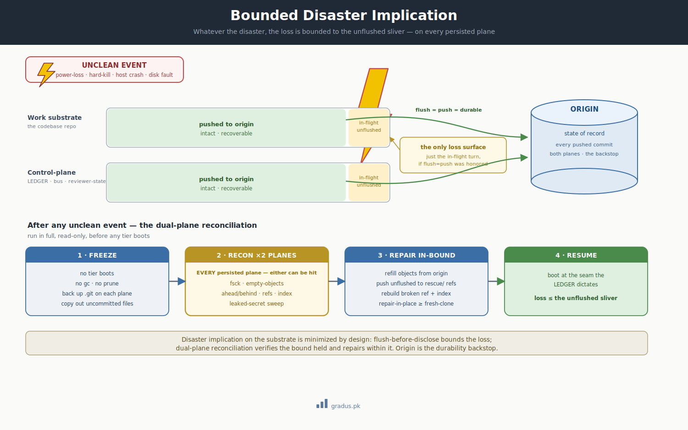

# Disaster Reconciliation

> *Whatever the disaster, its implication on the substrate is bounded — and verified. After any unclean event, every persisted plane is reconciled in full before a single tier boots.*

`[INVARIANT — dual-plane reconciliation after any unclean event]` `[TUNABLE — the exact recon + repair commands]`

This page is about what happens when the lights go out mid-work — a crash, a power cut, a force-kill — and how CompassAlpha makes sure that costs you almost nothing. The short version: anything already saved to the shared remote is safe, and a careful checkup runs and repairs every storage area *before* any agent is allowed to start working again.

## TL;DR

In plain terms: a crash can leave your git storage in a half-broken state, but the framework is built so the damage can only ever reach the small bit of work that hadn't been saved yet — and a thorough, look-don't-touch checkup confirms that and fixes the rest before anyone resumes.

An unclean event — power loss, a hard kill, a host crash, a disk fault — can leave a federation's git planes damaged: zeroed objects, a truncated index, a broken ref, an interrupted pre-commit artifact. CompassAlpha's posture is that **the disaster's implication on the substrate is minimized by design**: [flush-before-disclose](../01-axioms/persistence-law.md) plus push-to-origin bound the loss to the genuinely-unflushed, and an **aggressive, read-only reconciliation across every persisted plane** — run *before any tier boots* — verifies the bound held and repairs within it. The recovery is not improvised; it is a rehearsed protocol that ends with the federation booting at the seam the control-plane LEDGER dictates, with loss never exceeding the in-flight sliver.

<small>*The blast radius is bounded by construction: everything pushed to origin is intact; only the in-flight, unflushed sliver is ever at risk. The dual-plane reconciliation — freeze → recon ×2 → repair-in-bound → resume — confirms the bound and recovers within it.*</small>

## The principle: bounded implication, by design

This guardrail is the operational payoff of the [persistence law](../01-axioms/persistence-law.md). Because every load-bearing artifact is committed and pushed to origin *before* it is disclosed or acted on, the **state-of-record always lives on a remote that the local crash cannot touch**. Local corruption is therefore recoverable, and the only thing a disaster can genuinely destroy is work that was still in-flight — uncommitted, unpushed — at the instant the power dropped.

That is the whole claim: a power-down is a shrug, not a catastrophe, and it is a shrug *by design*, not by luck. The reconciliation protocol exists to **prove the bound held** on every plane and to repair the damage without ever exceeding it.

## Why every plane, always

A federation persists to **more than one git-backed plane**: at minimum a **work substrate** (the codebase repo) and a **control-plane** (the reviewer-state repo holding the LEDGER, the bus inboxes, and judicial state). Each axis you [declare](../03-tunables/axis-declarations.md) may add further planes.

The load-bearing lesson: **either plane can be damaged independently, and a single event can damage a different plane each time.** A reconciliation that inspects only the substrate — because that is "where the code is" — will sail past a corrupted control-plane and boot the federation onto a broken LEDGER. The rule is therefore unconditional: **reconcile every persisted plane the federation writes to, every time.** Checking one is the trap.

## The reconciliation protocol

Run in full, **read-only first**, before any tier boots.

### 1 · Freeze

Do **not** boot a tier onto a damaged repo, and do **not** run `git gc` / `prune` — garbage-collecting a corrupted object store can turn recoverable damage into permanent loss. Back up each plane's `.git` directory first (`cp -a .git .git.bak`), and copy out any uncommitted working files — they are plain files, independent of object-store corruption, and copying them makes every later step reversible.

### 2 · Recon — every plane

For **each** persisted plane, run the read-only inventory:

| Check | What it tells you |
|---|---|
| `git fsck --full` | Corrupt vs. merely dangling objects; broken refs |
| empty-object scan | Zero-byte loose objects — the classic power-loss signature |
| `git ls-remote origin` | Is origin reachable and complete? (the durability backstop) |
| ahead / behind per branch | **Unpushed local commits** — the only thing a fresh clone would drop |
| ref + index integrity | A truncated index or an emptied ref file blocks later operations |
| leaked-secret sweep | A token embedded in a remote URL is compromised the moment it is seen |

The ahead/behind answer is the one that decides the repair path — so reconcile *before* you act.

### 3 · Repair, in-bound

- **Repair-in-place is preferred** when origin is complete and there is unpushed local work: clear the damaged objects, refill from origin, restore the broken ref, rebuild the index. **Fresh-clone only** when nothing is unpushed — it is cleaner but silently abandons any local-only commits, which is why step 2's ahead/behind check gates the choice.
- **Preserve unpushed work first.** Push fast-forwardable branches; push diverged branches to a `rescue/` namespace so origin's real branches are never clobbered. Durability first, triage later.
- **A truncated index and a broken ref are disposable** — both rebuild from a sound object store and the reflog; only a staging snapshot is ever lost, never file contents.

!!! note "A surviving commit does not mean a sound history"
    A power cut can zero an object that a commit still *references* — the commit reads fine, but its trees or blobs are gone. A plain `git fetch` will not refill them: git sees the commit present locally and assumes it already holds everything reachable from it. Force a full re-fetch (or backfill the objects from a fresh mirror) so the missing reachable objects actually return. Re-run `fsck` until it reports dangling-only.

### 4 · Resume — at the LEDGER seam

Boot at the seam the **control-plane LEDGER dictates** — *not* the substrate's session-state trail, which can be days stale. The LEDGER is the authority on where the federation actually stood. A tier that had already stood down is not rebooted; the tier that holds the next move boots first and consumes the pending state.

## The recovery flush

A disaster frequently catches a **complete artifact mid-commit** — a finished return package or close-of-turn integration written to disk but not yet committed and pushed. Completing that commit is **recovery, not authoring**: the work product already exists and is verified concordant against its source; the only thing the crash interrupted was the `commit + push`.

The judgment of *whether the artifact is complete and may be flushed* belongs to a **booted tier that owns that jurisdiction** — never to the founder relay (who must not compose or arbitrate, per [brief completeness](brief-completeness.md)) and never blind-committed on someone else's say-so. The booting tier verifies, then flushes verbatim. [Single-live-writer](single-live-writer.md) and the bounded-loss guarantee hold throughout.

## What violating it looks like

### Example 1 — Booting onto a damaged plane

A tier is rebooted immediately after a host cycle, onto a substrate with zeroed objects. It reads a half-corrupt tree, "repairs" it by committing over the gap, and pushes — propagating the corruption to origin and destroying the clean backstop. The freeze step exists precisely to prevent this.

### Example 2 — Reconciling only one plane

The substrate `fsck`s clean, so the federation boots — but the control-plane's LEDGER ref was the one that broke. Tiers resume from a stale or unreadable seam, and the cycle's actual position is lost. Both planes take the hit; checking one is not reconciliation.

### Example 3 — Fresh-clone over unpushed work

Faced with local corruption, an operator reclones from origin "to be safe." Origin was behind; several branches held unpushed commits. The reclone is pristine — and silently drops every unpushed commit. The ahead/behind check would have caught it; skipping reconciliation in favour of a clean-looking shortcut is how bounded loss becomes real loss.

## Variations / tunables on top

| Tunable | Default | Range |
|---|---|---|
| Recon depth | full `fsck --full` + empty-scan + ref/index + secret sweep, every plane | full / fast-triage (origin-complete + ahead/behind only) |
| Repair path | reconcile-then-choose (repair-in-place vs clone) | repair-in-place / fresh-clone / mirror-backfill |
| Unpushed-work handling | `rescue/` namespace push before any destructive step | rescue-namespace / branch-local tag / operator review |
| Resume authority | control-plane LEDGER seam | LEDGER seam (recommended) / last-clean-checkpoint |

The *principle* — every plane reconciled before any boot, loss bounded to the unflushed — is `[INVARIANT]`. The *commands and depth* are `[TUNABLE]`.

## Remember this

- **A crash is a shrug, not a catastrophe — by design.** Anything pushed to the shared remote (origin) survives any local mishap; only work that was still in-flight is ever at risk.
- **Check every storage area, not just the obvious one.** A federation writes to more than one git repo (the code, plus a control-plane that tracks who's doing what). Either can break on its own, so you reconcile all of them before booting anything.
- **Look before you touch.** Run the read-only checkup first, never `git gc` on a damaged repo, and let the "ahead/behind" answer decide how to repair — that's what keeps a bounded loss from becoming a real one.
- This guardrail is the safety net under [the mental model](../00-foundation/mental-model.md): durable state lives on the remote, so the local machine is always disposable.

## How this connects to other axioms and guardrails

- **[Persistence law](../01-axioms/persistence-law.md)** is the axiom this guardrail pays off: flush-before-disclose + push-to-origin is what makes the loss bounded in the first place.
- **[Failure modes — power-down](failure-modes.md)** names the failure class in one line; this page is its full treatment, generalized from a single plane to *every* plane.
- **[Provenance law](../01-axioms/provenance-law.md)** is why resume trusts the LEDGER on disk over any tier's recollection of where things stood.
- **[Single-live-writer](single-live-writer.md)** and **[brief completeness](brief-completeness.md)** govern the recovery flush: the owning tier completes the interrupted commit; the relay never composes it.
- **[Git foundations](../01-axioms/git-foundations.md)** is the two-planes-never-cross-commit discipline that keeps each plane independently reconcilable.

---

## Next: [Brief Completeness →](brief-completeness.md)
