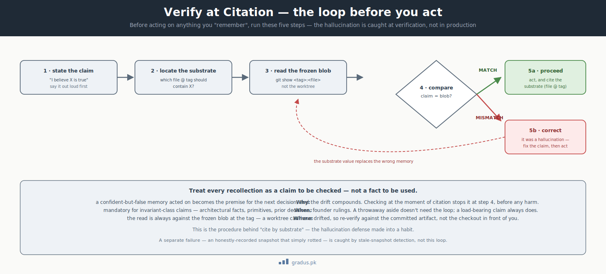

# Hallucination Defense

> *Memory is a hypothesis, never a fact. Every load-bearing claim is verified against substrate before it is acted on.*

`[INVARIANT]`

This page is about a simple, dangerous habit of AI: it can state something with total confidence that simply isn't true — and you can't tell the difference by listening. Here you'll see how CompassAlpha catches those confident fabrications before anyone acts on them.

## TL;DR

In plain terms: an AI will sometimes "remember" a decision, a spec detail, or a founder's ruling that never actually happened — and say it just as smoothly as a real one. The fix is to never trust the AI's memory for anything important; instead, check the claim against the real, written-down record before acting. Here's the longer version.

AI tiers fabricate plausible-but-false institutional memory — "I remember we decided X," "the Auth spec defines three roles," "the founder ruled DEFER on that." Confidently wrong, and indistinguishable from confidently right at the moment of utterance. CompassAlpha's defense is **verification-at-citation**: a tier's recall is treated as a *hypothesis* until checked against the immutable substrate (the committed codebase or doctrine source at a specific tag). The hallucination is caught at verification time, before it becomes the premise of the next decision. This is the operational face of the [provenance law](../01-axioms/provenance-law.md).



<small>*Before acting on anything you remember: state the claim, locate the substrate, read the frozen blob, and compare. Match → proceed and cite; mismatch → it was a hallucination, correct it. The fabrication is caught at the compare step, before it becomes the next decision's premise.*</small>

## The failure it prevents

A language model does not know the difference between a memory it formed and a memory it invented. Both arrive with the same fluency. In a long-lived federation this is corrosive in a way ordinary single-session use is not:

1. **Compounding.** A fabricated premise becomes the basis for the next decision, which becomes the basis for the one after. By the time the drift surfaces, several decisions rest on a fact that never existed.
2. **Cross-session divergence.** Two successive sessions of the same Mentor-1 may "remember" the same event differently. Without an external arbiter this is unresolvable he-said-she-said.
3. **Authority laundering.** A fabricated *founder ruling* is the most dangerous variant: it borrows the founder's authority for a decision the founder never made.

The defense is not "make the model remember better." Models will always be capable of confident fabrication. The defense is to **refuse to let memory be authoritative at all** for load-bearing claims.

## What violating it looks like

### Example 1 — Citing a spec from memory

A Mentor-1 tells the founder: *"The Auth module's role hierarchy is Viewer → Editor → Owner, per Auth spec §3."*

Reality: Auth spec §3 defines Viewer → Editor → Admin → Owner — four roles, not three. The mentor recalled wrong and the founder now plans around a hierarchy that doesn't exist.

**Caught by:** before citing, the tier must `git show auth-v0.1:docs/spec/auth.md` and read §3 from the frozen blob, not from recall.

### Example 2 — A founder ruling that never happened

A Mentor-2 writes into a brief: *"Founder ruled item-3 = DEFER (session 2026-05-15)."*

Reality: no such ruling exists in `HANDOVER_LOG.md` or any committed artifact. The mentor misremembered a discussion as a decision.

**Caught by:** every cited founder ruling must carry a substrate reference — `RULING-3 @ HANDOVER_LOG commit a1b2c3d`. A ruling with no locatable commit is, by rule, not a ruling.

### Example 3 — A decision attributed to a cycle that didn't make it

A tier asserts: *"We dropped soft-deletes in Reporting back in cycle 3."*

Reality: it was discussed in cycle 3 and never ratified; Reporting still has soft-deletes. Acting on the false memory would silently re-introduce a divergence between the federation's belief and the actual code.

**Caught by:** the claim is verified against the Reporting substrate at its cycle-tip tag before any action depends on it.

## How it's defended

### The verification-at-citation procedure

For any `[INVARIANT]`-class claim — architectural facts, primitives, prior decisions, founder rulings — the tier runs this before acting:

```
1. STATE the claim explicitly ("I believe X").
2. IDENTIFY the substrate that should contain X (which file, which tag).
3. READ the substrate from the frozen blob (git show <tag>:<file>).
4. COMPARE the claim to what the substrate actually says.
5. If MISMATCH → the claim was a hallucination; correct it, and surface the correction.
6. If MATCH → proceed, and cite the substrate, not the memory.
```

The discipline is captured in one rule: **cite by substrate, not by recall.** A citation references the frozen committed artifact at a tag, never the mentor's own LEDGER summary or memory notes.

### Substrate citation format

A verified claim is recorded with its provenance attached, so the next tier inherits the verification rather than re-fabricating:

```
file_path @ tag_name
file_path § <section> @ tag_name
ruling_id @ HANDOVER_LOG commit_sha
```

Examples: `docs/spec/auth.md @ arch-auth-v0.1` · `billing-spec §10K @ arch-billing-v0.1` · `RULING-1 @ HANDOVER_LOG commit a1b2c3d (2026-06-03)`.

### Memory as a curated index, not a parallel truth

Tiers may keep memory files — but a memory entry is valid only as a **pointer to substrate**, never as a freestanding source. Each entry cites the substrate event that triggered it and the substrate file that validates it, date-stamped. Memory becomes a fast index into the truth, not a competing copy of it.

!!! warning "Frozen blob, not the worktree"
    Verify against `git show <tag>:<file>`, not the current checkout. A worktree drifts the moment the branch advances; a tag is immutable. A tier that "verifies" against a stale worktree has only laundered a second hallucination through a git command. (See [Stale-snapshot detection](stale-snapshot-detection.md) for the worktree-vs-frozen failure in full.)

## Detection and recovery

**Detection.** A hallucination is detected at step 4 of the procedure above — the moment a confidently-stated claim fails to match the frozen substrate. The whole point of mandatory verification is that detection happens *before* action, not after the founder notices the drift.

**Recovery.** Correct the claim, surface the correction explicitly (do not silently swallow it — the founder's trust depends on seeing the system self-correct), and re-anchor any downstream decisions that were built on the false premise. If a fabricated founder ruling was propagated, the recovery includes re-confirming the actual founder intent, not just deleting the bad citation.

## Remember this

- An AI's memory is a **guess**, not a fact — confidently wrong sounds exactly like confidently right, so treat every load-bearing claim as unverified until checked.
- The check is simple: **look it up in the frozen, committed record** (a file at a specific tag), not in the AI's recollection. Cite by substrate, not by recall.
- The most dangerous fabrication is a **founder ruling that never happened** — it borrows real authority for a decision no one made. Every cited ruling must point to a locatable commit, or it isn't a ruling.
- This is one piece of the bigger picture — see [the mental model](../00-foundation/mental-model.md) for how verification fits the whole federation.

## How this connects to other axioms and guardrails

- **[Provenance law](../01-axioms/provenance-law.md)** is the load-bearing core this guardrail expands — cite-by-substrate, AI memory is not authoritative, frozen-base provenance.
- **[Persistence law](../01-axioms/persistence-law.md)** ensures the substrate exists on disk to verify against; provenance adds that it is also the *citation source*.
- **[Stale-snapshot detection](stale-snapshot-detection.md)** is the special case where the "hallucination" is an honestly-recorded snapshot that has simply rotted into falsehood.
- **[Failure modes — AI memory drift](failure-modes.md)** records this failure class with its recovery in the consolidated index.

---

## Next: [Stale-Snapshot Detection →](stale-snapshot-detection.md)
