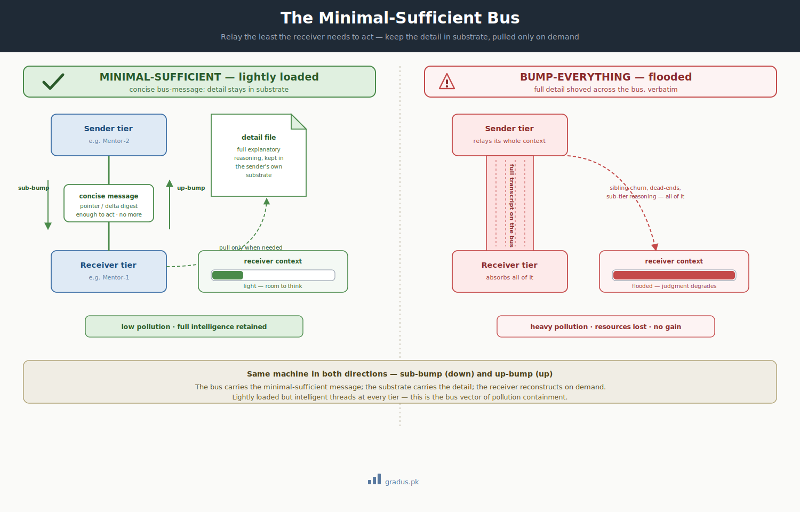

# The Minimal-Sufficient Bus

> *Relay the least the receiver needs to act; keep the detail in substrate, pulled only on demand. Lightly loaded but intelligent threads at every tier.*

`[INVARIANT — minimal-sufficient relay]` `[TUNABLE — pointer vs. concise digest]`

This page explains a simple habit: when one agent hands work to another, send just enough for them to act — a short note and a pointer to where the full story lives — instead of dumping everything you know. It matters because an agent buried in someone else's details thinks worse, not better.

## TL;DR

In plain terms: don't forward the whole conversation — forward a short note that says "here's what changed and where to look," and leave the rest on disk for the other agent to read if they actually need it.

Every message that crosses the relay bus between tiers should be **minimal-sufficient**: as complete as the receiver needs to act or decide, and *no more*. The full explanatory detail — the reasoning, the dead-ends, the sibling churn — is **persisted in the sender's own substrate files** and pulled by the receiver *only when needed*. Relay a pointer or a concise delta digest; never shove a full transcript across the bus. This is the **bus vector of [pollution containment](pollution-containment.md)**: where that guardrail keeps context from bleeding across the tier *hierarchy*, this one keeps it from being *pushed* across the *bus*. The result is lightly loaded but intelligent threads at every tier — `[INVARIANT]` in principle; the message *form* is the tunable.

<small>*Left: a concise bus-message carries just enough to act; the detail lives in the sender's substrate and is pulled on demand, so the receiver stays light and clear-headed. Right: shoving the full transcript across the bus floods the receiver's context — heavy pollution, resources spent, no intelligence gained.*</small>

## The rule: minimal-*sufficient*, not minimal

The discipline is not "relay as little as possible" — an under-informative ping forces the receiver to go digging and stalls the work. It is **minimal-*sufficient***: the message must carry enough for the receiver to act or decide unambiguously, and then stop. Everything beyond that threshold — the explanatory body — belongs **in the sender's own substrate**, where the receiver can reconstruct it on demand if a decision actually turns on it.

Two forms satisfy the rule, chosen by what the receiver needs:

- **A pointer** — a directive plus a substrate path ("the seam is here; read your brief at this location"). Sufficient when the receiver's next move is to go read and act.
- **A concise delta digest** — status plus the deltas that changed, without the transcript. Sufficient when the receiver must *decide* and needs the shape of the change in hand.

In both cases the explanatory detail is **persisted, not relayed**. The receiver pulls it from substrate only if a decision depends on it.

## Why it exists: the bus vector of pollution

Even when tiers run as a sub-agent-paired model, they **still exhaust one another's context across the bus**. A mid-tier mentor that mostly orchestrates — absorbing a doer's output and relaying it onward — pollutes heavily if it carries every return in full. A top mentor that sits quiet through a cycle nonetheless **drowns if everything is bumped up to it verbatim**. The cost is pure: context budget spent, no proportional intelligence gained, judgment degraded exactly where the federation most needs it sharp.

This is [context pollution](pollution-containment.md#the-failure-it-prevents) arriving by a different route. [Pollution containment](pollution-containment.md) guards the *spatial* vector — a tier auto-reading a folder it does not own. The minimal-sufficient bus guards the *relay* vector — a sender pushing detail the receiver never needed across the channel between them. Same pathology, same budget destroyed; different door.

When the cohorts relay pointers and concise digests while persisting the explanatory detail in their own files, **both sides stay light** — and lighter tiers are *more* intelligent, not less, because their budget is spent on judgment instead of on absorbing noise.

## Same machine, both directions

The mechanism is identical going down or up; only the direction differs:

| Direction | Bump | Example |
|---|---|---|
| **Downward** | **sub-bump** | a mentor propagates a charter primitive / directive to a lower tier |
| **Upward** | **up-bump** | a component bubbles a charter amendment toward the parent |

In both, the bus carries the minimal-sufficient message, the substrate carries the detail, and the receiving tier reconstructs on demand. The rule is symmetric — there is no "down is terse, up is verbose" asymmetry to remember.

## Two lines that keep the rule honest

### Pointer-complete is not detail-complete

There is an apparent tension with [brief completeness](brief-completeness.md), which forbids placeholders at the relay. The resolution: **the bus-message must be complete *as a pointer or digest*** — every field the receiver needs to locate the work and act on it is present and filled — but it deliberately does **not** inline the full payload. Brief-completeness is satisfied (nothing the receiver needs is missing); boot-light is satisfied (nothing the receiver doesn't need is inlined). The line is *sufficiency*, not *volume*.

### Don't relocate pollution from the bus into the boot

If the explanatory detail now lives in each tier's own files, those files must not become the new bloat that every fresh session re-reads at boot. The same [boot-light discipline](../03-tunables/context-patterns.md#keeping-fresh-per-event-actually-fresh) applies: the detail-file may be *full* — knowledge is preserved on disk — but the **boot read of it is trimmed and on-demand**. *Trim the load, not the knowledge.* Otherwise the pollution simply moves from the bus into every boot.

## What violating it looks like

### Example 1 — Bumping the full transcript up

A mid-tier finishes a dispatch and relays its entire working context — every file read, every dead-end, the full reasoning trail — up to the top mentor "so it has the full picture." The top mentor now carries a cycle's worth of slice-level noise it will never act on. Its next ruling is made through that fog. The fix: relay a concise digest; persist the trail in the mid-tier's own LEDGER.

### Example 2 — The under-informative ping

Over-correcting, a sender relays a bare "done — check the repo." The receiver cannot tell *what* changed or *where* to act, and burns a turn reconstructing context the sender already had. Minimal-sufficient was violated in the other direction: the pointer was not complete enough to act on.

### Example 3 — Detail that was never persisted

A sender relays a terse pointer but never wrote the explanatory detail to substrate — it lived only in the sender's volatile context. When the receiver pulls, there is nothing to pull. The rule requires the detail to be **persisted**, not merely *omitted from the relay*.

## Variations / tunables on top

| Tunable | Default | Range |
|---|---|---|
| Message form | concise digest (verbose audit trail) | pointer / concise digest / full digest |
| Digest verbosity | verbose | verbose / concise — the [context-patterns dial](../03-tunables/context-patterns.md) |
| Detail persistence locus | sender's own judicial / substrate file | judicial folder / dedicated detail file / commit body |

The *principle* — minimal-sufficient on the bus, detail persisted and pulled on demand — is `[INVARIANT]`. *Which* form a given message takes is the tunable, and it is exactly the [digest-verbosity dial](../03-tunables/context-patterns.md) seen from the bus.

## How this connects to other axioms and guardrails

- **[Pollution containment](pollution-containment.md)** is this guardrail's sibling: it guards the spatial vector of context pollution, this one the relay vector.
- **[Bus protocol](../01-axioms/bus-protocol.md)** is the channel; minimal-sufficient is the discipline on what that channel carries. The bus already moves content through git and keeps the founder's clipboard empty — this keeps the *receiver's context* empty of noise too.
- **[Persistence law](../01-axioms/persistence-law.md)** and **[provenance law](../01-axioms/provenance-law.md)** are what make pull-on-demand safe: the detail is durably on disk, and the receiver reconstructs from substrate rather than from a relayed summary.
- **[Context patterns](../03-tunables/context-patterns.md)** holds the boot-light discipline that stops the detail-files from becoming the new pollution.
- **[Retrieval discipline](retrieval-discipline.md)** mechanizes the pull-on-demand this guardrail relies on — and bounds it, so retrieving the detail doesn't reopen the pollution at the pull step.
- **[Brief completeness](brief-completeness.md)** sets the floor: the minimal-sufficient message is still *complete as a pointer* — sufficiency trims volume, never required fields.

## Remember this

- **Send the least the receiver needs to act — and no more.** Enough to act unambiguously, then stop. That's "minimal-*sufficient*."
- **The detail isn't lost — it's parked.** Write the full reasoning to your own files on disk; the other agent pulls it only if a decision actually depends on it.
- **This works in both directions.** Handing work down or bubbling a change up, the rule is the same: a short message on the bus, the detail in substrate.
- **A lighter agent is a smarter agent.** Spending its limited attention on judgment instead of absorbing noise is exactly why this guardrail exists — see [the mental model](../00-foundation/mental-model.md).

---

## Next: [Retrieval Discipline →](retrieval-discipline.md)
