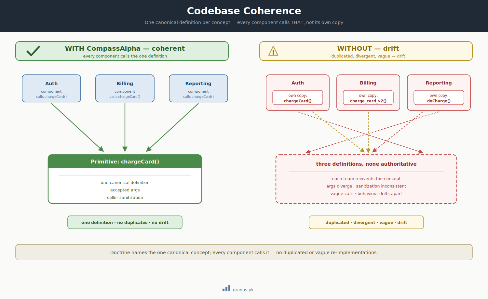

# Pollution Containment

> *Each tier sees only what it owns. Context bleed across tiers is contained by the firewall, not patched after the fact.*

`[INVARIANT]`

## TL;DR

**Context pollution** is the failure where a tier's working context fills with detail it does not own — a parent absorbing a child's slice-level churn, a mid-tier absorbing a doer's reasoning footprints. Polluted context makes judgment slower (cognitive overhead) and worse (the tier saw the trees and lost the forest). CompassAlpha contains it structurally: the [firewall](../01-axioms/firewall.md) confines each tier to its own folder, and **state-tracking scope** confines each mentor to its own granularity. Containment is a property of the structure, not a discipline you remember to apply.

[](../assets/codebase-coherence.svg)

<small>*The same containment principle at the code level: one canonical definition per concept — not a divergent copy per tier or team.*</small>

## The failure it prevents

In a federation, every tier carries a finite, precious context budget. Pollution is the slow leak of that budget into detail the tier has no business holding:

- A **Mentor-1** that tracks cycle-level state absorbs slice-level WIP, integration churn, and a sub-tier's intermediate reasoning.
- A **Mentor-2** that should ratify clean summaries instead carries every dead-end its Doer explored.

Two compounding harms follow:

1. **Degradation** — the tier spends budget reasoning over detail it cannot act on, so the decisions it *should* make arrive slower and shallower.
2. **Bias** — having seen the sub-tier's path, the tier anchors on it and loses the independent, higher-altitude view that justified its existence as a separate tier in the first place.

The worst variant is **delegated-context pollution**: a parent spawns a sub-agent expecting isolation, but the sub-agent's full return passes back through the parent's context on retrieval. The isolation was illusory; the parent is polluted anyway. (See [Failure modes §HYBRID DELEGATED](failure-modes.md#hybrid-delegated-context-pollution).)

## What violating it looks like

### Example 1 — A mentor auto-reads a sub-tier's working folder

A Mentor-1 boots while a Mentor-2 dispatch is already running. To "catch up," it runs `ls /path/to/reviewer-state/tier-2-billing/` and reads the live WIP.

Result: Mentor-1's context now holds Billing's slice-level detail — detail it does not own and cannot act on. Cycle-level state-tracking is now entangled with entity-level. Every subsequent Mentor-1 judgment is made through that noise.

### Example 2 — A mid-tier descends to "help" its doer

A Mentor-2 sees its Doer struggling on a Reporting slice and opens the Doer's worktree to debug alongside it.

Result: Mentor-2 absorbs the slice's reasoning footprints and dead-ends. It can no longer ratify the eventual return *independently* — it already lived inside the work. The separation of dispatch from labour collapsed.

### Example 3 — Cross-axis bleed

The Mentor-1 of a build axis reads the folder of a doctrine axis "just to stay aligned." The two axes are independent threads sharing only the protocol; now the build-axis mentor carries doctrine churn it will never act on, and its boot-time grounding is contaminated by another axis's in-flight state.

## How it's contained

Containment rests on two mechanisms working together.

### Mechanism 1 — The firewall (spatial containment)

Each tier writes **only** inside its own folder and **never auto-reads** another tier's folder during routine flow. Reading across the boundary is permitted only on a deliberate trigger — escalation, or an exit-study before final release — and even then the read is **narrow, transient, and never mirrored** into the tier's canonical state.

```
reviewer-state/
├── tier-1-mentor/          ← Mentor-1 reads ONLY here (its own files + inbox)
│   ├── LEDGER.md
│   ├── inbox/
│   └── tier-2-billing/     ← opaque to Mentor-1 during routine flow
│       ├── LEDGER.md
│       └── slice-1/inbox/  ← opaque to Mentor-2's parent
```

What reaches a parent reaches it **only via a tagged return** through the [bus protocol](../01-axioms/bus-protocol.md) — a summary, sized to the parent's granularity, not the raw working state.

### Mechanism 2 — State-tracking scope (granularity containment)

A mentor tracks **only the granularity it owns**:

| Tier | Tracks | Does NOT track |
|---|---|---|
| Mentor-1 | Dispatch/cycle-level state; the handoff snapshot | Live per-slice, per-entity WIP |
| Mentor-2 | Its dispatch + per-checkpoint milestones | Live per-slice WIP inside the Doer |

Live sub-tier progress lives in the **sub-tier's own folder** and is opaque to the parent until a tagged return or close. This is what makes aggressive session-refresh safe: any session can be discarded and rebooted from disk without loss, because no tier is hoarding another's state in memory.

### The delegated-pollution containment: pure RELAY over HYBRID

CompassAlpha defaults to **pure RELAY** — separate sessions handing off via paste-relay or a bus-mediated inbox — precisely because sub-agent delegation leaks the delegate's context back into the parent on retrieval. Sub-agent spawning at mentor tiers is used only if returns are summarized at a *separate* tier before reaching the parent. The containment is in the topology, not in a filter.

!!! note "Containment is structural, not behavioral"
    You do not contain pollution by *trying not to read* the wrong folder. You contain it by building the federation so that reading the wrong folder is an explicit, deliberate, logged act — never the path of least resistance. If staying clean depends on willpower, it will fail under fatigue.

## Detection and recovery

**Detection.** Pollution shows up as the [context-health signals](failure-modes.md) every tier self-monitors: responses lengthening without added content, recognition fuzziness, needing to re-read what should already be known. A mentor that finds itself reasoning about slice-level detail it cannot name a tagged return for is polluted.

**Recovery.** Flush all load-bearing state to disk (Layer-A: write + read-back + push), then **rotate the session**. Because state lives on disk and not in the polluted context, the fresh session reboots clean from its own folder and inbox. Do not push through pollution by "being careful" — refresh is cheap; degraded judgment is not.

## How this connects to other axioms and guardrails

- **[Firewall + state-tracking scope](../01-axioms/firewall.md)** is the axiom this guardrail operationalizes — the spatial and granularity containment both live there.
- **[Hard labour rule](../01-axioms/hard-labour-rule.md)** prevents the descent-to-help variant: mentors don't pollute by doing labour; doers escalate clean summaries upward instead.
- **[Stale-snapshot detection](stale-snapshot-detection.md)** is the failure that occurs when containment succeeds *spatially* but a tier still treats an old summary as live — the inverse risk.
- **[Single-live-writer](single-live-writer.md)** prevents a parallel-writer variant where overlapping writers cross-contaminate each other's folders.

---

## Next: [Hallucination Defense →](hallucination-defense.md)
