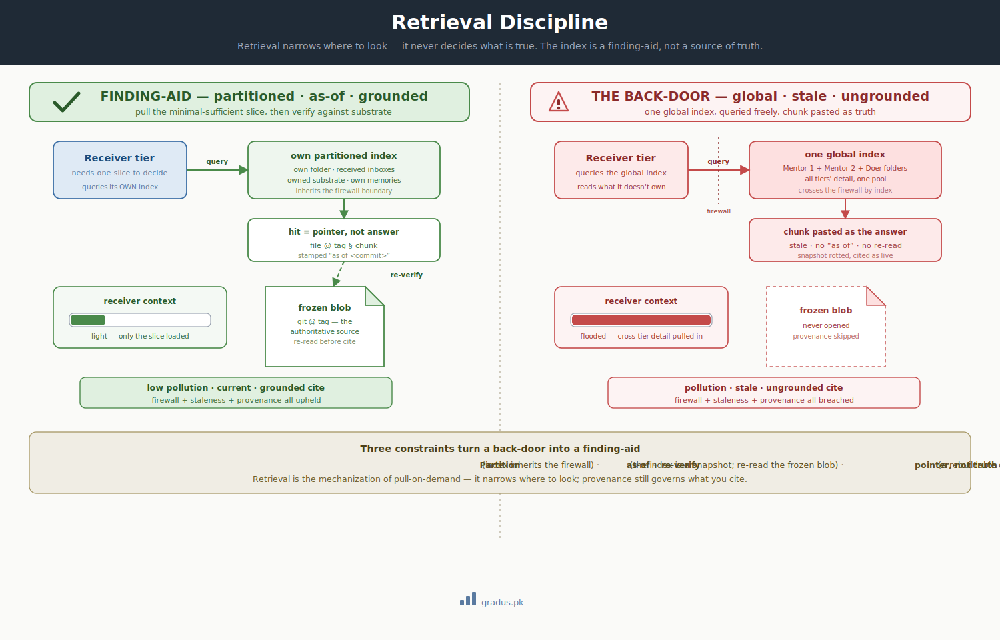

# Retrieval Discipline

> *Retrieval narrows where to look; it never decides what is true. The index is a finding-aid, not a source of truth.*

`[INVARIANT — retrieval constraints]` `[TUNABLE — the mechanism, see the retrieval surface]`

When an AI agent needs one fact buried in a big file, it's tempting to let a search tool fetch it automatically — this page explains how to use that kind of search safely, so the agent finds *where to look* without accidentally reading things it shouldn't, trusting outdated copies, or quoting the search result as if it were the truth.

## TL;DR

**In short:** "Search" here means a retrieval system (RAG, or a lighter keyword version) that pulls the one relevant slice of a file instead of the whole thing. Used carelessly, it quietly re-creates three mistakes the framework already bans. The fix is three rules, spelled out below.

The [minimal-sufficient bus](minimal-sufficient-bus.md) says the detail stays in substrate, **pulled only on demand** — but it never specifies *how* a receiver pulls. Left unspecified, "pull on demand" degrades into reading the *whole* LEDGER, the *whole* return, the *whole* history to find the one slice a decision turns on — and that full-read is itself a pollution event. **Retrieval** (RAG, or its leaner lexical cousin) is the mechanization of the pull: retrieve the *minimal-sufficient slice*, not the whole file. It is powerful — and it opens a new failure surface, because a naïve retrieval index **re-implements three pathologies the constitution already forbids**: auto-reading across the [firewall](../01-axioms/firewall.md), treating a [stale snapshot](stale-snapshot-detection.md) as live, and citing recall over [substrate](../01-axioms/provenance-law.md). This page names that failure class — **the retrieval back-door** — and fixes the three `[INVARIANT]` constraints that keep retrieval honest. *Which* retrieval mechanism a project uses is `[TUNABLE]` — see [the retrieval surface](../03-tunables/retrieval-surface.md).

<small>*Left: disciplined retrieval — the tier queries **its own** partitioned index, gets back an `as-of` pointer, and reads the **frozen blob** to ground the claim. Light context, grounded cite. Right: the back-door — one global index any tier queries crosses the firewall, returns a stale chunk, and the tier cites the chunk verbatim. Polluted, stale, ungrounded — all three axioms breached at once.*</small>

## The failure it prevents: the retrieval back-door

Retrieval is seductive precisely because it is useful — it makes the right slice appear without a full-text dredge. The danger is that the *easiest* index to build is the one that breaks the framework: a single global index over everything, queried freely, whose hits are pasted straight into the reasoning. Each of those three conveniences is a pathology the axioms already outlaw:

- **One global index, any tier queries it** → a tier reads what it does not own. That is exactly [auto-reading a sub-tier's folder](../01-axioms/firewall.md) — the firewall breached, by index instead of by `ls`.
- **The index is computed once and reused** → every hit is a [snapshot](stale-snapshot-detection.md). A hit retrieved today and acted on tomorrow is the firewall leak, mechanized and scaled across every query.
- **The retrieved chunk is treated as the answer** → the tier cites recall, not substrate. That is the [provenance law](../01-axioms/provenance-law.md) violated with extra steps; the chunk is a *hypothesis*, no more authoritative than a memory.

The discipline is not "don't use retrieval." It is: **use it as a finding-aid only**, bound by the three constraints below.

## The three constraints

### 1. Tier-partitioned scope — the index is not a back-door past the firewall

Retrieval is **partitioned per tier**. Each tier's index covers only what that tier is [entitled to read](../01-axioms/firewall.md) — its own folder, the inboxes it receives, its own memories, and the substrate it owns or reviews. There is **no global index that any tier can query**. A Mentor-1 cannot retrieve a Doer's slice-level detail any more than it can `ls` the Doer's folder during routine flow; the index inherits the firewall's boundary exactly.

A [forensic descent](stale-snapshot-detection.md#forensic-descent-before-action) across the firewall remains what it always was — a deliberate, narrow, transient, **un-mirrored** act on a real trigger (escalation, exit-study). It is *not* mechanized into routine retrieval. The moment retrieval becomes the standing way a tier sees across the boundary, the firewall is gone.

This holds **regardless of harness**. A vector store wired in through a single MCP server that every tier queries is the same global-index back-door, just behind a protocol — give each tier its own namespace or endpoint. A local model that bakes retrieval into its own loop is bound identically. The partition is a property of the index, not of the agent that queries it.

### 2. As-of stamping + re-verify against the frozen blob — the index is a snapshot

Every index is a snapshot by construction: it is computed at index-time, and the substrate advances afterward. So every retrieval hit carries an **`as of <commit>`** watermark, and **for any load-bearing use the tier re-reads the frozen blob at the relevant tag** before citing or acting ([provenance law](../01-axioms/provenance-law.md#verification-before-action); [stale-snapshot detection](stale-snapshot-detection.md#forensic-descent-before-action)). Retrieval tells you *where to look*; provenance still governs *what you cite*. A hit is a lead, never a verdict.

This is the same discipline the firewall already demands of every sub-tier snapshot — "current" means "as of the last tagged return, re-verified," never "live." Retrieval does not earn an exemption; it earns the *strictest* application of the rule, because it produces snapshots in bulk.

### 3. Pointer, not truth — the index is a rebuildable cache, never a state-of-record

The framework's durability layer is [git](../01-axioms/git-foundations.md), and the framework runs on **no specialized databases**. A retrieval index — lexical or vector — is therefore a **rebuildable cache derived from substrate**: drop it entirely and it regenerates from git. It holds *locations* (pointers: `file @ tag § chunk`) and, optionally, embeddings over content — but the authoritative content stays in the commit history. The index never becomes a parallel source of truth, and nothing load-bearing lives only inside it.

### The boot-light echo — don't relocate pollution into the index

The same trap that the minimal-sufficient bus warns of — [don't move the pollution from the bus into the boot](minimal-sufficient-bus.md#dont-relocate-pollution-from-the-bus-into-the-boot) — applies here. If building or refreshing the index is itself a heavy context event for a tier, or if a query returns oversized chunks, the pollution has simply moved into the retrieval step. So: **index-build runs off the tiers' context budget** (server-side, on the host), and **the retrieved slice is itself minimal-sufficient** — the least the receiver needs to act, no more. *Trim the load, not the knowledge.*

## What violating it looks like

### Violation 1 — The global index that crosses the firewall

An adopter builds one embeddings index over the entire reviewer-state repo "so any tier can find anything." A Mentor-1, deciding a cycle-level question, queries it and retrieves slice-level reasoning from a Doer's folder. Its context now carries detail it does not own — the [pollution](pollution-containment.md) the firewall exists to prevent, delivered by query.

**Fix:** partition the index per tier. Mentor-1's index covers Mentor-1's folder + received inboxes + owned substrate only. Slice detail reaches it via tagged return or a deliberate forensic descent — never via standing retrieval.

### Violation 2 — The stale hit cited as live

A tier retrieves a chunk describing a module "at stage S2a," computed when the index last ran a week ago. It acts on S2a. The module reached S4 days ago. The index produced an honest snapshot that rotted — the [firewall leak](stale-snapshot-detection.md), now arriving through retrieval.

**Fix:** the hit is stamped `as of <commit>`; before acting, the tier re-reads the frozen blob at the current tag (or requests an interim tagged return). The index narrowed the search; provenance grounded the decision.

### Violation 3 — The chunk pasted in place of the substrate

A mentor retrieves a chunk of a spec and cites it directly in a brief — never opening the file. The chunk was a near-duplicate from an older revision the index hadn't dropped. The brief now carries stale doctrine, cited confidently. This is [citing by recall](../01-axioms/provenance-law.md#cite-by-substrate-not-by-recall) with a retrieval step bolted on.

**Fix:** treat the chunk as a pointer. Open `file @ tag`, read the frozen blob, cite *that*. Retrieval output is a hypothesis until the substrate confirms it.

## Detection and recovery

**Detection.** Audit the retrieval setup against the three constraints: *Is there a global index any tier can hit?* (back-door) · *Do hits carry an `as of` watermark, and does load-bearing use re-read the blob?* (staleness) · *Are chunks ever cited without opening the substrate?* (ungrounded). Any "yes / no / yes" is a leak. A retrieval layer with no partition, no watermark, or no re-verify step is a leak by construction, not just in practice.

**Recovery.** Re-partition the index to the firewall boundary; add `as of <commit>` stamping and a mandatory frozen-blob re-read before any load-bearing cite; re-anchor any decision made on a bare chunk. The cure is never "stop retrieving" (that returns you to whole-file dredging and bus flooding) — it is to make the pull obey the three constraints.

## Variations / tunables on top

| Tunable | Default | Range |
|---|---|---|
| Retrieval mechanism | lexical / grep-grade | lexical / embeddings-vector — the [retrieval-surface dial](../03-tunables/retrieval-surface.md) |
| Re-verify strictness | strict (re-read blob for every load-bearing cite) | strict / spot-check (anti-pattern for regulated work) |
| Index refresh cadence | per-commit to substrate it indexes | per-commit / scheduled / on-demand |

The **constraints** — tier-partitioned scope, as-of + re-verify, pointer-not-truth — are `[INVARIANT]`. The **mechanism** that satisfies them is `[TUNABLE]` and lives on [the retrieval surface](../03-tunables/retrieval-surface.md).

## Remember this

- **Search tells you *where* to look, never *what* is true.** A hit is a lead to chase, not an answer to quote — open the real file at the right version and cite that.
- **Each tier searches only its own stuff.** One shared search index that everyone can query is a back-door around the boundaries the framework draws — see [the mental model](../00-foundation/mental-model.md) for why those tier boundaries exist.
- **A search index goes stale the moment it's built.** Treat it like a cache you can throw away and rebuild from git — never the official record of anything.

## How this connects to other axioms and guardrails

- **[The minimal-sufficient bus](minimal-sufficient-bus.md)** specifies *that* detail is pulled on demand; this page disciplines *how* the pull is mechanized so it stays light and honest.
- **[Firewall + state-tracking scope](../01-axioms/firewall.md)** supplies the partition boundary the index must inherit — retrieval must not become the back-door past it.
- **[Stale-snapshot detection](stale-snapshot-detection.md)** is the failure an unstamped index reproduces at scale; the `as of` + re-verify constraint is its rule applied to retrieval.
- **[Provenance law](../01-axioms/provenance-law.md)** makes the pull safe: the hit is a pointer, the frozen blob is the truth, the cite is the substrate.
- **[Git foundations](../01-axioms/git-foundations.md)** keeps the index a rebuildable cache, never a specialized parallel database.
- **[The retrieval surface](../03-tunables/retrieval-surface.md)** is the tunable mechanism — grades, corpus, chunking, cadence — that this guardrail bounds.

---

## Next: [Hallucination Defense →](hallucination-defense.md)
