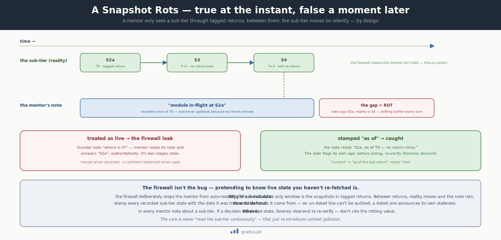

# Stale-Snapshot Detection

> *A snapshot is true at the instant it is taken and false a moment later. "Current WIP" in a mentor's notes means "as of the last tagged return" — never "live."*

`[INVARIANT]`

This page is about a quiet trap: a mentor writes down where a teammate's work stood at one moment, then keeps repeating that note as if it were still true — long after the work has moved on. Here you'll learn how to spot that "frozen note" problem and how the framework stops it.

## TL;DR

In short: notes about a teammate's progress go stale fast, so always stamp them with *when* they were true and re-check before acting.

The **firewall leak** is the subtle failure where a mentor records a true point-in-time snapshot of a sub-tier's progress, then keeps treating it as *live* long after the sub-tier has moved on. The snapshot was honest; it simply rotted. The sub-tier advances without telling the mentor — by design, that is the [firewall](../01-axioms/firewall.md) working — so a snapshot held as live drifts further from reality with every conversation turn. The defense is a linguistic and procedural discipline: every recorded sub-tier state is stamped **"as of `<return-date>`"**, and a mentor performs a forensic descent to re-verify before acting on it.



<small>*A tagged return is true the instant it's taken. The sub-tier then advances silently (the firewall working) while the mentor's note stays frozen — the growing gap is rot. Cited as live, it's a confident falsehood; stamped "as of `<date>`" and re-verified before acting, it's caught.*</small>

## The failure it prevents

This is the inverse of hallucination. The mentor did *not* fabricate anything — it recorded exactly what a tagged return said. The defect is purely **temporal**: the recording was accurate at time T and is being used at time T+N as though nothing changed.

Why it is structurally inevitable without the discipline: the firewall deliberately prevents the mentor from auto-reading the sub-tier's live state. So the mentor's only window into the sub-tier is the snapshots that arrive via tagged returns. Between returns, the sub-tier moves on silently. A mentor that forgets the snapshot has an expiry date will:

- Make decisions on a state the sub-tier left behind days ago.
- Surface that stale state to the founder while sounding authoritative.
- Compound the error — each turn restates the rotting snapshot as if freshly confirmed.

The firewall is not the bug here; it is the design. The bug is **pretending to know live state you have not re-fetched.**

## What violating it looks like

### Example 1 — A ledger that froze in time

A Mentor-1 receives a tagged return: *Billing is at stage S2a, expect two more days.* It writes into `LEDGER.md`:

```
Billing in-flight at S2a.
```

Three days later the founder asks where Billing is. The mentor reads its ledger and answers *"Billing is at S2a."* Reality: Billing reached S4 yesterday. The mentor is authoritatively wrong, and the founder makes a plan on a state two stages stale.

### Example 2 — The worktree that drifted under the work

A Mentor-2 operates on a substrate worktree checked out yesterday. Mid-cycle, the substrate's main branch advanced. The mentor ratifies a slice as *"matches latest substrate"* — but it matches the *worktree*, which is now stale. The ratification is against a snapshot, not against reality.

### Example 3 — A snapshot surfaced as live to the founder

In conversation, a mentor says *"the Reporting compass is at v0.1.2."* That value came from session memory of a return that was in flight when the session crashed before push. Disk says v0.1.1. The "current" claim is a snapshot that was never even durable.

## How it's enforced

### The "as of last tagged return" rule

A mentor tracks only the granularity it owns ([state-tracking scope](../01-axioms/firewall.md)), and **every** note about sub-tier state carries three things: the value, the timestamp it was true, and the tagged return it came from. The phrasing is not optional decoration — it is the detection mechanism.

A correct `LEDGER.md` entry:

```markdown
## Sub-tier state (as of last tagged return)

| Sub-tier | Last return | What they said | Tag |
|---|---|---|---|
| Mentor-2-Billing   | 2026-05-26 14:00 | S2a started; ~2 days | [[MENTOR-2→MENTOR-1 · Billing · S2a-started]] |
| Mentor-2-Reporting | 2026-05-26 18:30 | S5 close imminent     | [[MENTOR-2→MENTOR-1 · Reporting · S5-WIP]] |
```

Wrong (the leak): `Billing at S2a.` Right: `Billing last-known S2a, as of 2026-05-26 per tag — no return since.`

### The answer discipline

When the founder asks "where is Billing now?", the disciplined answer is:

> *"Last tagged return said S2a-started on May 26; no return since. I can request an interim update from the Mentor-2 if you need live state."*

Not *"Billing is at S2a."* The first answer is honest about what is knowable; the second silently promotes a rotting snapshot to a live fact. This one linguistic habit is the primary defense.

### Forensic descent before action

If a decision actually requires *live* sub-tier state — not just a status report — the mentor performs a **forensic descent**: a deliberate, narrow, transient read across the firewall to re-verify, exactly as the firewall permits for escalation and exit-study. The descended read is used for the decision and **not mirrored** back into the mentor's canonical state (mirroring it would just create the next stale snapshot). For substrate state, "re-verify" means reading the frozen blob at the relevant tag, not the drifted worktree.

!!! note "Detection lives in the grammar"
    The reason CompassAlpha insists on `as of <date>` framing is that it makes staleness *visible*. A ledger line with no timestamp cannot be audited for rot; a ledger line stamped `as of 2026-05-26` flags itself the moment someone reads it on June 9. The discipline turns an invisible temporal bug into a self-announcing one.

## Detection and recovery

**Detection.** Scan mentor notes for any sub-tier state lacking an `as of <date>` stamp — that is an un-auditable line and a leak candidate. A stamped line whose date is old relative to the cycle's pace is a leak waiting to be cited. The [failure-modes](failure-modes.md#firewall-leak-stale-snapshot-treated-as-live) index lists this as the firewall-leak class.

**Recovery.** Re-stamp the offending notes with explicit "as of" framing. Before acting on any sub-tier state, forensic-descend to re-verify or request an interim tagged return. Re-anchor any decision that was made against the stale value. The cure is never "read the sub-tier folder continuously" — that re-introduces [context pollution](pollution-containment.md). The cure is to know the snapshot's age and refuse to treat it as live.

## Remember this

- A snapshot of someone's work is only true at the moment you took it. Treating it as live later is the failure this guardrail catches.
- Stamp every note about a teammate's state with *when* it was true and *where* it came from. An unstamped note can't be audited for rot.
- When asked "where are they now?", say what you last heard *and when* — never promote an old snapshot to a live fact.
- Need live state? Go look again (a "forensic descent") rather than trusting the old note — but don't start reading their work continuously, or you trade one problem for another. If the idea of safe boundaries between tiers is new, start with [the mental model](../00-foundation/mental-model.md).

## How this connects to other axioms and guardrails

- **[Firewall + state-tracking scope](../01-axioms/firewall.md)** defines the snapshot-vs-live discipline this guardrail enforces; the leak is the named pathology that axiom exists to prevent.
- **[Hallucination defense](hallucination-defense.md)** handles the *fabricated* claim; this page handles the *honestly-recorded-but-rotted* claim. Both end in the founder hearing a confident falsehood.
- **[Pollution containment](pollution-containment.md)** is the opposing constraint: the fix for staleness must not become continuous auto-reading, which pollutes.
- **[Provenance law](../01-axioms/provenance-law.md)** supplies the worktree-vs-frozen-blob rule that defeats the drifted-worktree variant.

---

## Next: [Failure Modes →](failure-modes.md)
