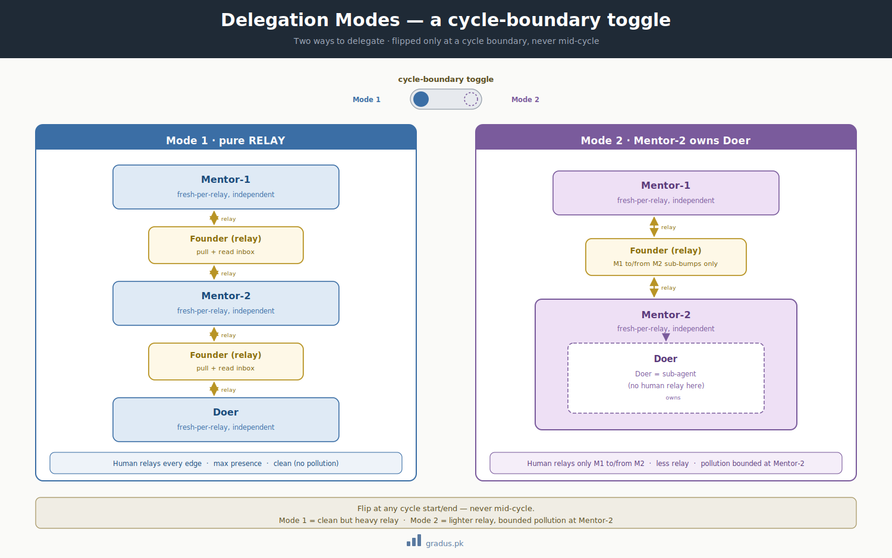
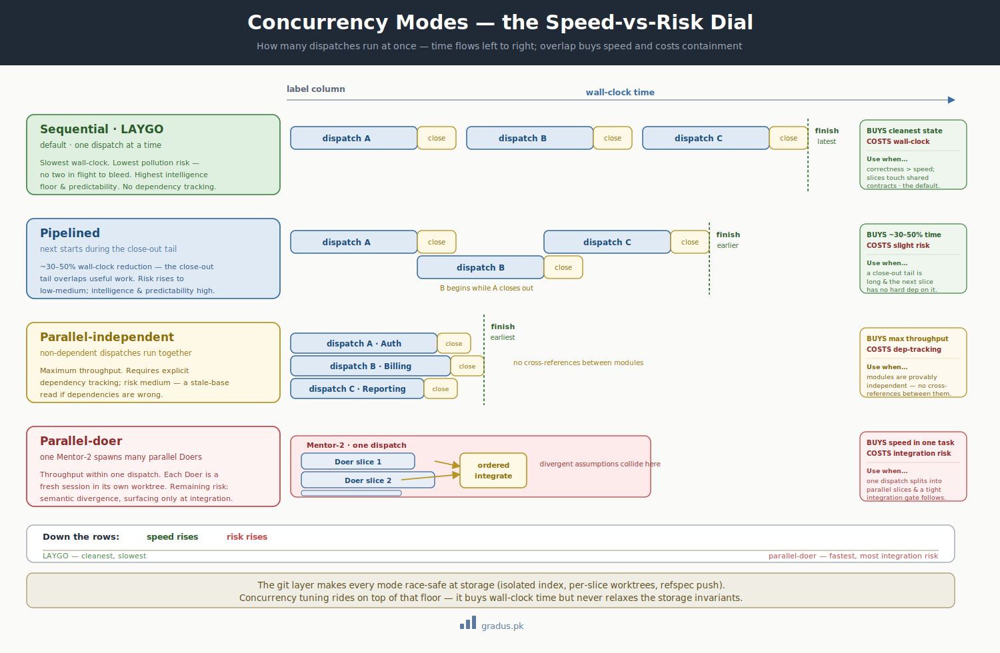

# Concurrency Modes

> *How many dispatches run at once. The primary speed-vs-risk dial.*

`[TUNABLE — concurrency mode]`

## TL;DR

Concurrency mode chooses **how many units of work proceed simultaneously**. The four modes — sequential (LAYGO), pipelined, parallel-independent, parallel-doer — trade wall-clock speed against pollution and dependency risk. The conservative default is **sequential (LAYGO)**: one dispatch at a time, maximum context cleanliness, lowest risk, slowest. Most projects graduate to pipelined after the first cycle proves the rhythm. The git-layer mechanics ([commit discipline + worktrees](../01-axioms/git-foundations.md)) make every mode race-safe at the storage layer, but the *coordination* risk still rises with concurrency.

<small>*A related but separate dial: the **delegation mode** (who coordinates with whom) is its own cycle-boundary toggle that composes with the concurrency mode (how many run at once).*</small>

<small>*How dispatches overlap — from one-at-a-time to parallel Doers under one orchestrator — and the speed-versus-risk each buys.*</small>

## The dial

The cross-axis alternation (LOCKED build vs UNLOCKED doctrine) is `[INVARIANT]` — those don't run together. This dial controls concurrency **within** an active axis: how many of its dispatches run at the same time.

## The four modes

### Sequential — *Learn As You Go* (LAYGO) · default

One dispatch at a time. The next dispatch starts only after the current one fully closes. Maximum context cleanliness per dispatch; lessons fully absorbed before the next begins.

- **Slowest** wall-clock.
- **Lowest** pollution risk — no two dispatches in flight to bleed into each other.
- **Highest** intelligence floor — each dispatch has the full attention of a clean orchestrator.
- **Highest** predictability — one thing happening at a time is easy to estimate.

**Recommended for the first cycle and for risk-averse projects.** It is the only mode that needs no dependency tracking, because there is never more than one dispatch to depend on anything.

### Pipelined

The next dispatch starts while the current one is in **close-out** (its gate-check / tag-apply tail). The orchestrator is composing the next stamp while the previous dispatch finishes its ceremony.

- **Modest throughput gain** — roughly a 30–50% wall-clock reduction in workflows of this shape, since the close-out tail overlaps useful work.
- **Some cross-dispatch bleed** if the top mentor has to triage two dispatches at once.
- Intelligence and predictability stay high; risk rises to low-medium.

**Recommended after the first cycle proves the rhythm.** This is the natural graduation from LAYGO.

### Parallel-independent

Multiple dispatches run concurrently **when they have no substrate dependencies** — for example two modules (or two doctrine entities) that don't cross-reference each other.

- **Maximum throughput** at the dispatch level.
- **Requires explicit dependency tracking** — the orchestrator must know which dispatches are independent.
- **Risk if dependencies are wrong** — one dispatch reads a base that another is concurrently amending, and the read goes stale silently.

The cost of getting dependency tracking wrong is the gating consideration. If your work naturally factors into independent units, this mode pays off; if dependencies are subtle, the [provenance law](../01-axioms/provenance-law.md) is your only defense against a stale-base read.

### Parallel-doer

A **single** orchestrator (Mentor-2) spawns multiple Doer slices in parallel within one dispatch.

- **Throughput within one dispatch** — useful when a dispatch decomposes into many independent slices.
- Fresh-per-slice still applies; each parallel Doer is its own fresh session in its own worktree.
- **Risk of doer-level divergence at integration** — multiple fresh slices must be integrated in order, and divergent assumptions surface only at merge.

The git-layer mechanics make the *storage* safe (each Doer gets its own worktree and isolated index; object writes never conflict — see [Git foundations](../01-axioms/git-foundations.md)). The remaining risk is **semantic**: two slices making incompatible assumptions that only collide at integration.

## Trade-off matrix

| Mode | Speed | Intelligence | Cost | Risk | Predictability |
|---|---|---|---|---|---|
| **Sequential (LAYGO)** | low | high | low | low | high |
| **Pipelined** | medium | high | medium | low–medium | high |
| **Parallel-independent** | high | high | medium–high | medium | medium |
| **Parallel-doer** | high (within dispatch) | medium–high | medium–high | medium | medium |

## What stays invariant across all modes

The storage-layer correctness is non-negotiable regardless of concurrency:

- **Per-session isolated index** (`GIT_INDEX_FILE` + `commit-tree`) so parallel sessions never stomp each other's stages.
- **Per-slice worktrees** so parallel Doers never share a working directory.
- **Refspec push** so a ref race is resolved by fast-forward rejection, never a silent overwrite.

These are detailed in [Git foundations](../01-axioms/git-foundations.md). Concurrency tuning rides on top of them; it never relaxes them.

## Defaults

| Setting | Default | Range |
|---|---|---|
| Concurrency mode | Sequential (LAYGO) | LAYGO / Pipelined / Parallel-independent / Parallel-doer |
| Dependency tracking | not required (LAYGO) | required for both parallel modes |

## How to choose

1. **First cycle → LAYGO, always.** Prove the rhythm before adding concurrency. Bootstrap and Conservative presets pin this.
2. **After first close → Pipelined.** Low-cost throughput win with minimal added risk. This is the Balanced default.
3. **Time-pressured, mature project, naturally independent work → Parallel-independent.** Only with disciplined dependency tracking. This is the Throughput preset.
4. **A single dispatch decomposes into many independent slices → Parallel-doer.** Budget for ordered integration.

Weigh each step by the cost of getting dependency tracking wrong. If a stale-base read would be expensive to roll back (regulated/compliance work), stay at LAYGO or Pipelined.

## How this connects

- [Git foundations](../01-axioms/git-foundations.md) — the storage-layer mechanics that make concurrency race-safe.
- [Context patterns](context-patterns.md) — concurrency interacts with mentor lifecycle (a parallel mode pressures the top mentor's context more).
- [Operating presets](../04-toggles/operating-presets.md) — each preset pins a concurrency mode.
- [Tunables overview](tunables-overview.md) — concurrency is the canonical speed-vs-risk dial.

---

## Next: [Context patterns →](context-patterns.md)
