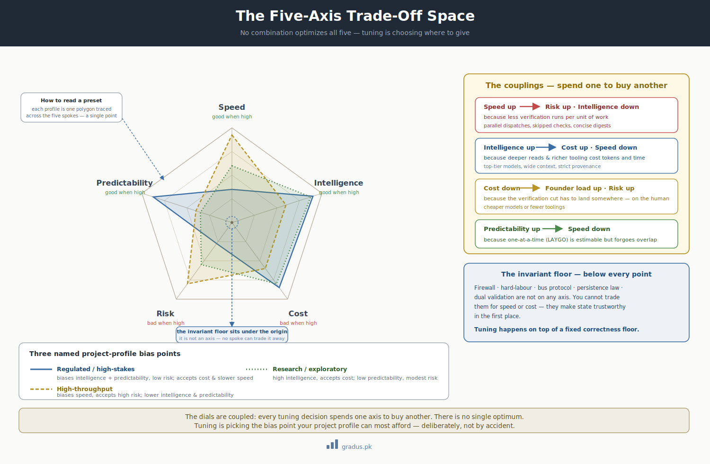

# Tunables Overview — the 5-axis trade-off

> *Five axes in tension. No combination optimizes all of them. Tuning is choosing where to give.*

`[TUNABLE]`

## TL;DR

CompassAlpha exposes a tunable design space along **five primary axes**: speed, intelligence, cost, risk, predictability. They pull against each other. Every tuning decision spends one axis to buy another. The framework's job is to make the trade explicit so you choose deliberately instead of discovering the cost after the fact. The structural rules behind the dials remain `[INVARIANT]` no matter where you set them.

<small>*The customization surface as a trade-space: every preset is a point on these five axes; the invariants underneath them never move.*</small>

## The five axes

| Axis | Definition | High means |
|---|---|---|
| **Speed** | Wall-clock time from cycle activation to deliverable. | Fast turnaround; less waiting. |
| **Intelligence** | Depth, correctness, coverage of the deliverable — the federation's "IQ floor." | Catches more; specializes better; fewer escapes. |
| **Cost** | Compute (tokens, API calls) + founder cognitive load + maintenance burden. | Expensive to run and maintain. |
| **Risk** | Chance of pollution, hallucination, drift, replay, or stale-snapshot decisions. | More chance of a costly mistake. |
| **Predictability** | How accurately cycle duration and deliverable scope can be estimated up front. | Reliable estimates; few surprises. |

Note the asymmetry: high speed, high intelligence, and high predictability are *good*; high cost and high risk are *bad*. The tension is that the good ones trade against each other and tend to drag in the bad ones.

## Why no combination wins everywhere

The dials are coupled. The most common couplings:

- **Speed ↑ → risk ↑, intelligence ↓.** Running dispatches in parallel, skipping verification, or using concise digests shaves wall-clock time but raises the chance of pollution or a missed defect.
- **Intelligence ↑ → cost ↑, speed ↓.** Top-tier models, wide context, strict provenance, and many invariants raise the quality floor but burn more tokens and take longer.
- **Cost ↓ → founder load ↑ or risk ↑.** Cheaper models or fewer toolings shift verification onto the founder, or simply let more defects through.
- **Predictability ↑ → speed ↓.** LAYGO (one unit at a time) makes cycles estimable but slow; parallelism makes them faster but harder to forecast.

You cannot collapse all five into a single optimum. Tuning is choosing a **bias point** appropriate to the project.

## Bias points by project profile

Different projects sit naturally at different points on the surface:

| Profile | Biases toward | Accepts more |
|---|---|---|
| Regulated multi-tenant SaaS (financial, academic, health-adjacent) | Intelligence + low risk | Cost, slower speed |
| Compliance-critical (medical, financial-core) | Risk-aversion above all | Cost, speed |
| Small source-available project | Speed + cost-optimization | More risk |
| Research / high-churn doctrine | Predictability + low founder load | Modest intelligence trade |
| Brand-new adoption (first cycle) | Intelligence + low risk while learning | Speed, until rhythm proves |

The framework's conservative defaults bias hard toward **intelligence + low risk** — the right bias for a regulated multi-tenant profile where doctrine errors are expensive to roll back. A small source-available project can legitimately choose the opposite bias. Neither is "wrong"; they're different points on the same surface.

## The dials, mapped to axes

Each tunable in this section moves the federation along one or more axes. The summary:

| Tunable | Page | Primary trade |
|---|---|---|
| Concurrency mode | [Concurrency modes](concurrency-modes.md) | Speed ↑ vs Risk ↑ |
| Mentor lifecycle | [Context patterns](context-patterns.md) | Cost ↓ vs Continuity / Pollution |
| Doer effort level | [AI model choices](ai-model-choices.md) | Intelligence ↑ vs Cost ↑ |
| Doer context scope | [Context patterns](context-patterns.md) | Intelligence ↑ vs Cost ↑ |
| Doer model tier | [AI model choices](ai-model-choices.md) | Intelligence ↑ vs Cost ↑ |
| Provenance verification | [Guardrails → hallucination defense](../02-guardrails/hallucination-defense.md) | Correctness ↑ vs Speed ↑ |
| Founder involvement | [Constitution → founder role](../00-foundation/constitution.md) | Cost ↓ vs Founder load ↑ |
| Memory accumulation rate | [Memory policy](memory-policy.md) | Learning ↑ vs Noise ↑ |
| Rotation cadence | [Context patterns](context-patterns.md) | Pollution ↓ vs Continuity ↓ |
| Cycle-tail acceptance | [Stage taxonomies](stage-taxonomies.md) | Predictability ↑ vs Speed ↑ |
| Audit/digest verbosity | [Context patterns](context-patterns.md) | Audit depth ↑ vs Cost ↑ |
| Cross-tier visibility | [Context patterns](context-patterns.md) | Containment ↑ vs Continuity ↓ |
| Enrichment (invariants/toolings/agents) | [Invariants, toolings & agents](invariants-toolings-agents.md) | Intelligence ↑ vs Cost ↑ |
| Work granularity lane | [Work granularity lanes](work-granularity-lanes.md) | Ceremony ↔ change size |

## The invariant floor under all of it

The load-bearing rules — [firewall](../01-axioms/firewall.md), [hard labour](../01-axioms/hard-labour-rule.md), [bus protocol](../01-axioms/bus-protocol.md), [persistence law](../01-axioms/persistence-law.md), dual validation — are `[INVARIANT]` across **every** point on the surface. They are not on any axis. You cannot trade them for speed or cost, because they are what make the federation's state trustworthy in the first place. Tuning happens *on top of* a fixed correctness floor.

This is the single most important thing to internalize about tunables: the dials are real and consequential, but they never reach below the floor.

## How to choose

1. Identify your project profile (above).
2. Pick a starting **operating preset** ([Toggles → Operating presets](../04-toggles/operating-presets.md)) that matches the profile.
3. Run one cycle. Observe where it hurts — too slow? too expensive? an escape got through?
4. Tune the *one or two* dials that address the pain, deliberately spending the axis you can most afford.
5. Re-observe. Tuning is iterative, not one-shot.

Do not tune every dial up front. Most adopters touch three or four parameters in their first year.

## How this connects

- The [full parameter matrix](full-parameter-matrix.md) lists every dial with defaults and ranges.
- [Operating presets](../04-toggles/operating-presets.md) bundle dial settings into named starting points.
- The [GitAI category](../00-foundation/gitai-category.md) explains why the correctness floor (git-backed state) is non-negotiable.

---

## Next: [Axis declarations →](axis-declarations.md)
