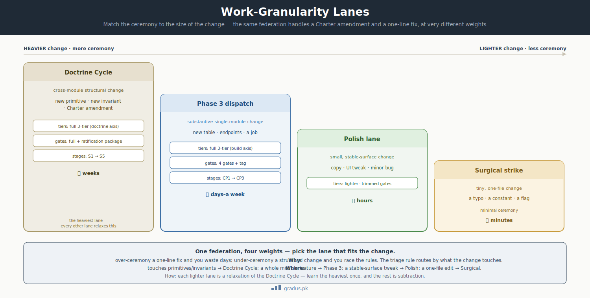

# Work Granularity Lanes — the four lanes

> *Match the ceremony to the size of the change. The same federation handles a Charter amendment and a "make this button blue" — at very different weights.*

`[TUNABLE — per-lane policies + which lanes a preset enables]`

This page explains how CompassAlpha sizes the process to fit the job — so a tiny "make this button blue" request doesn't get the same heavyweight treatment as a major design change, and you don't have to choose between a framework that's too formal for small work or too loose for big work.

## TL;DR

A "lane" here is just a level of process ceremony — how many review steps, sign-offs, and paperwork a change goes through. CompassAlpha supports work at **four granularity levels** — Doctrine Cycle, Phase 3, Polish Lane, Surgical Strike — each with a ceremony level matched to the size of the change. Lane choice is a **triage decision** made at incoming-request time. All four lanes share the same load-bearing rules (firewall, hard labour, bus, persistence, commit discipline) and differ only in ceremony and gating. This is what makes CompassAlpha usable for every daily request, not just big projects — the difference between "an academic ideal for large work" and "the smartest tooling the project has." Which lanes a project enables is `[TUNABLE]`; that all four exist is `[INVARIANT]`.

## The dial

Every project has all four lanes available structurally. The tunable is **which lanes a preset enables** and **the per-lane policies** (gate strictness, tag ceremony, status-grid requirements). Get the lane-set wrong — too few enabled — and the framework feels like over-engineering; get it right and it feels like the project's smartest tooling.



<small>*Match the ceremony to the change. Heaviest at left (Doctrine Cycle — weeks, full gates), lightest at right (Surgical — minutes). Over-ceremony a one-line fix and you waste days; under-ceremony a structural change and you race the rules. Each lighter lane is a relaxation of the Doctrine Cycle.*</small>

## The four lanes

| Lane | Granularity | Examples | Tier ceremony | Gates | Tag | Turnaround |
|---|---|---|---|---|---|---|
| **Doctrine Cycle** | Cross-module structural change | new primitive · new invariant · Charter amendment | Full 3-tier (doctrine axis) | full gates + ratification package | major bump | Weeks |
| **Phase 3** (substantive build) | Single-module substantive change | new schema · new routes · multi-stage rollout · audit-chain rework | Full 3-tier (build axis) | full gates 1–4 | `<module>-v<x.y>` | Days to weeks |
| **Polish Lane** | Cosmetic / bounded behavioral | datatable column add · microcopy tweak · modal layout fix · dropdown filter | Mentor-1 → slim Mentor-2 → Doer · single-CP | smoke + regression + UX critic | `polish-<topic>-v<x.y>` | Hours to a day |
| **Surgical Strike** | Single-concern, single-file | "make this button blue" · "change this copy" · "fix this margin" | Mentor-1 → Doer (Mentor-2 skipped) · single-turn | smoke pass + commit discipline | (no tag; commit on trunk) | Minutes to hours |

The stages each lane runs through are detailed in [Stage taxonomies](stage-taxonomies.md).

## Triage — which lane gets which request

Every incoming request is triaged at the top mentor:

```
IF  touches primitives / invariants / Charter            → DOCTRINE CYCLE queue
ELIF schema change / new API / cross-module              → PHASE 3 dispatch
ELIF bounded behavior change / new column / single
     feature in one module                               → POLISH LANE
ELIF single-concern cosmetic / copy / margin             → SURGICAL STRIKE
ELSE (ambiguous)                                          → escalate to founder for triage
```

Triage **is** founder-eligible, because founder requests are the most common source of Polish and Surgical work — the small day-to-day wishes. For those lanes the founder can request directly; the top mentor triages, picks the lane, and dispatches.

## What's preserved across all lanes (the invariant floor)

Lighter lanes do **not** relax these:

- **Firewall + state-tracking scope** — even a surgical strike goes through a tier, never a founder-direct edit.
- **Provenance law** — changes remain traceable to substrate.
- **Persistence law** — commit-and-push for durability.
- **Hard labour rule** — the founder never authors code; the Doer does. This holds *even in Surgical Strike.*
- **Flush-before-disclose** — state on disk before it is discussed.
- **Bus protocol** — even a one-line surgical brief goes through the inbox.
- **Commit discipline** — isolated index + commit-tree + refspec push, on every lane.

## What's relaxed for lighter lanes

| What | Heavy lanes | Polish | Surgical |
|---|---|---|---|
| Doer freshness | fresh-per-slice | fresh-per-slice | fresh-per-**turn** (one request, then dies) |
| Mid-tier (Mentor-2) | full | slim (no CP ceremony) | **skipped entirely** |
| CP gating | CP1→CP3 | single-CP | none (just commit) |
| Brief depth | full operational brief | bounded | one-liner (change + file + line range) |
| Tag ceremony | full tag | lightweight tag | no tag (commit on trunk) |
| Status grid | mandatory | mandatory (Tier 1) | optional |

## Charter-state interaction

- **Charter LOCKED epoch (build axis active):** all four lanes available; the founder picks per request.
- **Charter UNLOCKED epoch (doctrine cycle running):** Phase 3 is dormant (build axis dormant), **but Polish and Surgical can still run** — by definition they don't touch the primitives the doctrine cycle is amending.

This is why the triage rule "touches primitives/invariants → doctrine queue" matters: it keeps Polish and Surgical work confined to stable surfaces (UI polish, copy, minor bugs) that don't race the amendment.

## Anti-patterns

- **Surgical-striking a schema change** — schema touches primitives; belongs at Phase 3 minimum, possibly a Doctrine Cycle.
- **Doctrine-cycling a microcopy tweak** — wastes a multi-week cycle; Surgical Strike is the right lane.
- **Polish-Lane'ing a cross-module change** — Polish is bounded to a single module; cross-module is Phase 3.
- **Founder authoring directly** — even in Surgical Strike, the founder requests via inbox and the Doer executes. The hard labour rule holds.

## Per-preset lane policies

Operating presets enable or restrict lanes:

| Preset | Doctrine Cycle | Phase 3 | Polish | Surgical |
|---|---|---|---|---|
| **Conservative** | ✓ | ✓ | ✓ | ✓ (with caution) |
| **Balanced** | ✓ | ✓ | ✓ | ✓ |
| **Throughput** | ✓ | ✓ | ✓ (encouraged) | ✓ (encouraged) |
| **Cost-optimized** | ✓ | ✓ | ✓ (preferred when ambiguous) | ✓ |
| **Risk-averse / regulated** | ✓ | ✓ | ✓ (full audit despite the name) | ✗ (even cosmetic goes Polish) |
| **Research / high-churn** | ✓ (frequent) | ✓ | ✓ | ✓ |
| **Bootstrap / first-cycle** | ✓ | ✓ | ✓ (sparingly) | ✗ (until first cycle close) |

## Defaults

| Setting | Default | Notes |
|---|---|---|
| Lanes enabled | all four | `[INVARIANT]` that they *exist*; enablement is tunable. |
| Surgical Strike before first close | disabled | Enable once the rhythm is proven. |
| Triage tier | top mentor (founder-eligible) | Founder may request Polish/Surgical directly. |

## How to choose

- **Enable all four early** unless you're risk-averse/regulated (then forbid Surgical and route even cosmetics through Polish with full audit).
- **Hold Surgical until first close** on a new adoption — prove ceremony before relaxing it.
- **When a request is ambiguous between two lanes, pick the heavier one.** Under-ceremony is the more expensive mistake.

## Remember this

- **Match the ceremony to the size of the change.** A button-colour tweak and a Charter amendment go through the same federation, but at very different weights — that's the whole point of lanes.
- **The lighter lanes drop ceremony, never the safety rules.** Even a one-line "Surgical Strike" still routes through a tier, goes on the bus, and is executed by the Doer (never the founder) — only the review steps and paperwork shrink.
- **When in doubt, pick the heavier lane.** Doing too little process is the costlier mistake; you can always relax later.
- New here? Start with [the mental model](../00-foundation/mental-model.md) to see how these lanes sit inside the wider federation.

## How this connects

- [Stage taxonomies](stage-taxonomies.md) — the stage vocabulary each lane runs through.
- [Hard labour rule](../01-axioms/hard-labour-rule.md) (axiom) — holds on every lane, including Surgical.
- [Firewall](../01-axioms/firewall.md) (axiom) — even surgical strikes route through a tier.
- [Operating presets](../04-toggles/operating-presets.md) — each preset's lane-set.
- [Axis declarations](axis-declarations.md) — an axis declares which lanes it hosts.

---

## Next: [Stage taxonomies →](stage-taxonomies.md)
