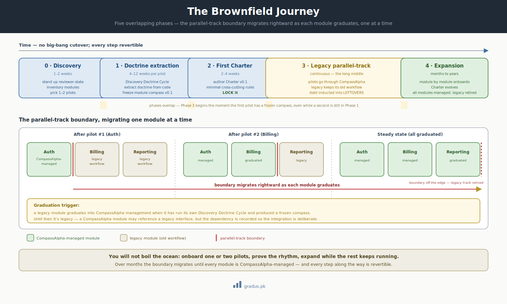

# Brownfield Onboarding

> *Adopting CompassAlpha over a codebase you already have. A pre-existing project walks in with code, culture, obligations, and tooling — but no doctrine layer. This is the phased journey for extracting one.*

**In plain terms:** this page is for when you already have a working project — real code, real users, real history — and you want to start running it the CompassAlpha way without stopping everything to rebuild from scratch. It walks you through doing that gradually, one piece at a time.

Most real adoptions are brownfield. You don't get to start from a blank slate; you have a running system with users, history, and tribal knowledge. The rules that govern your codebase already exist — its **Charter** (the project-wide constitution), its module boundaries, its invariants (the things that must always stay true) — but they're **buried in code and people's heads**, not written down as *doctrine*: the explicit, agreed-on rules a CompassAlpha federation works to.

Extracting that doctrine is the hard, valuable work brownfield onboarding does. CompassAlpha treats it as a **first-class, phased journey** — not an afterthought. You will not boil the ocean. You'll onboard one or two pilot modules first, prove the rhythm, and expand from there while the rest of the project keeps running on your existing workflow.

!!! note "Greenfield is simpler"
    If you're starting from nothing, you don't need any of this — go to [greenfield setup](greenfield-setup.md). Brownfield is the path for a codebase with existing weight.

!!! note "Commercial use"
    Onboarding a real production codebase is production use. Confirm your [commercial license](https://github.com/busyboy77/compassAlpha/blob/main/COMMERCIAL.md) before you go past the pilot.

---




<small>*Brownfield adoption is phased, not big-bang: modules graduate one at a time as the managed/legacy boundary migrates rightward.*</small>

## The five-phase journey

| Phase | Typical duration | What happens |
|---|---|---|
| **0. Discovery** | 1–2 weeks | Stand up the reviewer-state repo · pick a host · install the AI harness · inventory modules · pick 1–2 pilot modules. |
| **1. Doctrine extraction** | 4–12 weeks per pilot module | Run the **Discovery Doctrine Cycle** — extract doctrine *from existing code* rather than amend existing doctrine. |
| **2. First charter** | 2–4 weeks | Author Charter v0.1 with the minimum cross-cutting rules. **LOCK** it. |
| **3. Legacy parallel-track** | continuous | Pilot modules go through CompassAlpha; everything else keeps using your pre-CompassAlpha workflow. Legacy debt is inducted into `LEFTOVERS`. |
| **4. Expansion** | months → years | More modules onboard · Charter evolves · eventually all modules become CompassAlpha-managed. |

The phases overlap in practice. Phase 3 begins the moment your first pilot module has a frozen doctrine, even while a second module is still in Phase 1.

---

## Phase 0 — Discovery

Goal: a working federation skeleton and a chosen pilot.

1. **Stand up the infrastructure.** Create the substrate and reviewer-state repos as siblings, drop in the master, author canonical state artifacts, lay out the bus tree, stamp the tiers. This is mechanically identical to [greenfield setup](greenfield-setup.md) steps 1–6 — do those first. The difference is that your substrate repo already has code in it.
2. **Inventory the modules.** List every module / service / bounded area in the codebase. For each, note: rough size, how well it's understood, how much it changes, what depends on it, and what it depends on.
3. **Pick 1–2 pilot modules.** Choose modules that are:
   - **Self-contained enough** to reason about without dragging in the whole system.
   - **Active enough** that extracting their doctrine pays off soon.
   - **Not on fire** — don't pilot on the module that's mid-incident.
   - A worked example set: **Auth**, **Billing**, **Reporting**. Auth is a good first pilot — well-bounded, widely depended-on, with clear invariants worth writing down.

Phase 0 ends when you have a skeleton federation and one pilot module selected.

---

## Phase 1 — Doctrine extraction (the Discovery Doctrine Cycle)

A standard doctrine cycle *amends* existing doctrine. A brownfield project has none — so it runs a **variant** whose input is existing code rather than an existing Charter.

### The Discovery Doctrine Cycle stages

```
SURVEY → DRAFT → CROSS-REFERENCE → REVIEW → FREEZE-AS-v0.1
```

| Stage | Input | Output |
|---|---|---|
| **SURVEY** | The module's code, READMEs, ADRs, commit history, and human interviews | A raw inventory of what the module does and the rules it implicitly enforces |
| **DRAFT** | The survey | A first compass — the doctrine document for this one module, tiered at three altitudes (a ~60K overview, a ~30K mid-level, a ~10K detail layer) |
| **CROSS-REFERENCE** | The draft + the actual code | Every doctrine claim checked against the code that implements it. Discrepancies flagged. |
| **REVIEW** | The cross-referenced draft | Substance review + factual-correctness review by the founder and the tiers; cite-by-substrate ([provenance law](../01-axioms/provenance-law.md)) |
| **FREEZE-AS-v0.1** | The reviewed draft | The module's compass v0.1 — frozen, tagged, the first piece of written doctrine the project has ever had |

### How it runs on the tiers

The Discovery Doctrine Cycle flows through the same three tiers as any other work:

- **Mentor-1** owns the cycle, ratifies the frozen compass, surfaces founder-calls (e.g. "the code does X but the team says the rule is Y — which is doctrine?").
- **Mentor-2** orchestrates the extraction of one module, slicing it into Doer-sized survey/draft chunks.
- **The Doer** does the actual reading of code and drafting — it's the only tier that touches substrate, even when "touching" means *reading* the existing code to extract its rules.

!!! warning "Doctrine must match reality, not aspiration"
    The single biggest brownfield trap is documenting how the system *should* work instead of how it *does*. The CROSS-REFERENCE stage exists to catch exactly this. Every claim in the extracted doctrine must cite the code that backs it. Where code and intent disagree, that's a **founder-call** — surface it, don't paper over it.

### The Discovery Doctrine Cycle, repeated

Run this once per pilot module. After Auth, run it for Billing, then Reporting. Each produces one frozen compass. The cycle is the same; only the module changes.

---

## Phase 2 — First Charter

Once you have one or two frozen module compasses, you have enough to write the project's first **Charter** — the master constitutional document. Keep v0.1 minimal:

- Only the **cross-cutting rules** that genuinely span modules (e.g. "all modules authenticate through Auth", "money values never use floating point", "every external call is logged for the Reporting axis").
- Module-specific rules stay in module compasses, *not* the Charter.
- Resist completeness. A 5-rule Charter you can defend beats a 50-rule Charter half of which is aspirational.

When the Charter v0.1 is reviewed and ratified, **LOCK it**. A LOCKED Charter is the precondition for the build axis to run (see the [alternation state machine](../03-tunables/axis-declarations.md)). You now have a doctrine layer where there was none.

---

## Phase 3 — Legacy parallel-track operating mode

This is the long middle of brownfield onboarding. Some modules are CompassAlpha-managed; most are not yet. You run a **hybrid mode** with explicit boundary rules.

### Boundary rules

- **CompassAlpha modules** (Auth, once piloted) take all changes through the federation: dispatches, the bus, gates, frozen tags.
- **Legacy modules** (Billing, Reporting, until onboarded) keep using your existing workflow — your old pull-request process, your existing CI, your current review culture.
- **A CompassAlpha module referencing a legacy interface** is allowed, but the dependency is recorded. When a Doer working on Auth has to call into legacy Billing, the brief notes the legacy boundary so the integration is deliberate, not accidental.

### Graduation

A legacy module **graduates** into CompassAlpha management when it has run its own Discovery Doctrine Cycle and produced a frozen compass. Until then it's legacy. Define your graduation trigger explicitly so "when does this module become CompassAlpha-managed?" has a written answer.

### Legacy debt induction

A pre-existing codebase carries pre-existing tech debt. Don't lose it — induct it into `LEFTOVERS.md` with metadata so it's visible and triageable:

| Field | Brownfield meaning |
|---|---|
| **Type** | `PRE-EXISTING` (debt that predates CompassAlpha) vs `DEFERRED` (deliberately deferred under CompassAlpha) |
| **Origin** | "pre-CompassAlpha" for inherited debt |
| **Target** | the cycle / module / "never" when it gets addressed |
| **Status** | `ACTIVE` / `BLOCKED-ON-<id>` / `READY` / `RESOLVED` |

This keeps inherited debt from being silently forgotten and gives you a forward-looking picture of what the federation will work on next.

---

## Phase 4 — Expansion

Repeat the loop. Each module:

1. Runs its Discovery Doctrine Cycle (Phase 1).
2. Produces a frozen compass.
3. Graduates into CompassAlpha management (Phase 3 boundary updated).
4. Surfaces any cross-cutting rule it implies → the Charter evolves (a doctrine cycle, now a *standard* one, amends the Charter; UNLOCK → amend → re-LOCK).

Over months, the parallel-track boundary moves until every module is CompassAlpha-managed and the legacy workflow is retired. There is no big-bang cutover — the boundary migrates one module at a time, and every step is revertible.

---

## The team dimension

Brownfield onboarding is also a **people** change. Decide explicitly:

- **Who is the founder?** One person (or a small team as one role) on the bus + lost+found.
- **Who plays each Mentor tier?** Humans, AI sessions, or a mix. The framework cares about the positions, not whether a human or a session fills them.
- **Lost+found discipline.** Keep the founder out of per-decision arbitration; the most common brownfield failure is the founder becoming a bottleneck.
- **Onboarding new team members mid-project.** A new joiner reads the frozen compasses to learn the system — which is exactly why extracting doctrine pays off. The doctrine layer *is* the onboarding material.

---

## Brownfield readiness checklist

```
[ ] infrastructure stood up (greenfield steps 1–6, over your existing substrate)
[ ] all modules inventoried
[ ] 1–2 pilot modules chosen (well-bounded, active, not on fire)
[ ] Discovery Doctrine Cycle run for pilot #1 → frozen compass v0.1
[ ] Charter v0.1 authored from extracted compasses → LOCKED
[ ] parallel-track boundary rules written (CompassAlpha vs legacy)
[ ] graduation trigger defined
[ ] legacy debt inducted into LEFTOVERS with PRE-EXISTING metadata
[ ] founder + tier roles assigned
```

For a concrete, revertible, step-by-step walkthrough of moving an existing project under CompassAlpha — using Auth / Billing / Reporting as the worked example — see [Cutover from a pre-AI project](cutover-from-pre-AI-project.md).

## Remember this

- **You don't have to convert everything at once.** Pick one or two well-bounded modules, prove the rhythm there, and let the rest of the project keep running the way it already does.
- **Your rules already exist — you're writing them down, not inventing them.** Brownfield onboarding is mostly the work of extracting the rules already living in your code and your team's heads into explicit doctrine.
- **Document how the system actually works, not how you wish it worked.** When the code and the team's story disagree, that's a decision to surface, not a gap to paper over.
- **Keep your first Charter small.** A handful of rules you can genuinely defend beats a long list that's half wishful thinking. New here? Start with [the mental model](../00-foundation/mental-model.md).

## Next: [First boot →](first-boot.md)
