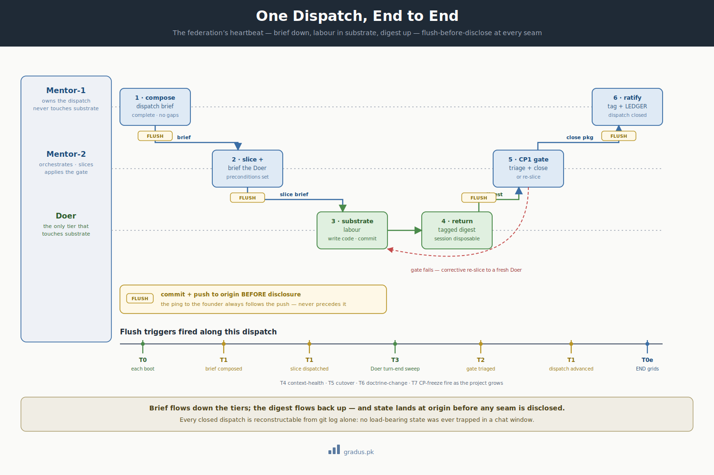

# First Dispatch

> *Running your first piece of work end-to-end through the bus: Mentor-1 → Mentor-2 → Doer and back. Flush-before-disclose at every step, gates at every seam. This is the federation's heartbeat.*

You've booted a clean session ([first boot](first-boot.md)). Now you move a real piece of work all the way through the federation and watch state land on disk + at origin before anyone discusses it. By the end you'll have one completed dispatch and a working mental model of the whole rhythm.

We'll use the small first dispatch you chose during setup — say, **scaffold an `auth/` module skeleton** in the substrate.

---


[](../assets/dispatch-flow-sequence.svg)

<small>*The federation's heartbeat: brief flows down, labour happens in substrate, the digest flows up — and state lands at origin before any seam is disclosed.*</small>

## The cast

| Tier | In this dispatch | Touches substrate? |
|---|---|---|
| **Mentor-1** | Decides the dispatch is worth doing; composes the dispatch brief; ratifies the close. | Never |
| **Mentor-2** | Orchestrates this one dispatch; slices it; triages the Doer's return; applies gates. | Never |
| **Doer** | Reads its slice brief; writes the actual code; commits to substrate; returns a tagged digest. | **Only this tier** |
| **Founder** | Spawns each session; relays one-line pings. Carries zero content. | No |

---

## The flow, end to end

```
Mentor-1 ──brief──▶ Mentor-2 ──slice brief──▶ Doer
                                                │
                                          (writes code,
                                       commits to substrate)
                                                │
Mentor-1 ◀──close pkg── Mentor-2 ◀──tagged digest──┘
```

Each arrow is a **bus message**: a file written into the recipient's inbox, committed + pushed to reviewer-state, followed by a one-line founder ping. Content never travels in chat. See the [bus protocol](../01-axioms/bus-protocol.md).

---

## Step 1 — Mentor-1 composes the dispatch brief

The booted Mentor-1 decides what to dispatch and writes a **complete** brief into Mentor-2's inbox. Complete means no placeholders for the founder to fill — the dispatching tier owns the fill ([brief completeness](../02-guardrails/brief-completeness.md)).

Write to `tier-1-mentor/tier-2-orchestrator/inbox/from-mentor1-auth-brief.md`:

```markdown
[[MENTOR-1→MENTOR-2 · auth · dispatch-brief]]

DISPATCH: scaffold the auth/ module skeleton.
SCOPE:    create auth/ package dir + an empty entrypoint + a placeholder test.
          Do NOT implement auth logic — skeleton only.
CHARTER:  v0.1 LOCKED. No Charter-touching changes.
DELIVERABLE: code on a feature branch; one slice expected.
GATE:     CP1 (skeleton compiles / lints) → close.

[[/MENTOR-1→MENTOR-2]]
```

Then Mentor-1 flushes and publishes — **flush before disclose**:

```bash
git -C /path/to/reviewer-state pull --ff-only
git -C /path/to/reviewer-state add -A
git -C /path/to/reviewer-state commit -m "mentor-1: auth dispatch brief"
git -C /path/to/reviewer-state push origin main:main   # verify GH-sync 0/0 after
```

Only **after** the file is on disk and at origin does Mentor-1 ping the founder: *"ready for Mentor-2."* The founder relays: *"pull + read your inbox."*

---

## Step 2 — Mentor-2 boots, slices, and briefs the Doer

The founder spawns a fresh Mentor-2 session in `tier-1-mentor/tier-2-orchestrator/`. It [boots](first-boot.md) (T0), then:

1. `git -C /path/to/reviewer-state pull --ff-only` — picks up the new brief.
2. Reads its inbox; finds `from-mentor1-auth-brief.md`.
3. Slices the dispatch. This one is small — a single slice, `s1`.
4. Composes a **complete Doer brief** with operational preconditions, written to the Doer's inbox at `tier-2-orchestrator/s1/inbox/from-mentor2-s1-brief.md`:

```markdown
[[MENTOR-2→DOER · auth/s1 · slice-brief]]

YOU ARE: a Doer for auth/s1. The only tier that touches substrate.

OPERATIONAL PRECONDITIONS:
  branch:          feat/auth-s1-skeleton
  base HEAD:       <cycle-tip-SHA>
  GIT_INDEX_FILE:  /path/to/substrate/.work-tmp/auth/s1/index
  worktree:        /path/to/substrate/.work-tmp/auth/s1/wt

YOUR SLICE:
  - create auth/ package dir
  - add an empty entrypoint file
  - add one placeholder test that asserts the module imports

RETURN: tagged digest into Mentor-2's inbox (control plane).
COMMIT DISCIPLINE: worktree + commit-tree + refspec push; NEVER mix planes.

[[/MENTOR-2→DOER]]
```

5. Flush + push reviewer-state (as in step 1). Ping founder: *"ready for the auth/s1 Doer."*

---

## Step 3 — The Doer does the labour

The founder spawns a fresh Doer session. It boots from its composed brief, then works under strict [git foundations](../01-axioms/git-foundations.md) discipline. **Two planes, never crossed.**

**Data plane — the deliverable goes to substrate:**

```bash
export GIT_INDEX_FILE=/path/to/substrate/.work-tmp/auth/s1/index
git -C /path/to/substrate worktree add /path/to/substrate/.work-tmp/auth/s1/wt <cycle-tip-SHA>

# ...create auth/ dir, entrypoint, placeholder test in the worktree...

git --work-tree=/path/to/substrate/.work-tmp/auth/s1/wt update-index --add auth/__init__ auth/entrypoint auth/test_imports
TREE=$(git -C /path/to/substrate write-tree)
COMMIT=$(git -C /path/to/substrate commit-tree $TREE -p <cycle-tip-SHA> -m "auth/s1: skeleton")
git -C /path/to/substrate update-ref refs/heads/feat/auth-s1-skeleton $COMMIT
git -C /path/to/substrate push origin feat/auth-s1-skeleton:feat/auth-s1-skeleton
```

**Control plane — the return goes to reviewer-state** (a *separate* `git -C`, never mixed with the above):

Write `tier-2-orchestrator/inbox/from-doer-s1-digest.md`:

```markdown
[[DOER→MENTOR-2 · auth/s1 · digest]]

DELIVERABLE: auth/ skeleton on feat/auth-s1-skeleton @ <commit-SHA>.
DONE: package dir + entrypoint + placeholder import test. Test passes.
GATE CP1: skeleton imports + lints clean. READY.
OPEN: none.

[[/DOER→MENTOR-2]]
```

```bash
git -C /path/to/reviewer-state pull --ff-only
git -C /path/to/reviewer-state add -A
git -C /path/to/reviewer-state commit -m "doer auth/s1: return digest"
git -C /path/to/reviewer-state push origin main:main
git -C /path/to/substrate worktree remove /path/to/substrate/.work-tmp/auth/s1/wt   # cleanup
```

Ping founder: *"auth/s1 done, ready for Mentor-2."* The Doer session is now disposable — it is never reused for another slice.

---

## Step 4 — Mentor-2 triages and applies the gate

A fresh (or the same in-tenure) Mentor-2 pulls, reads the digest, and applies the **CP1 gate**: does the deliverable meet the slice brief? Here, the skeleton imports and the test passes — gate **closed**. Mentor-2 then writes a close package into Mentor-1's inbox (`tier-1-mentor/inbox/auth/from-mentor2-close.md`), flushes + pushes, pings the founder.

If the gate had *failed* (skeleton didn't import), Mentor-2 would compose a corrective slice brief for a fresh Doer instead — the loop repeats until the gate closes.

---

## Step 5 — Mentor-1 ratifies and tags

Mentor-1 pulls, reads the close package, ratifies the dispatch, and applies the immutable **tag** that marks the close — the federation's ratification artifact:

```bash
git -C /path/to/substrate tag -a auth-skeleton-v0.1 <commit-SHA> -m "auth skeleton dispatch closed"
git -C /path/to/substrate push origin auth-skeleton-v0.1
```

Mentor-1 updates the LEDGER (the dispatch is now `closed`), flushes + pushes reviewer-state, and prints an END status grid. Your first dispatch is complete — and every piece of it is reconstructable from git log.

---

## Flush-before-disclose, restated

At every step above, the pattern is identical and **non-negotiable**:

> **State on disk and at origin BEFORE it is disclosed to the founder.**

The ping always comes *after* the push. The founder's clipboard carries zero substantive content — just one-line triggers. This is the [persistence law](../01-axioms/persistence-law.md), and it's what makes rotation, recovery, and audit trivial: there is never load-bearing state trapped in a chat window.

---

## The gates that protect a dispatch

Work advances through **flush triggers T0–T7**. The ones you exercised in this dispatch:

| Trigger | Fired when | Action |
|---|---|---|
| **T0** | Each session boots | Read artifacts, verify consistency, print START grid, GH-sync check |
| **T1** | A state change (brief composed, gate ruled, dispatch advanced) | Flush to `LEDGER.md` + read back |
| **T2** | A return is triaged (Mentor-2 hands back a ruling) | Flush resulting state before standby |
| **T3** | End-of-turn sweep | Confirm the ledger reflects what the turn did — unflushed state = incomplete turn |
| **T7** | A checkpoint freezes with pending items | Onboard every leftover to `LEFTOVERS.md` *before* reporting the freeze as ratification-ready |

(T4 context-health, T5 cutover, T6 doctrine-change round out the set — you'll meet those as the project grows.)

---

## First-dispatch checklist

```
[ ] Mentor-1 composed a COMPLETE brief (no placeholders); flushed + pushed BEFORE pinging
[ ] Mentor-2 booted, sliced, composed a complete Doer brief with operational preconditions
[ ] Doer used worktree + GIT_INDEX_FILE + commit-tree + refspec push (no plain git add/commit)
[ ] Doer kept the two planes separate (substrate vs reviewer-state) — never one git command across both
[ ] Doer returned a tagged digest; worktree cleaned up; session not reused
[ ] Mentor-2 applied the CP1 gate (close or corrective re-slice)
[ ] Mentor-1 ratified, tagged the close, updated LEDGER, printed END grid
[ ] every ping followed a push — flush before disclose, every time
```

You now have a working federation with one closed dispatch behind it. From here, repeat the rhythm — and for a brownfield team, walk the revertible cutover.

## Next: [Cutover from a pre-AI project →](cutover-from-pre-AI-project.md)
