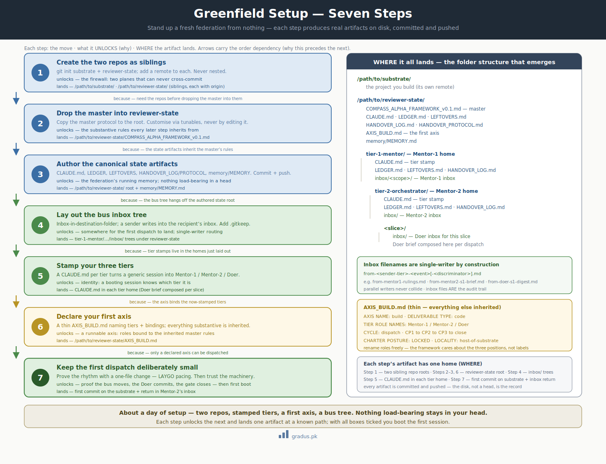

# Greenfield Setup

> *Stand up a fresh federation from nothing: two repos, stamped tiers, a first axis declaration, a bus inbox layout. About a day of setup, then you're ready for [first boot](first-boot.md).*

**New here?** This is the checklist for starting a brand-new project from scratch. You'll create two folders, drop in a few files, and end the day with a working setup your AI agents can boot into. No prior experience with the framework required — just follow the seven steps in order.

This page assumes you've cleared the [prerequisites](prerequisites.md). It walks the greenfield path — a brand-new project with no prior doctrine and no legacy obligations. (If you have an existing codebase, go to [brownfield onboarding](brownfield-onboarding.md) instead.)

The whole setup is seven steps. Each produces real artifacts on disk that you commit and push. Nothing load-bearing stays in your head.

!!! tip "Smallest viable first day"
    This page goes into the full detail, but you don't have to absorb all of it at once. If you want the gentlest possible start, begin in the **Bootstrap** [operating preset](../04-toggles/operating-presets.md) — the *leanest posture*: it's still the full setup (two repos, three tiers), but tuned to keep the machinery slow and quiet while you find your feet. You can dial the rest up later. Work through the steps below at your own pace; nothing here has to be done in one sitting.

---




<small>*Greenfield setup in seven steps, each producing a concrete artifact, until the federation's folder structure stands up.*</small>

## Step 1 — Create the two repos as siblings

You keep two separate git repositories, side by side. The **substrate** is your actual project — the code you ship. The **reviewer-state** is where the federation keeps its own bookkeeping: who decided what, what's pending, how rotations happened. These are **two distinct repos in two distinct sibling directories** (sibling = they sit next to each other, neither inside the other). They never cross-commit; that separation is the [firewall](../01-axioms/firewall.md).

```bash
# substrate — the thing you build
git init /path/to/substrate
```

This creates a brand-new, empty git repository in the folder for your actual project. A git repository ("repo") is a folder whose every change is tracked and versioned.

```bash
git -C /path/to/substrate remote add origin <substrate-remote-url>
```

This points the substrate repo at its home on a hosting service (such as GitHub). `git -C <folder>` runs the command as if you were standing inside that folder. A "remote" named `origin` is the address git pushes your commits to; replace `<substrate-remote-url>` with the real URL.

```bash
# reviewer-state — the federation's judicial / coordination state
git init /path/to/reviewer-state
```

This creates the second, separate empty repository — the one that holds the federation's bookkeeping rather than your shipped code.

```bash
git -C /path/to/reviewer-state remote add origin <reviewer-state-remote-url>
```

This points the reviewer-state repo at its own separate remote address, keeping its history fully independent from the substrate's.

!!! warning "Sibling, never nested"
    `/path/to/reviewer-state` must be **outside** `/path/to/substrate`'s working tree. If reviewer-state lived inside the substrate, reviewer commits could land on a substrate branch and the structural firewall would collapse. Keep them side by side.

---

## Step 2 — Drop the master into reviewer-state

The **master** is the single rulebook that states every substantive rule once. You don't rewrite it per project — your customizations (called axes) inherit from it.

Where does `COMPASS_ALPHA_FRAMEWORK_v0.1.md` come from? The master document is the framework's full manifesto. To get it, either clone [the repository](https://github.com/busyboy77/compassAlpha) and copy the master out of it, or save the [full manifesto](../07-reference/manifesto-full.md) to disk under the filename `COMPASS_ALPHA_FRAMEWORK_v0.1.md`. Either way you end up with that file sitting next to the `cp` command below.

```bash
# copy the CompassAlpha master into the reviewer-state root
cp COMPASS_ALPHA_FRAMEWORK_v0.1.md /path/to/reviewer-state/
```

You do not edit the master to customise your project. You customise through **tunables** and **axis declarations** that layer on top. See [Tunables overview](../03-tunables/tunables-overview.md).

---

## Step 3 — Author your canonical state artifacts

These live at the reviewer-state root. They are the federation's running memory.

```
/path/to/reviewer-state/
├── COMPASS_ALPHA_FRAMEWORK_v0.1.md     ← the master (copied in step 2)
├── CLAUDE.md                           ← root boot orientation
├── LEDGER.md                           ← live federation state
├── LEFTOVERS.md                        ← deferred items register
├── HANDOVER_LOG.md                     ← tier-rotation audit
├── HANDOVER_PROTOCOL.md                ← how rotations happen
└── memory/
    └── MEMORY.md                       ← index of cross-cycle learnings
```

Minimal starting content for each:

- **`CLAUDE.md`** — "This is the reviewer-state for `<project>`. Boot read order: this file → `LEDGER.md` → `memory/MEMORY.md`. Persistence law in force." (Your tier stamps in step 5 extend this per tier.)
- **`LEDGER.md`** — an empty state grid scaffold (the [Tier 1 six-line grid](first-boot.md#the-start-status-grid)).
- **`LEFTOVERS.md`** — `# Leftovers` and an empty table with columns: ID · Description · Type · Origin · Target · Status.
- **`HANDOVER_LOG.md`** — `# Handover Log` and an empty append-only list.
- **`memory/MEMORY.md`** — `# Memory Index` and an empty list. Memories accrue from real incidents, not theory.

Commit and push:

```bash
git -C /path/to/reviewer-state add -A
```

This stages every new and changed file in the reviewer-state repo, marking them to be saved in the next commit. `-A` means "all files".

```bash
git -C /path/to/reviewer-state pull --ff-only
```

This fetches any changes from the remote first and applies them. `--ff-only` ("fast-forward only") tells git to refuse if your local and remote histories have diverged, so you never accidentally create a tangled merge — you pull before you push.

```bash
git -C /path/to/reviewer-state commit -m "scaffold: master + canonical state artifacts"
```

This saves the staged files as a single permanent snapshot in the repo's history. The text after `-m` is the commit message describing what changed.

```bash
git -C /path/to/reviewer-state push origin main:main
```

This sends your new commit up to the remote. `origin main:main` means "push my local `main` branch to the remote's `main` branch" — being explicit about both ends so the commit lands exactly where intended.

---

## Step 4 — Lay out the bus inbox tree

The [bus protocol](../01-axioms/bus-protocol.md) is inbox-in-destination-folder: a sender writes into the *recipient's* inbox. Lay the folders out now so the first dispatch has somewhere to land. The default layout (tunable):

```
/path/to/reviewer-state/
├── tier-1-mentor/                          ← Mentor-1 home
│   ├── inbox/                              ← Mentor-1's inbox
│   │   └── <scope>/
│   ├── CLAUDE.md  LEDGER.md  LEFTOVERS.md  HANDOVER_LOG.md
│   └── tier-2-orchestrator/                ← Mentor-2 home (confined under Mentor-1)
│       ├── inbox/                          ← Mentor-2's inbox
│       ├── CLAUDE.md  LEDGER.md  LEFTOVERS.md  HANDOVER_LOG.md
│       └── <slice>/
│           └── inbox/                      ← Doer's inbox for this slice
```

Inbox filenames follow `from-<sender-tier>-<event>[-<discriminator>].md`, e.g. `from-mentor1-rulings.md`, `from-mentor2-s1-brief.md`, `from-doer-s1-digest.md`. Each filename is single-writer by construction, so parallel writers never collide.

!!! note "Git doesn't track empty folders"
    Add a `.gitkeep` to each `inbox/` so the tree survives a fresh clone.

---

## Step 5 — Stamp your three tiers

A **tier** is a role in the chain of command, and a **stamp** is the `CLAUDE.md` file that tells a fresh, generic AI session which role it's playing. This is how an off-the-shelf session becomes a specific tier — it reads its stamp on boot and knows who it is. The three stamps, dropped into the homes from step 4:

### Mentor-1 stamp (`tier-1-mentor/CLAUDE.md`)

```markdown
# YOU ARE: Mentor-1 (build axis)

ROLE: Top of the chain. Mentor at unit-of-work granularity. Ratify completion.
      Surface founder-calls. NEVER touch substrate.
SESSION: Long-lived in tenure (one per major cycle); rotate at clean seams.
HOME: /path/to/reviewer-state/tier-1-mentor/
MAY WRITE: own folder + Mentor-2's inbox.
READS INBOX AT: own inbox/<scope>/.
BOOT (T0): read master → this file → LEDGER → memory/MEMORY.md;
           verify disk==understanding; print START status grid; GH-sync check.
COMMIT DISCIPLINE: GIT_INDEX_FILE + commit-tree + explicit refspec push;
                   pull --ff-only before push; separate git -C per plane.
```

### Mentor-2 stamp (`tier-1-mentor/tier-2-orchestrator/CLAUDE.md`)

```markdown
# YOU ARE: Mentor-2 (build axis) — orchestrator of ONE unit of work

ROLE: Slice the dispatch into Doer-sized chunks. Triage tagged returns.
      Apply ratification gates. NEVER touch substrate.
SESSION: Fresh per dispatch.
HOME: /path/to/reviewer-state/tier-1-mentor/tier-2-orchestrator/
MAY WRITE: own folder + Mentor-1's inbox + Doer's inbox.
READS INBOX AT: own inbox/.
COMMIT DISCIPLINE: as Mentor-1, control-plane only (reviewer-state).
```

### Doer stamp (composed per slice into `<slice>/`)

The Doer is fresh-per-slice and disposable, so its brief is **composed by Mentor-2** at dispatch time rather than living statically. The shape:

```markdown
# YOU ARE: a Doer for <entity>/<slice>. The ONLY tier that touches substrate.

OPERATIONAL PRECONDITIONS:
  branch:          feat/<scope>-<slice>
  base HEAD:       <cycle-tip-SHA>
  GIT_INDEX_FILE:  /path/to/substrate/.work-tmp/<scope>/<slice>/index
  worktree:        /path/to/substrate/.work-tmp/<scope>/<slice>/wt
YOUR SLICE: <the bounded brief>
RETURN: tagged digest into Mentor-2's inbox (control plane).
COMMIT DISCIPLINE: commit deliverable to substrate via worktree + commit-tree
                   + refspec push; NEVER mix planes in one git command.
```

See [git foundations](../01-axioms/git-foundations.md) for why the Doer never runs in the main working tree and never uses plain `git add` + `git commit`.

---

## Step 6 — Declare your first axis

Most greenfield projects start with `build`. The axis declaration is **thin** — it names tiers and bindings; everything substantive is inherited. Save as `/path/to/reviewer-state/AXIS_BUILD.md`:

```
AXIS NAME:            build
PURPOSE:              Produce and evolve the project's code.
TIER ROLE NAMES:
  Mentor-1:           Mentor-1
  Mentor-2:           Mentor-2
  Doer:               Doer
DELIVERABLE TYPE:     code
CYCLE GRANULARITY:    dispatch · CP1 → CP2 → CP3 → close
CHARTER POSTURE:      LOCKED
CYCLE ACTIVATOR:      founder request for a build dispatch
RATIFICATION PATTERN: per-dispatch sub-bump
LOCALITY:             host-of-substrate (default)
```

You can keep the generic role names or rename them — the framework cares about the three *positions* (Mentor-1 / Mentor-2 / Doer), not the labels. See [axis declarations](../03-tunables/axis-declarations.md).

Commit + push the axis declaration the same way as step 3.

---

## Step 7 — Keep the first dispatch deliberately small

Resist the urge to dispatch something ambitious first. The point of dispatch #1 is to **prove the rhythm** — that the bus moves a file, the Doer commits to substrate, the digest comes back, the gate closes. A one-file change is ideal.

Good first dispatches:

- Add a `README.md` to the substrate.
- Scaffold an empty module directory (e.g. an `auth/` package skeleton).
- Wire a single trivial function with a single test.

This is [LAYGO](../00-foundation/glossary.md) pacing — *Learn As You Go*. Once dispatch #1 closes cleanly, you trust the machinery.

---

## Setup checklist

```
[ ] substrate + reviewer-state created as SIBLING repos, each with its own remote
[ ] master copied into reviewer-state root
[ ] canonical state artifacts authored + pushed
[ ] bus inbox tree laid out (with .gitkeep)
[ ] Mentor-1 + Mentor-2 stamps written; Doer brief shape understood
[ ] AXIS_BUILD.md declared + pushed
[ ] a small first dispatch chosen
```

With all boxes ticked, boot your first session.

## Remember this

- **Two folders, never nested.** Your project (substrate) and the federation's bookkeeping (reviewer-state) live side by side. Keeping them apart is what protects each from the other.
- **You don't edit the rulebook.** The master stays as-is; you shape your project through thin axis declarations and tunables that layer on top.
- **Every step lands a real file you commit.** Nothing important lives only in your head or the chat — it's all on disk, pushed, and auditable.
- **Start tiny on purpose.** Your first dispatch should be a one-file change. The goal is to prove the rhythm works before you trust it with anything big. If the moving parts here feel abstract, see [the mental model](../00-foundation/mental-model.md) for the big picture.

## Next: [First boot →](first-boot.md)
