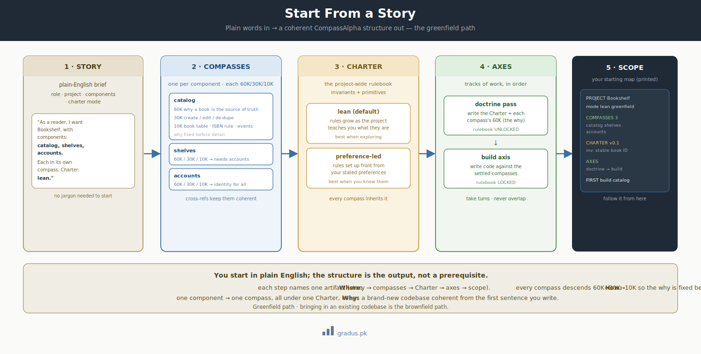

# Start From a Story

> *Describe your project in plain words. Get back a CompassAlpha structure you can build against.*

The gentlest way to begin: you do **not** need to learn the framework's vocabulary first. You write a short, everyday description of what you want to build — a "user story" — and the federation translates it into the CompassAlpha structure for you. This page walks a complete newcomer through that translation, step by step, defining every term as it appears. (Brand-new to the framework? Read [the mental model](../00-foundation/mental-model.md) first — it's the eight ideas everything here rests on.)

## TL;DR

In plain terms: you say *"I want to build X, made of parts A, B, and C"*, and the framework gives each part its own planning document, writes down the project's rules, and lays out the order of work. No setup and no jargon are needed to **start** — the structure is the output, not the prerequisite.

This is the **greenfield** path — starting a brand-new project from scratch. (Already have an existing, pre-AI-era codebase you want to bring in? That's the *brownfield* path — see [Start From a Story — Existing Project](start-from-a-story-brownfield.md).)

## A few words you'll meet (defined once, here)

You'll see these terms below. Here's the plain-English version of each, so nothing is a surprise:

- **Component** — one part of your project (e.g. "the login screen", "the billing engine"). You list these in your story.
- **Compass** — the canonical planning document for one component, written at three zoom levels: **60K** (the *why* / ideology), **30K** (the *how* / mechanics), and **10K** (the *exact* schema and rules, executable detail). One component → one compass. ([More on the altitude descent →](../00-foundation/codebase-coherence.md))
- **Charter** — the project's rulebook: the handful of rules that apply across *all* components. It holds **invariants** (rules that must always hold true — e.g. "every invoice is immutable once issued") and **primitives** (shared building-block concepts every component reuses).
- **Axis** — a track of work. A **build axis** writes code; a **doctrine axis** changes the rulebook. They take turns; they never run at the same time. ([More →](../03-tunables/axis-declarations.md))

That's the whole vocabulary you need to follow this page.

## The flow, at a glance

[](../assets/story-to-structure.svg)

<small>*Left to right: your **story** comes in; it's **decomposed** into one compass per component (each at 60K/30K/10K); a **Charter** is derived (lean or preference-led); the **axes** are laid out in build order; and a **printed scope** comes out the other side. The detail of each step is below.*</small>

## Step 1 — Write your story

Use this simple template. You fill in the angle-bracket parts in plain English:

```
As a <role>, I want to build <project>, with the following components:
<comp1>, <comp2>, … <compN>.
Put each component in its own compass.
For the Charter (the rulebook), use:
  (1) lean — let the rules develop as we go [the framework's default], OR
  (2) preference-led — set the rules to my stated preferences from the start.
```

You don't have to get it perfect. The role and the project line give context; the **component list** is the part that does the real work, because each component becomes its own compass.

### A worked example

Say you're building a small book-tracking website. Your story might be:

> *"As a reader, I want to build **Bookshelf**, a website to track the books I own and want to read, with the following components: **catalog** (the books and their details), **shelves** (lists I sort books into), and **accounts** (sign-in and per-user data). Put each component in its own compass. For the Charter, use the **lean** mode — let the rules develop as we go."*

Three components named: `catalog`, `shelves`, `accounts`. That's all the framework needs to begin.

## Step 2 — Each component becomes a compass

The federation creates **one compass per component** — three here. Each compass is built at the three zoom levels, top to bottom, so the *why* is settled before the *exact detail*:

| Compass | 60K — the why | 30K — the how | 10K — the exact detail |
|---|---|---|---|
| **catalog** | "A book is a durable record; the catalog is the source of truth for book identity." | how a book is created, edited, de-duplicated | the `book` table fields, the ISBN rule, the events emitted |
| **shelves** | "A shelf is a user's private ordering of books they care about." | how books are added/removed/reordered on a shelf | the `shelf` + `shelf_item` schema, the ordering rule |
| **accounts** | "An account is the identity everything else is scoped to." | sign-in, sessions, per-user data boundaries | the `account` schema, the session rule, what other compasses may read |

Notice the **cross-references**: `shelves` and `catalog` both depend on `accounts` for "who owns this". Those edges get written down in each compass's 30K layer, so the components stay coherent with one another instead of drifting apart. (This is the [codebase-coherence](../00-foundation/codebase-coherence.md) idea in action — say the vision, grow coherent code from it.)

## Step 3 — The Charter is derived

The **Charter** is the project-wide rulebook. You chose one of two modes in your story:

- **Lean / emergent (the default).** The Charter starts nearly empty and grows as the project teaches you what its real rules are. You discover, for example, that "every book must have a stable ID" matters across *all three* components — so it gets lifted into the Charter as an **invariant**, and now every component inherits it automatically. Best when you're exploring and don't yet know all the rules.
- **Preference-led.** You state your rules up front, and the Charter is seeded with them from day one — e.g. "all timestamps are UTC", "accounts are soft-deleted, never hard-deleted". Best when you arrive with strong, known requirements.

Either way, the Charter ends up holding the **invariants** (always-true rules) and **primitives** (shared concepts) that the per-component compasses lean on. The difference is only *when* those rules get written: discovered along the way (lean) or declared at the start (preference-led).

## Step 4 — The axes are presented in build order

Now the work is laid out as **axes** — the tracks you'll step through. For a greenfield project the order is:

1. **A short doctrine pass first** (optional in lean mode) — just enough to write the initial Charter and the 60K of each compass, so everyone agrees on the *why* before code. The rulebook is **UNLOCKED** while this happens (you're allowed to change the rules).
2. **The build axis** — the rulebook **LOCKS**, and code gets written against the now-settled compasses. If you discover a rule needs to change mid-build, you don't quietly change it; you open a new doctrine pass, change it there, then re-lock and resume. This "take turns, never overlap" rule is what stops the build from racing the rules. ([Why →](../04-toggles/cycle-toggles.md))

You step through these as **cycles** — bounded chunks of work — at whatever pace fits. You can also add more axes later (review, QA, ops, …) at any time; that's covered in [axis declarations](../03-tunables/axis-declarations.md).

## Step 5 — What you get out: the printed scope

The end of the translation is a **printed scope** — a plain summary you can act on:

```
PROJECT: Bookshelf  ·  mode: lean greenfield
COMPASSES (3):  catalog · shelves · accounts   (each: 60K/30K/10K)
CHARTER:        v0.1 (lean — grows as the project does)
                seeded invariant: "every book has a stable ID"
AXES:           doctrine pass (write Charter + 60K) → build axis (LOCKED)
FIRST CYCLE:    author the three compasses' 60K, then build catalog
```

That scope is your starting map. From here you follow the ordinary [greenfield setup](greenfield-setup.md) to stand up the repos and tiers, and the [sample doctrine cycle](../06-adoption-patterns/sample-doctrine-cycle.md) to see a compass authored end-to-end.

## Remember this

- **You start in plain English, not jargon.** Describe the project and list its components; the structure is the *output*, not a prerequisite. ([the mental model](../00-foundation/mental-model.md) is the only background worth reading first.)
- **One component → one compass**, each written 60K → 30K → 10K so the *why* is fixed before the *detail*.
- **The Charter is your project-wide rulebook**, derived either **lean** (rules grow as you go) or **preference-led** (rules set up front).
- **Axes take turns** — settle the rules, lock them, build; never both at once.
- This is the **greenfield** path; bringing in an existing codebase is the [brownfield path](start-from-a-story-brownfield.md).

---

## Next: [Greenfield setup →](greenfield-setup.md)
