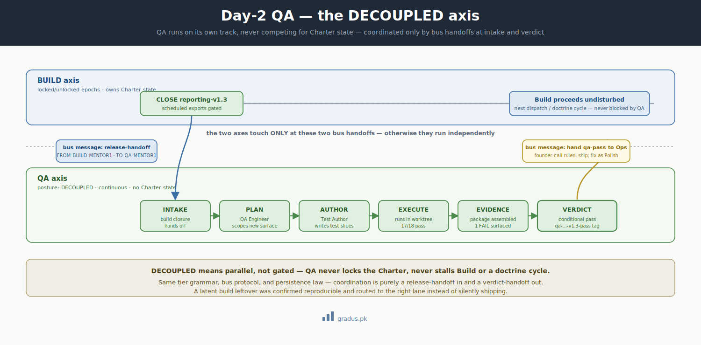

# Sample Day-2 QA axis — verifying the scheduled-exports release

> *A DECOUPLED Day-2 axis. QA runs parallel to Build and Doctrine, never competing for Charter state, on its own cadence: per-build-closure plus periodic full regression.*

**New here?** This page follows a quality-assurance (QA) team as it checks a finished feature before it ships — running alongside the people still building, never getting in their way. It is a worked example of how testing fits into CompassAlpha without slowing development down.

A quick vocabulary note before we start. An **axis** is one team working one kind of job. A **Charter** is the shared lock that says "this work is in progress, don't touch it." **DECOUPLED** (you'll see it in capitals) just means an axis that runs on its own track and never grabs that lock — so it can never block anyone else.

The four lanes ([Doctrine](sample-doctrine-cycle.md), [Phase 3](sample-phase3.md), [Polish](sample-polish.md), [Surgical](sample-surgical.md)) cover *building*. Once a product ships, building isn't enough — you have to **operate** it: test it, watch it, keep it compliant. CompassAlpha's answer is a set of **Day-2 axes** — teams that handle that ongoing work. They reuse the same building blocks the build teams use (the same tier structure, the same message bus, the same write-it-to-disk persistence law), but they run **DECOUPLED**: parallel to Build and Doctrine, never waiting on them.

This is the worked example for the **QA axis**.




<small>*A Day-2 axis runs on its own track, coupled to the build axis only by bus handoffs at intake and verdict.*</small>

## The DECOUPLED posture

A normal Build/Doctrine axis alternates Charter state (LOCKED ↔ UNLOCKED — see [Axis declarations](../03-tunables/axis-declarations.md)). A DECOUPLED axis does **not**:

- It runs **continuously**, not in locked/unlocked epochs.
- It does **not compete for Charter state** — it never blocks Build or Doctrine.
- It **shares infrastructure** — the same master rules, [bus protocol](../01-axioms/bus-protocol.md), and [persistence law](../01-axioms/persistence-law.md).

QA, Ops, and Compliance are all DECOUPLED axes. They are declared like any other axis (§4 axis declarations extend naturally), just with `posture: DECOUPLED`.

## Setup

The [Phase 3 dispatch](sample-phase3.md) just closed `reporting-v1.3` (scheduled exports). Before that release reaches production, the QA axis verifies it. The QA axis has its own three tiers:

| Generic tier | Northwind QA role | Does |
|---|---|---|
| **Mentor-1** | QA Lead | owns the test charter; ratifies release approval; surfaces founder-calls |
| **Mentor-2** | QA Engineer (per dispatch) | orchestrates verification of one release; triages results |
| **Doer** | Test Author / Validator | writes + runs tests; gathers pass/fail evidence |

- **Deliverable:** test coverage + pass/fail evidence + a release-approval decision.
- **Cadence:** per-Build-closure (this case) **plus** periodic full regression.
- **Tag plan:** `qa-reporting-v1.3-pass` on the evidence commit.

## Stage-by-stage walkthrough

QA declares its own stage taxonomy — Northwind uses `INTAKE → PLAN → AUTHOR → EXECUTE → EVIDENCE → VERDICT`.

### INTAKE — Build closure hands off

When the Build axis closed `reporting-v1.3`, its status grid `NEXT` line said *"hand to QA axis."* That handoff is a bus message into the QA Lead's inbox — DECOUPLED axes coordinate through the same bus, never by blocking each other:

```
/path/to/reviewer-state/qa/tier-1-lead/inbox/from-build-handoff.md
  [[FROM-BUILD-MENTOR1→TO-QA-MENTOR1 · reporting-v1.3 · release-handoff]]
  reporting-v1.3 closed (scheduled exports). EXIT_REPORT attached. Request release verification.
  Known build leftovers: retry-on-email-failure (untested path), cron-cadence (§9, out of scope).
  [[/FROM-BUILD-MENTOR1→TO-QA-MENTOR1]]
```

### PLAN — QA Lead dispatches a QA Engineer

The QA Lead stamps a QA Engineer (Mentor-2) for this release. The engineer plans coverage against the *new* surface only — schema, CRUD routes, the runner, the Notifications wiring.

### AUTHOR / EXECUTE — Test Author writes + runs

A fresh Doer (Test Author) writes the test slices and runs them in a worktree:

```
/path/to/reviewer-state/qa/tier-2-engineer/reporting-v1.3/s1/inbox/from-engineer-brief.md
  [[FROM-QA-MENTOR2→TO-DOER · reporting-v1.3/s1 · brief]]
  Author + run tests for scheduled-export CRUD + runner.
  Cover: create/list/delete schedule · runner fires at next_run_at · CSV emailed via Notifications.
  Explicitly probe the build leftover: behaviour when the delivery email fails.
  [[/FROM-QA-MENTOR2→TO-DOER]]
```

The Doer commits the tests + an evidence file to substrate (data plane), returns the result digest to the QA Engineer (control plane):

```
EXECUTE results:
  CRUD: 9/9 pass
  Runner fires at next_run_at: pass
  CSV delivered via Notifications: pass
  Email-failure path: FAIL — runner marks export "sent" even when Notifications returns an error
```

### EVIDENCE — QA Engineer assembles the package

The QA Engineer reconciles results into an evidence package and surfaces the failure to the QA Lead:

```
/path/to/reviewer-state/qa/tier-1-lead/inbox/reporting-v1.3/from-engineer-evidence.md
  [[FROM-QA-MENTOR2→TO-QA-MENTOR1 · reporting-v1.3 · evidence]]
  17/18 pass. One FAIL: email-failure path mismarks export as sent (the known build leftover, now confirmed reproducible).
  Recommendation: conditional approval — ship CRUD + runner, gate the failure as a fast-follow.
  [[/FROM-QA-MENTOR2→TO-QA-MENTOR1]]
```

### VERDICT — QA Lead ratifies + founder-call

The confirmed failure is a judgment call, so the QA Lead surfaces a **founder-call**: ship now with a tracked fast-follow, or hold the release? The founder rules "ship; fix the email-failure path as a [Polish](sample-polish.md) item." The QA Lead records the verdict and tags the evidence:

```bash
git -C /path/to/substrate tag -a qa-reporting-v1.3-pass -m "QA conditional pass: 17/18; email-failure fast-follow tracked"
git -C /path/to/substrate push origin qa-reporting-v1.3-pass
```

The email-failure fix is onboarded to `LEFTOVERS.md` (trigger T7 discipline applies to DECOUPLED axes too).

## What the QA status grid shows at close

```
STATUS GRID — 2026-06-09 · END · QA-Mentor-1 · MODE: RELAY · axis QA (DECOUPLED) · stage VERDICT
GATE        no Charter state (DECOUPLED) · release CONDITIONAL-PASS · 17/18
DISPATCH    none — last: qa-reporting-v1.3-pass
LEFTOVERS   1 open  (top: email-failure-mismark → Polish fast-follow)
NEXT        hand qa-pass to Ops axis for deploy
DISK        2 state artifacts · read-back ✓ · no unflushed state · GH-sync 0/0 @ e92b117
```

## Why DECOUPLED matters here

Notice what *didn't* happen: QA never locked the Charter, never blocked the Build axis, never stalled a future doctrine cycle. It ran on its own track, coordinated purely through bus handoffs, and produced an auditable verdict. If a [doctrine cycle](sample-doctrine-cycle.md) had been running concurrently, QA would have proceeded undisturbed — that's the entire point of the DECOUPLED posture.

## Outcome

- `reporting-v1.3` got a real verification pass with durable, tagged evidence.
- A latent bug (the build leftover) was confirmed reproducible and routed to the right lane instead of silently shipping.
- The release is now ready for the [Ops axis](sample-day2-ops.md) to deploy.
- QA ran in parallel with everything else, competing for nothing.

## Remember this

- **Building a feature and operating it are different jobs.** Day-2 axes (like QA) handle the operating part, using the same playbook as the build teams.
- **DECOUPLED means "never blocks."** A QA axis runs continuously on its own track and never grabs the shared lock, so it can verify a release without freezing the people still building. That separation is the whole point.
- **Teams coordinate by passing notes, not by waiting.** The build team hands off to QA through a bus message; QA hands its verdict to Ops the same way. Each team keeps moving.
- **Hard calls go up, evidence stays on disk.** When a real failure showed up, the QA Lead surfaced a founder-call instead of guessing — and the test results were committed and tagged so the decision is auditable later. For why "write it down" runs through everything here, see [the mental model](../00-foundation/mental-model.md).

---

## Next: [Sample Day-2 Ops →](sample-day2-ops.md)
