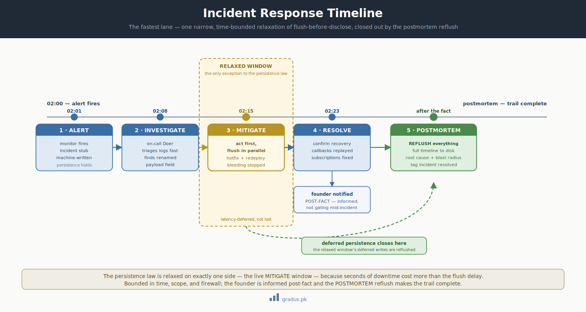

# Sample Incident Response — Billing webhook outage at 02:00

> *The fastest lane in the framework. Reduced ceremony, founder post-fact (not gating), and a narrow time-bounded exception to flush-before-disclose for the immediate response window. The postmortem reflushes everything.*

**In plain terms:** this page walks through how an AI-agent team handles a real production emergency — a billing system breaking at 2 in the morning — and shows the one moment where the framework lets responders move fast first and write the full record afterward. If you want to see how all the careful rules bend (just a little, just briefly) when seconds cost money, start here.

A quick note on two terms you'll see throughout. A **lane** is just a named way of doing work — different sizes of job get different amounts of process. **Flush-before-disclose** is the framework's normal rule that you write something down (to disk) before you act on it or tell anyone — so there's always a durable record. This page is about the *one* lane where that rule is briefly relaxed.

This is the worked example for the **Incident Response lane** — a fifth work-granularity lane that lives within (or cross-cuts) the [Ops axis](sample-day2-ops.md). It exists because the other lanes are all designed for *planned* work, and a production outage at 02:00 is not planned. Incident Response is **faster than a [Surgical Strike](sample-surgical.md)**: it must be, because the meter is running.


[](../assets/incident-response-timeline.svg)

<small>*The one sanctioned exception to flush-before-disclose: a narrow live-mitigation window, with the audit re-flushed at postmortem and the founder notified post-fact.*</small>

## What makes this lane different

| Aspect | Every other lane | Incident Response |
|---|---|---|
| Founder | gates or relays at decision points | **post-fact** — informed, not gating |
| Flush-before-disclose | strict, always | **narrowly relaxed** for the live response window |
| Ceremony | proportional to change size | minimal during response; full at postmortem |
| Driver | a request | an **alert** |

The flush relaxation is the subtle part and the most important to get right: during the immediate response window, the responder may act *before* every step is on disk, because seconds of downtime cost more than the persistence delay. **The postmortem reflushes everything** — the full timeline lands on disk afterward, so the audit trail is complete even though it wasn't real-time.

This is a *narrow, time-bounded* exception. It applies only to the live MITIGATE window, only to the immediate response, and it is closed out by a mandatory postmortem reflush.

## Setup

At 02:00 a monitor fires: Billing's payment-provider **webhook handler is erroring** — incoming `payment_succeeded` callbacks are 500ing, so subscriptions aren't being marked paid. The on-call responder is an **Ops Doer** — a hands-on agent allowed to deploy and edit config; the **SRE Lead** (a mentor-tier agent, "Mentor-1") is paged to oversee.

The lane uses the stages `ALERT → INVESTIGATE → MITIGATE → RESOLVE → POSTMORTEM`.

## Stage-by-stage walkthrough

### ALERT — the monitor fires

The monitor wired during the [Ops deploy](sample-day2-ops.md) does its job. The alert auto-creates an incident record stub in the Ops inbox (machine-written, so persistence holds even before a human responds):

```
/path/to/reviewer-state/ops/incidents/INC-2026-06-09-billing-webhook/from-monitor-alert.md
  [[FROM-MONITOR→TO-OPS · INC-2026-06-09-billing-webhook · alert]]
  Billing webhook handler error rate 100% since 02:01. payment_succeeded callbacks 500ing.
  Impact: subscriptions not transitioning to paid; risk of false past_due dunning.
  [[/FROM-MONITOR→TO-OPS]]
```

### INVESTIGATE — responder triages fast

The on-call Doer pulls the alert and investigates. Logs show the webhook handler is throwing on a payload field the provider renamed in a silent API change — `event.data.object.amount_paid` is now `amount_received`.

### MITIGATE — act first, flush in parallel *(the relaxed window)*

This is the time-bounded exception. The responder mitigates **immediately** — the fastest safe stop-the-bleeding action — rather than waiting for a full brief/flush cycle. Here the safe mitigation is to make the handler tolerant of both field names and redeploy:

```bash
# Immediate mitigation — applied during the relaxed window
git -C /path/to/substrate commit -m "billing(hotfix): webhook handler accepts amount_received fallback [INC-2026-06-09]"
git -C /path/to/substrate push origin main:main
# fast redeploy of the webhook service only
```

The responder also re-queues the failed callbacks so missed `payment_succeeded` events replay. Error rate drops to 0%. **Bleeding stopped.**

During this window the responder did not pause to author full inbox ceremony — the commit message carries the incident ID so the trail is still recoverable, and the full reconstruction happens at postmortem.

### RESOLVE — confirm + notify founder post-fact

Once stable, the responder confirms recovery (replayed callbacks processed, subscriptions corrected, no erroneous dunning sent) and **notifies the founder after the fact** — the founder is informed, not asked to approve mid-incident:

```
/path/to/reviewer-state/ops/tier-1-lead/inbox/from-oncall-resolve.md
  [[FROM-DOER→TO-OPS-MENTOR1 · INC-2026-06-09-billing-webhook · resolve]]
  RESOLVED 02:23. Root cause: provider renamed amount_paid → amount_received (silent API change).
  Mitigation: tolerant field parsing + callback replay. No customer-visible dunning errors confirmed.
  Founder notified post-fact. Postmortem to follow.
  [[/FROM-DOER→TO-OPS-MENTOR1]]
```

### POSTMORTEM — reflush everything

This stage **restores full persistence discipline**. The SRE Lead orchestrates a postmortem that writes the complete timeline to disk — everything the relaxed window deferred is now reflushed:

```
/path/to/reviewer-state/ops/incidents/INC-2026-06-09-billing-webhook/POSTMORTEM.md
  Timeline:  02:01 alert · 02:08 investigate · 02:15 mitigate (hotfix) · 02:19 replay · 02:23 resolved
  Root cause: silent upstream API field rename, no contract test caught it.
  Blast radius: 22 min; 47 callbacks delayed, all replayed; 0 erroneous dunning.
  Follow-ups (onboarded to LEFTOVERS):
    - add a contract test against the provider's webhook schema  → QA axis
    - the hotfix's tolerant parsing should become permanent + tested → Polish lane
    - alert on upstream-API-change earlier → Ops monitoring
```

The postmortem tags the incident closed:

```bash
git -C /path/to/substrate tag -a inc-2026-06-09-billing-webhook-resolved -m "Billing webhook outage: resolved + postmortem"
git -C /path/to/substrate push origin inc-2026-06-09-billing-webhook-resolved
```

## What the Ops/incident status grid shows at close

```
STATUS GRID — 2026-06-09 · END · Ops-Mentor-1 · MODE: RELAY · lane INCIDENT · stage POSTMORTEM
GATE        no Charter state · incident RESOLVED · MTTR 22m · postmortem reflushed
DISPATCH    none — last: inc-2026-06-09-billing-webhook-resolved
LEFTOVERS   3 open  (top: webhook-contract-test → QA, permanent-fix → Polish, upstream-change-alert → Ops)
NEXT        route 3 follow-ups to their lanes; standby
DISK        postmortem + incident record · read-back ✓ · no unflushed state · GH-sync 0/0 @ 0ab7c44
```

## Why the relaxation is safe

The flush relaxation could look like a hole in the [persistence law](../01-axioms/persistence-law.md). It isn't, because it is **bounded on every side**:

- **Bounded in time** — only the live MITIGATE window.
- **Bounded in scope** — only the immediate stop-the-bleeding action.
- **Bounded by the firewall** — the founder is still not authoring substrate; a Doer is. The [hard labour rule](../01-axioms/hard-labour-rule.md) holds even at 02:00.
- **Closed out** — the mandatory POSTMORTEM reflush makes the audit trail complete after the fact. Nothing load-bearing is *permanently* off-disk; it's only briefly *latency-deferred*.

The incident commit even carries the incident ID, so the trail is reconstructable from git even before the postmortem is written.

## Outcome

- A production outage was mitigated in 22 minutes by a single on-call Doer, with the founder informed but not blocking.
- Persistence was *briefly* relaxed for speed, then fully restored by the postmortem.
- Three concrete follow-ups were routed to their proper lanes ([QA](sample-day2-qa.md), [Polish](sample-polish.md), [Ops](sample-day2-ops.md)) instead of evaporating with the on-call shift.
- The whole incident — alert, mitigation commit, resolution, postmortem, tag — is reconstructable from git.

This is the last of the worked examples. Together they walk the full spectrum: from a weeks-long [doctrine cycle](sample-doctrine-cycle.md) down to a 22-minute incident — the *same* primitives throughout, only the ceremony changing to match the moment.

## Remember this

- **Emergencies get their own fast lane.** Every other lane is built for planned work; this one is built for a 2 a.m. alert, so it trades ceremony for speed.
- **The "write it down first" rule bends only here, and only briefly.** During the live mitigation window the responder acts first; the postmortem then writes the *full* record to disk, so nothing is permanently lost — it's just delayed.
- **The founder is told, not asked.** Mid-incident there's no waiting for approval; the founder is informed after the fact.
- **Loose ends don't evaporate.** Follow-up fixes get routed to their proper lanes instead of disappearing with the on-call shift. For how these pieces fit together, see [the mental model](../00-foundation/mental-model.md).

---

## Next: [Reference →](../07-reference/index.md)
