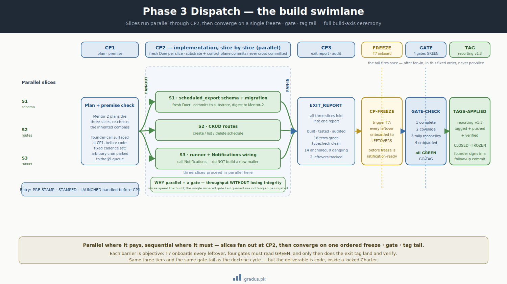

# Sample Phase 3 dispatch — scheduled exports for Reporting

> *The build axis at full ceremony. A single-module substantive change runs CP1 → CP2 → CP3, freezes, gate-checks, and tags. This walkthrough adds scheduled exports to Northwind's Reporting module.*

**New here?** This page follows one real feature — adding scheduled report exports to a sample app — from first plan to final tagged release, so you can see how a substantial piece of work moves through the framework's checkpoints. Think of it as a recorded demo of the full process.

A quick orientation before the jargon arrives. **Phase 3** is the framework's name for a chunky-but-contained piece of work: one module gets something genuinely new (a database table, new endpoints, a background job). The work passes through three review **checkpoints** — CP1 (plan it), CP2 (build it), CP3 (report on it) — and then a closing ritual where the work is locked, checked against a set of **gates** (pass/fail quality checks), and given a git **tag** (a permanent version label). Tiers like *Mentor* and *Doer* are simply roles: planners/reviewers above, the hands-on builder below. With that map in hand, the walkthrough below should read cleanly.

This is the worked example for the **Phase 3** lane (see [Work Granularity Lanes](../03-tunables/work-granularity-lanes.md)) — the heaviest *build*-axis lane, used for substantive single-module work: a new schema, new routes, a multi-stage rollout. It is the build-axis sibling of the [doctrine cycle](sample-doctrine-cycle.md): same three tiers, same freeze/gate/tag tail, but the deliverable is **code**, not doctrine, so §19 compass structure doesn't apply.




<small>*Parallel slices fan out through the checkpoints and fan back in to a single freeze-gate-tag close.*</small>

## Setup

Northwind's Reporting module can render dashboards live but can't deliver them on a schedule. The founder wants **scheduled exports**: users pick a report + a cadence, and the system emails a CSV at that cadence. This is a new schema (a `scheduled_export` table), new routes, and a background runner — squarely Phase 3.

- **Charter posture:** LOCKED (build axis active — the [doctrine cycle](sample-doctrine-cycle.md) already closed; Reporting's compass is the inherited reference).
- **Tiers in play (build axis):** Mentor-1 · Mentor-2 (this dispatch) · Doer (fresh-per-slice).
- **Deliverable:** working scheduled-export feature in `/path/to/substrate/reporting/**`, passing typecheck + tests + audit.
- **Tag plan:** `reporting-v1.3` on the gated commit.

Northwind uses the default build stage taxonomy: `PRE-STAMP → STAMPED → LAUNCHED → WIP-CP1 → WIP-CP2 → WIP-CP3 → CP-FREEZE → GATE-CHECK → GO-TAG → TAGS-APPLIED → CLOSED → FROZEN` (see [Stage taxonomies](../03-tunables/stage-taxonomies.md)).

## Stage-by-stage walkthrough

### PRE-STAMP → STAMPED → LAUNCHED

Mentor-1 composes the dispatch stamp and writes it into Mentor-2's inbox (trigger **T1** flush), then the founder relays one ping.

```
/path/to/reviewer-state/tier-2-orchestrator/reporting-exports/inbox/from-mentor1-launch.md
  [[FROM-MENTOR1→TO-MENTOR2 · reporting-exports · launch]]
  Dispatch: scheduled exports for Reporting. Scope: schedule CRUD + background runner + CSV email.
  Inherit Reporting compass (reporting-compass-v0.2) + Charter v0.6.
  Reuse Notifications for delivery — do NOT build a new mailer.
  [[/FROM-MENTOR1→TO-MENTOR2]]
```

Mentor-2 boots: stage `LAUNCHED`.

### CP1 — Planning + premise check

CP1 is **think before build**. Mentor-2 plans the slices, re-checks the premise against the inherited compasses, and surfaces founder-calls *before* any code is written.

```
/path/to/reviewer-state/tier-1-mentor/inbox/reporting-exports/from-mentor2-cp1-founder-call.md
  [[FROM-MENTOR2→TO-MENTOR1 · reporting-exports · cp1-founder-call]]
  FOUNDER-CALL: cadence options — daily/weekly/monthly only, or arbitrary cron?
  Recommend: fixed set (daily/weekly/monthly) for v1; cron deferred to §9.
  Slice plan: S1 schema+migration · S2 CRUD routes · S3 runner+Notifications wiring.
  [[/FROM-MENTOR2→TO-MENTOR1]]
```

The founder rules "fixed set for v1" (relayed through Mentor-1's inbox). Cron support is parked in the **§9 queue** for a future doctrine cycle. CP1 closes.

### CP2 — Implementation, slice by slice

Each slice is a fresh Doer (fresh-per-slice — see [Tier Grammar](../01-axioms/tier-grammar.md)). Mentor-2 briefs slice S1; the Doer works in a worktree and returns tagged.

```
/path/to/reviewer-state/tier-2-orchestrator/reporting-exports/s1/inbox/from-mentor2-brief.md
  [[FROM-MENTOR2→TO-DOER · reporting-exports/s1 · brief]]
  Add scheduled_export table + migration. Columns: id, user_id, report_id, cadence(enum),
  next_run_at, last_run_at, status. Anchor to Reporting compass 10K schema section.
  [[/FROM-MENTOR2→TO-DOER]]
```

The Doer commits to substrate (data plane), then writes a digest into Mentor-2's inbox (control plane) — **two separate git operations, never cross-committed**:

```bash
# Data plane (substrate)
git -C /path/to/substrate add reporting/migrations/ reporting/models/scheduled_export.ts
```

This stages the new files — the migration and the model — for the next commit. `git add` tells git which changed files to include; `-C /path/to/substrate` just means "run this in that directory" so you don't have to move there first.

```bash
git -C /path/to/substrate commit -m "reporting: scheduled_export schema + migration"
```

This records the staged files as a permanent, labelled snapshot in the project's history. The `-m` text is the commit message — a short note saying what changed, so anyone reading the history later knows why.

```bash
git -C /path/to/substrate push origin main:main
```

This uploads the new commit to the shared remote copy of the project (`origin`) so the rest of the team can see it. `main:main` means "send my `main` branch to the remote's `main` branch."

Mentor-2 triages the return (stage `TRIAGING`), applies per-stage substantive review, then briefs S2, then S3. The S3 Doer is told explicitly to **call Notifications**, not to build a mailer — enforcing the Federation Contract from the inherited compass.

### CP3 — Exit-report assembly + audit reconciliation

Mentor-2 assembles the `EXIT_REPORT`: what was built, what was tested, what audit checks ran, and the finding tally.

```
/path/to/reviewer-state/tier-2-orchestrator/reporting-exports/EXIT_REPORT.md
  Built: schema (S1), CRUD routes (S2), runner + Notifications wiring (S3).
  Tests: 18 added, all green. Typecheck: clean. Route-coverage audit: 100% of new routes.
  Findings: 14 anchored, 0 dangling.
  Leftovers: cron-cadence (§9), retry-on-email-failure (build leftover).
```

## Freeze → gate-check → tag

At **CP-FREEZE**, trigger **T7** onboards every leftover to `LEFTOVERS.md` before freeze is declared ratification-ready.

Mentor-1 runs the four **gates** (see [Guardrails](../02-guardrails/index.md)):

| Gate | Check | Result |
|---|---|---|
| 1 · Deliverable COMPLETE | feature passes typecheck + tests + audit | GREEN |
| 2 · Coverage at target | all three slices done + substance review | GREEN |
| 3 · Finding tally self-reconciles | 14 anchored, 0 dangling | GREEN |
| 4 · Every non-closed item onboarded | 2 leftovers tracked | GREEN |

Gates GREEN → **GO-TAG**. Mentor-2 applies the exit tag and verifies it landed:

```bash
git -C /path/to/substrate tag -a reporting-v1.3 -m "Scheduled exports: schema + CRUD + runner"
```

This attaches a permanent version label, `reporting-v1.3`, to the current commit. A tag is a named bookmark for a specific point in history; `-a` makes it an "annotated" tag that also stores the `-m` message, so the release has a description you can read back later.

```bash
git -C /path/to/substrate push origin reporting-v1.3
```

This uploads the new tag to the shared remote (`origin`). Tags aren't sent automatically with a normal push, so you name the tag explicitly to make the release label visible to everyone.

```bash
git -C /path/to/substrate ls-remote --tags origin | grep reporting-v1.3   # TAGS-APPLIED
```

This checks that the tag actually arrived on the remote. `ls-remote --tags origin` lists every tag the remote knows about, and `grep reporting-v1.3` filters that list down to just the line you're looking for — if it prints, the tag landed.

Stage advances `GO-TAG → TAGS-APPLIED → CLOSED`. Mentor-1 sends the STAND-DOWN ack; Mentor-2's judicial folder is archived (`FROZEN`).

The founder's signature lands in a **follow-up commit after the tag** — it's decoupled judgment, not a gate (see §13 tag-vs-close-record convention).

## What the status grid shows at close

```
STATUS GRID — 2026-06-09 · END · Mentor-1 · MODE: RELAY · cycle stage CLOSED
GATE        Charter v0.6 LOCKED · gates closed · 1/1 dispatch done
DISPATCH    none — last: reporting-v1.3
LEFTOVERS   2 open  (top: cron-cadence §9, retry-on-email-failure)
NEXT        hand reporting-v1.3 to QA axis for release verification
DISK        3 state artifacts · read-back ✓ · no unflushed state · GH-sync 0/0 @ a71e0bd
```

## Outcome

- Scheduled exports shipped as `reporting-v1.3`: schema, routes, runner, all gated.
- The Federation Contract held — delivery went through Notifications instead of a duplicate mailer.
- A scope question (arbitrary cron) was surfaced at CP1 and parked cleanly, not silently dropped.
- The dispatch is now ready to hand to the [QA axis](sample-day2-qa.md) for release verification and the [Ops axis](sample-day2-ops.md) for deployment.

Compared to the [doctrine cycle](sample-doctrine-cycle.md): same tier count, same gate tail — but no 60K/30K/10K altitude structure and no Charter unlock. The build axis runs *inside* a locked Charter. The next two examples relax the ceremony further.

## Remember this

- **Phase 3 is the heavy lane for building, not deciding.** It runs inside an already-settled Charter (the rules don't change here) — the deliverable is working code, gated and tagged.
- **CP1 → CP2 → CP3 means plan, build, account.** Open questions get surfaced early (at CP1) and either answered or parked on a queue — never silently dropped.
- **The closing ritual is the safety net.** Freeze, four gates (all must be GREEN), then a version tag. A feature only "ships" once every gate passes and every loose end is tracked.
- **Roles map to a simple hierarchy.** If "Mentor" and "Doer" still feel abstract, [the mental model](../00-foundation/mental-model.md) lays out who does what and why the layers exist.

---

## Next: [Sample Polish Lane →](sample-polish.md)
