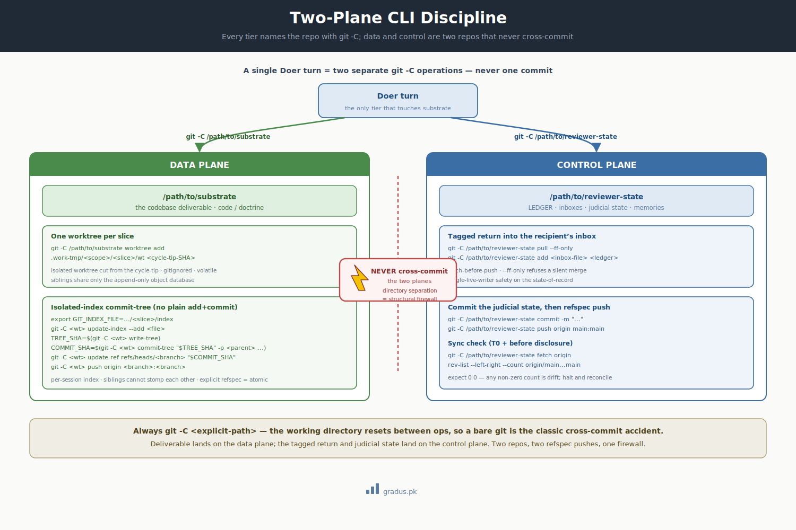

# CLI conventions

> *The git/shell discipline for operating a federation. Two planes, an isolated index, one worktree per slice, refspec push — every time.*

`[INVARIANT — commit discipline + worktree mechanism]` · `[TUNABLE — paths, remote service]`

**New here?** This page is the rulebook for how every AI agent in a federation uses git and the command line — which commands to run, in which folder, and in what order — so that many agents can work at once without overwriting each other's files. If you'll be running or configuring a federation, these are the moves to copy exactly.

This page is the operational cheat-sheet for the git layer. The framework's claim that *state of the federation = state of git* only holds if every tier follows these conventions exactly. They are the concrete resolution of "commit discipline" referenced throughout the portal. The mechanics are explained in depth on the [git foundations axiom](../01-axioms/git-foundations.md); this page is the lookup form.

All paths below are generic placeholders. Substitute your own: `/path/to/substrate` (the project repo) and `/path/to/reviewer-state` (the federation meta-state repo).

---




<small>*Two repos, two planes: the substrate deliverable and the control-plane state are committed by separate git operations and never crossed.*</small>

## 1. Two-plane discipline

A federation operates **two distinct repos in two sibling directories that never cross-commit:**

| Plane | Repo | Holds | A tier touches it with |
|---|---|---|---|
| **Control plane** | `/path/to/reviewer-state` | Briefs, returns, judicial state, memories, status grids | `git -C /path/to/reviewer-state …` |
| **Data plane** | `/path/to/substrate` | The actual deliverable (code / doctrine) | `git -C /path/to/substrate …` |

**The rule: always `git -C <explicit-path>`.** Never rely on the current working directory — the working directory is reset between operations and a bare `git` command in the wrong tree is the classic cross-commit accident. Naming the repo with `-C` on every invocation makes the plane explicit and the command location-independent.

A single Doer turn is **two separate `git -C` operations**: commit the deliverable to the substrate (data plane), then write the tagged return into the recipient's inbox and push the reviewer-state repo (control plane). They are never one commit.

```bash
# data plane — the deliverable
git -C /path/to/substrate <commit-discipline ...>
```

First, commit the actual work product into the project repo (the "data plane"). The `-C /path/to/substrate` part tells git to act on that specific folder, no matter where you happen to be standing.

```bash
# control plane — the return + judicial state
git -C /path/to/reviewer-state add <inbox-file> <ledger>
```

Now switch to the bookkeeping repo (the "control plane") and stage two files: the return note that reports the work back, and the ledger that records what happened. "Stage" means mark these files to be included in the next commit.

```bash
git -C /path/to/reviewer-state commit -m "..."
```

Record those staged files as a permanent commit in the bookkeeping repo, with a short message describing the change.

```bash
git -C /path/to/reviewer-state push origin main:main
```

Send that commit up to the shared remote copy of the bookkeeping repo so the rest of the federation can see it. `main:main` means "publish my local `main` branch onto the remote's `main` branch."

The pollution firewall is **structural by directory separation**: because the reviewer-state repo is outside the substrate working tree, a reviewer commit *cannot* land on a substrate branch. See [the firewall](../01-axioms/firewall.md).

---

## 2. The isolated-index commit pattern (`GIT_INDEX_FILE` + `commit-tree`)

Git keeps a *staging area* called the **index** — the list of changes that the next commit will include. By default every command shares one index file, so if two agents stage changes at the same time, they trip over each other.

Never use plain `git add` + `git commit` for federation work. Plain `git add` modifies the shared default index (`.git/index`); two parallel sessions stomp each other's staged files and produce commits with sibling-session deltas — silently. Use a **per-session index** (each agent gets its own private staging area) and `commit-tree`:

```bash
# 1. Point this session at its OWN index file (per-session staging area).
export GIT_INDEX_FILE=/path/to/substrate/.doer-tmp/<scope>/<slice>/index
```

Set an environment variable that tells every git command in this session to use a private staging area at the given path, instead of the one shared default. This is what keeps two agents from tripping over each other's staged files.

```bash
# 2. Stage changes into THAT index (run inside the slice worktree, see §3).
git -C <worktree> update-index --add <file>     # or read-tree + manipulation
```

Add a file to that private staging area. `update-index --add` is the lower-level equivalent of `git add`, and because step 1 redirected the index, the change lands in this session's own staging area.

```bash
# 3. Write a tree object from the isolated index.
TREE_SHA=$(git -C <worktree> write-tree)
```

Snapshot the staged files into a "tree" — git's internal record of a folder's contents — and capture its identifier in a variable. This freezes exactly what was staged so the next step can build a commit from it.

```bash
# 4. Build a commit pointing at that tree, parented on the base.
COMMIT_SHA=$(git -C <worktree> commit-tree "$TREE_SHA" -p <parent-sha> -m "<message>")
```

Create a commit object from that snapshot, attached to the starting commit named by `-p` (its "parent"), and capture the new commit's identifier. Unlike `git commit`, this builds the commit directly without touching any branch yet.

```bash
# 5. Move the branch ref to the new commit.
git -C <worktree> update-ref refs/heads/<branch> "$COMMIT_SHA"
```

Point the branch at the commit you just built. A branch is just a movable label for a commit, and this is what makes the new commit the tip of `<branch>`.

```bash
# 6. Publish via explicit refspec (see §4).
git -C <worktree> push origin <branch>:<branch>
```

Send the branch up to the shared remote, spelling out source and destination so the publish targets exactly one branch (see §4 for why that matters).

`GIT_INDEX_FILE` is a per-process pointer to *which* index a git invocation uses. A unique path per session gives each session its own staging area; siblings cannot see or stomp on each other's stage. This is `[INVARIANT]` — it is what prevents sibling-session contamination under any concurrency mode.

---

## 3. One worktree per slice (`git worktree`)

A **worktree** is a separate folder where one repo can have a different branch checked out — so each agent edits its own copy of the files instead of sharing one. The Doer (the agent doing the work) never edits the substrate's main working tree. Each slice (a unit of assigned work) gets its own **isolated worktree**, cut from the cycle-tip (the agreed starting commit for the round):

```bash
# Cut a worktree from the cycle-tip SHA into a gitignored, slice-local path.
git -C /path/to/substrate worktree add \
    /path/to/substrate/.doer-tmp/<scope>/<slice>/wt  <cycle-tip-SHA>
```

Create a new working folder at the given path, checked out to the starting commit (`<cycle-tip-SHA>`). This gives the agent its own copy of the files to edit, separate from everyone else's.

```bash
# Operate entirely inside it.
git -C /path/to/substrate/.doer-tmp/<scope>/<slice>/wt <commands ...>
```

Run all of the agent's git work against that dedicated folder by naming it with `-C`. Because each agent has its own folder, their edits can't collide.

```bash
# Remove it at a clean slice close (the worktree is volatile).
git -C /path/to/substrate worktree remove \
    /path/to/substrate/.doer-tmp/<scope>/<slice>/wt
```

Delete the worktree folder once the work is finished and committed. It is scratch space, not something to keep — the committed history already holds everything that matters.

`git worktree` lets one repository have multiple branches checked out in separate directories, sharing only the append-only, concurrency-safe `.git/` object database. Sibling Doers never collide on working files. The worktree IS the Doer's disk-home — hot, volatile, pluggable — satisfying the persistence law (on disk) while keeping scratch off the committed substrate. The `.doer-tmp/` path is gitignored in the substrate; do not commit scratch into the project.

---

## 4. Refspec push + fetch-before-push

A **refspec** is the `<source>:<destination>` part of a push that spells out exactly which local branch goes to which remote branch. Always push with an **explicit refspec** — `git push origin <branch>:<branch>` — never a bare `git push`. A single-ref refspec push is **atomic for that ref**: if two sessions race the same branch, only one succeeds; the loser gets a `non-fast-forward` rejection and must fetch + rebase + retry. Race-safe by construction — the loser cannot silently overwrite the winner.

Before every push to the **reviewer-state** repo, fetch first:

```bash
# fetch-before-push on the control plane (single-live-writer safety)
git -C /path/to/reviewer-state pull --ff-only
```

Pull down any new commits from the remote first. `--ff-only` ("fast-forward only") means git will only accept the update if your local copy hasn't diverged — if it has, the command fails loudly instead of quietly merging, which is exactly the warning you want.

```bash
# ... make your changes / write inbox file ...
git -C /path/to/reviewer-state add <files>
```

After making your edits, stage the changed files — mark them to be included in the next commit.

```bash
git -C /path/to/reviewer-state commit -m "<message>"
```

Record the staged files as a permanent commit, with a short message describing what changed.

```bash
git -C /path/to/reviewer-state push origin main:main
```

Send the commit up to the shared remote's `main` branch. Because you pulled first, this push should go through cleanly.

`pull --ff-only` refuses to create a merge commit — if the local branch has diverged, it fails loudly rather than silently merging. Combined with [single-live-writer](../02-guardrails/single-live-writer.md) discipline, this keeps the state-of-record clean.

---

## 5. Commit discipline (the rules, summarized)

| Rule | Why | Status |
|---|---|---|
| Always `git -C <explicit-path>` | Working directory resets between ops; bare git risks cross-plane commits | `[INVARIANT]` |
| Per-session `GIT_INDEX_FILE` | Prevents sibling-session index contamination | `[INVARIANT]` |
| `commit-tree`, not `git add`+`git commit` | Materializes the isolated index deterministically | `[INVARIANT]` |
| One worktree per slice | Prevents working-tree collisions between Doers | `[INVARIANT]` |
| Explicit refspec push | Atomic single-ref publication; race-safe | `[INVARIANT]` |
| `pull --ff-only` before every reviewer-state push | Fetch-before-push; single-live-writer safety | `[INVARIANT]` |
| Frequent small commits at every flush trigger | A power-down loses ≤ the current in-flight turn | `[TUNABLE — cadence]` |
| Keep inbox files (don't prune) | Inbox files ARE the audit trail | `[INVARIANT]` |

---

## 6. Verifying state (the sync check)

At boot (T0) and before disclosure, confirm local == origin. A clean federation shows **sync 0/0** (zero ahead, zero behind) at a known SHA:

```bash
# fetch refs, then compare local tip to origin tip
git -C /path/to/reviewer-state fetch origin
```

Download the latest branch pointers from the remote without changing any of your files. This refreshes git's picture of where the remote stands, so the next command can compare against it.

```bash
git -C /path/to/reviewer-state rev-list --left-right --count origin/main...main
# expect: 0      0      → in sync
```

Count how many commits your local `main` is ahead of and behind the remote `main`. Two zeros means the two are identical; anything else means they have drifted apart and you should reconcile before doing more work.

```bash
# the SHA that appears on the DISK line of the status grid
git -C /path/to/reviewer-state rev-parse --short HEAD
```

Print the short identifier of the commit you are currently sitting on. This is the SHA you record on the status grid so anyone can confirm which exact state you were working from.

Any non-zero count is drift — halt and reconcile before acting (T0 boot-integrity).

To verify an applied tag actually reached the remote (the `TAGS-APPLIED` stage):

```bash
git -C /path/to/substrate push origin <tag>
```

Send a tag — a fixed, named marker on a specific commit — up to the remote. Tags are not pushed automatically with ordinary commits, so this step publishes it explicitly.

```bash
git -C /path/to/substrate ls-remote --tags origin <tag>   # confirm it's there
```

Ask the remote which tags it actually holds, filtered to the one you just pushed. If it comes back, you have proof the tag really landed rather than just assuming the push worked.

---

## 7. Tunables on the CLI surface

| Tunable | Default | Notes |
|---|---|---|
| VCS | git | `[INVARIANT — git is the bus]` |
| Remote service | a hosted git remote | Could be self-hosted; just needs a push target |
| Flush cadence | every flush trigger pushes | Lighter cadence acceptable on hosts without abrupt power-down |
| `/tmp` usage | no load-bearing file in `/tmp` | `[TUNABLE]` — on for hosts with volatile tmpfs; off where `/tmp` is durable |
| Worktree root | `<substrate>/.doer-tmp/` (gitignored) | Path layout is tunable; the worktree mechanism is invariant |

→ [Git foundations axiom](../01-axioms/git-foundations.md) · [Bus protocol](../01-axioms/bus-protocol.md) · [Persistence law](../01-axioms/persistence-law.md) · [Single-live-writer](../02-guardrails/single-live-writer.md) · [Flush triggers](flush-triggers.md)

---

## Remember this

- **Two folders, never crossed.** The deliverable lives in one repo, the federation's bookkeeping in another. Always name the folder with `git -C <path>` so a command can't land in the wrong place.
- **Give every agent its own staging area and its own folder.** A per-session index plus one worktree per slice is what lets many agents work at once without overwriting each other.
- **Push narrowly and check before you trust.** An explicit refspec push is race-safe, and a quick "is local the same as origin?" sync check at boot catches drift before it bites.
- These habits are the hands-on form of the bigger picture in [the mental model](../00-foundation/mental-model.md): the state of the federation simply *is* the state of git.

---

## Next: [Community →](../08-community/index.md)
