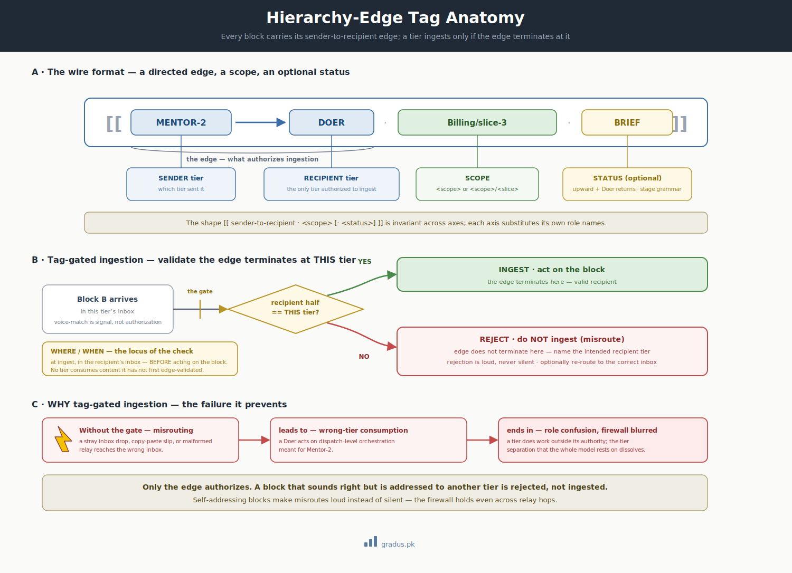

# Hierarchy tags

> *Every block carries its sender→recipient edge. A tier ingests a block only if the edge terminates at it.*

`[INVARIANT — the wire format]` · `[TUNABLE — exact tag names]`

**New here?** This page explains the little "address label" that gets stamped on every message agents pass to each other — who it's from, who it's for. That label is what stops a message from being read by the wrong agent. If you're routing work between tiers and want to know why messages can't get crossed, this is the page for you.

Hierarchy-edge tags are the addressing layer of the [bus protocol](../01-axioms/bus-protocol.md) — the shared messaging system tiers use to pass work back and forth. Every paste-ready block — and every inbox file's content — is wrapped in a tag naming the **edge** it travels (an "edge" here just means the directed link from one tier to another): which tier sent it, which tier it is for. The tag is what makes routing auditable — you can always trace where a message came from and where it was headed — and what powers **tag-gated ingestion**: before a tier acts on a message, it checks the tag to confirm the message was actually addressed to it.

This defends against a specific failure: a block that *sounds* right (voice-match across relay hops) being ingested by the wrong tier. Voice-match is signal, not authorization. Only the edge authorizes.

---


[](../assets/hierarchy-tag-anatomy.svg)

<small>*Every bus message is wrapped in an edge tag; the recipient validates the edge terminates at its own tier before ingesting — misrouted tags are rejected.*</small>

## The wire format

A tag names a directed edge between two tiers, plus a scope, plus (for upward returns) a status.

| Direction | Open tag | Close tag |
|---|---|---|
| **Down** (mentor → sub-tier) | `[[MENTOR-1→MENTOR-2 · <scope>]]` | `[[/MENTOR-1→MENTOR-2]]` |
| **Up** (sub-tier → mentor) | `[[MENTOR-2→MENTOR-1 · <scope> · <status>]]` | `[[/MENTOR-2→MENTOR-1]]` |
| **Mid → Doer** | `[[MENTOR-2→DOER · <scope>/<slice>]]` | `[[/MENTOR-2→DOER]]` |
| **Doer → Mid** | `[[DOER→MENTOR-2 · <scope>/<slice> · <status>]]` | `[[/DOER→MENTOR-2]]` |
| **Cross-axis** (rare) | `[[<AXIS_A>→<AXIS_B> · <scope>]]` | `[[/<AXIS_A>→<AXIS_B>]]` |

**Anatomy of a tag:**

```
[[  MENTOR-2 → DOER   ·   Billing/slice-3   ·   BRIEF  ]]
    └─sender─┘ └recip┘     └────scope────┘      └status┘
    └──── the edge ────┘
```

- **Sender / recipient** — the two tiers the block travels between. Generic names shown; each axis substitutes its own role names (the rules are stated in the generic vocabulary).
- **Scope** — the unit of work. `<scope>` for dispatch-level, `<scope>/<slice>` for slice-level.
- **Status** (upward + Doer-return tags) — the return's disposition, drawn from the [stage grammar](stage-grammar.md) (e.g. `WIP-CP2`, `CP-FREEZE`, `BRIEF-INCOMPLETE`, `READY-FOR-GATE`).

### Per-axis substitution

The framework speaks `MENTOR-1 / MENTOR-2 / DOER`; each axis declares its own role names and uses them on the wire. A federation operating a build axis (roles, say, Mentor-1/Mentor-2/Doer) and a doctrine axis (its own three role names) would see edges named for each axis's roles — but the *shape* (`[[<sender>→<recipient> · <scope> [· <status>]]]`) is invariant across axes.

---

## Tag-gated ingestion (validate-then-reject)

The rule a tier applies before consuming any block:

```text
ON receiving a block B:
  1. Parse B's edge tag.
  2. IF the recipient half of the edge == THIS tier:
        ingest and act.
  3. ELSE:
        REJECT. Do NOT ingest.
        Name the intended recipient tier in the rejection.
        (Optionally re-route the block to the correct recipient's inbox.)
```

Three rules make this load-bearing:

1. **Edge must terminate at the consuming tier.** A `[[MENTOR-1→MENTOR-2]]` block is for Mentor-2 only. A Doer that sees it rejects it.
2. **Voice-match is not authorization.** A block can be relayed through several hops and still read as if it came from a trusted tier. The *content* carrying a trusted voice does not authorize ingestion — only the edge does.
3. **On mismatch, name the intended tier.** Rejection is not silent. The rejecting tier states which tier the block was actually for, so the founder (or a re-route) can correct the path.

### Why this matters

Without tag-gating, a misdirected inbox drop, a copy-paste error, or a malformed relay could feed one tier instructions meant for another — for instance a Doer acting on dispatch-level orchestration meant for Mentor-2, blurring the firewall. Tag-gating makes every block self-addressing and makes misroutes loud instead of silent.

---

## Worked examples

**Downward brief (Mentor-1 → Mentor-2):**

```text
[[MENTOR-1→MENTOR-2 · Billing]]
Dispatch the Billing module Phase 3. Base commit a1b2c3d. Slice as you see fit.
Gate on §13 1-4. Surface any charter-tier proposal as a founder-call.
[[/MENTOR-1→MENTOR-2]]
```

**Upward return with status (Mentor-2 → Mentor-1):**

```text
[[MENTOR-2→MENTOR-1 · Billing · CP-FREEZE]]
All 4 slices frozen. Gates 1-4 green. 2 leftovers onboarded (LO-114, LO-119).
Finding tally reconciles. Requesting GO-TAG.
[[/MENTOR-2→MENTOR-1]]
```

**Doer escalation (Doer → Mentor-2):**

```text
[[DOER→MENTOR-2 · Billing/slice-3 · BRIEF-INCOMPLETE]]
Operational precondition unfilled: base commit SHA missing from brief.
Halting per brief-completeness rule. Not improvising. Awaiting concrete value.
[[/DOER→MENTOR-2]]
```

**A misroute being rejected (Doer receives a mentor-level block):**

```text
[[DOER→MENTOR-2 · Billing/slice-3 · REJECT-MISROUTE]]
Received a block tagged [[MENTOR-1→MENTOR-2 · Billing]] in my slice inbox.
Edge does not terminate at DOER — intended recipient is MENTOR-2. Not ingesting.
[[/DOER→MENTOR-2]]
```

---

## Relationship to inbox file naming

The tag lives **inside** the file; the [bus protocol](../01-axioms/bus-protocol.md) names the **file** `from-<sender-tier>-<event-class>[-<discriminator>].md`. The filename tells you (and the audit log) who wrote it and why; the inner tag is what the consuming tier validates before acting. Both must agree — a file named `from-mentor1-brief.md` should contain a `[[MENTOR-1→…]]` tag.

→ [Bus protocol](../01-axioms/bus-protocol.md) · [Stage grammar](stage-grammar.md) · [Dispatch brief template](templates/index.md) · [Firewall](../01-axioms/firewall.md)

---

## Remember this

- **Every message wears an address label.** The tag names who sent it and who it's for — that's the "edge" it travels along.
- **The recipient checks the label before acting.** If the message isn't addressed to this tier, it gets rejected, not silently obeyed.
- **Sounding right isn't the same as being authorized.** A message can read like it came from a trusted tier and still be for someone else — only the edge decides.
- **Misroutes get caught out loud.** A rejected message names who it was actually for, so the path can be corrected. For how this fits the bigger picture, see [the mental model](../00-foundation/mental-model.md).

---

## Next: [Flush triggers T0–T7 →](flush-triggers.md)
