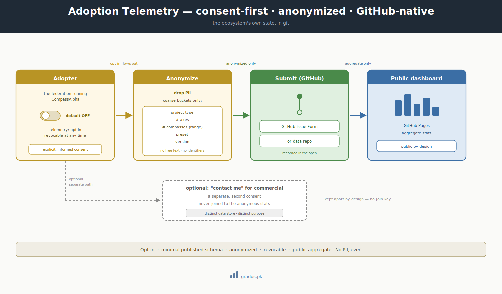

# Roadmap

> The path from v0.1 DRAFT to a stable v1.0.

This page is a plain progress report: where CompassAlpha is today, what's left to do, and how we'll know it's ready for everyday reliance. If you're deciding whether to lean on it now or wait, this is the page that tells you.

CompassAlpha is young. This page describes where it is, what stands between here and a stable release, and how we will know we have arrived. It is deliberately milestone-based rather than date-based — the framework matures when the work is done, not when a calendar says so.

## Where we are now

**v0.1 DRAFT.** The framework has been extracted into a clean, abstract, adopter-independent form and published by gradus under the Business Source License 1.1.

The documentation portal is built through its first two layers:

- **Foundation** — orientation: framework-not-tool framing, the constitution overview, the GitAI category, and the glossary.
- **Axioms** — the invariant constitution.

The full portal is now drafted end to end — Foundation, Axioms, Guardrails, Tunables, Toggles, Getting Started, Adoption Patterns, Reference, and Community. What remains is hardening and review, not authoring.

## The path to v1.0

The work ahead falls into phases. Each builds on the one before it.

### Phase 1 — Complete the doctrine surface *(drafted — now verifying coherence)*

The portal is authored end to end; this phase now tightens cross-references and consistency across:

- **Guardrails** — what the framework prevents.
- **Tunables** — the customization surface.
- **Toggles** — the live switches.
- **Getting started** — onboarding, including brownfield adoption.
- **Adoption patterns** — worked examples and Day-2 operation.
- **Reference** — the manifesto and technical reference.
- **Community** — the section you are reading.

### Phase 2 — Harden through use

The doctrine — the framework's written rules and conventions — only proves itself in contact with reality. This phase is about running the framework, finding the rough edges, and feeding what we learn back into the doctrine through the normal doctrine-cycle discipline (the routine of proposing a change, reviewing it, and locking it in).

### Phase 3 — Re-lock for stability

Close a full doctrine cycle, fold in community review, and lock the axioms and conventions into a form stable enough to promise compatibility against.

## Planned mechanisms

**Adoption telemetry (consent-first).** A way for adopters to **opt in** and share coarse, **anonymized** usage statistics — project type, axis/compass counts, preset, framework version — presented publicly via a GitHub-native data repo and a Pages dashboard. Default-off, revocable, with a minimal published schema and no PII. On-brand with GitAI (the ecosystem's own state, in git). Design is being finalized; not yet built.

## v1.0 stability criteria

We will tag **v1.0** when all three of the following hold:

1. **A full doctrine cycle closes and re-locks** — at least one complete cycle of proposal, review, and lock has run end to end, leaving the doctrine internally consistent and settled.
2. **A community review pass** — contributors outside the original authorship have reviewed the doctrine and their feedback has been resolved.
3. **Real adoption** — at least **one greenfield** project (built on CompassAlpha from the start) and **one brownfield** project (an existing system adopting it) are running on the framework.

Until those are met, expect breaking changes between v0.x releases.

## Remember this

- **v0.1 means "drafted, not yet locked."** The portal is written end to end, but the rules can still change between v0.x releases — so try it, shape it, but don't depend on stability yet.
- **v1.0 is milestone-based, not date-based.** It ships when three things hold: a full doctrine cycle closes, outside contributors review it, and at least one greenfield and one brownfield project run on it.
- New to the framework? Start with [the mental model](../00-foundation/mental-model.md) before tracking where it's headed here.

## A licensing note in context

Each released version of CompassAlpha carries a Change Date — for v0.1 that date is **2030-06-09**, after which that version converts to Apache 2.0. This is a property of the license, not a roadmap milestone; the roadmap above is about reaching a stable, well-adopted v1.0 well before then.

---

*Want to help move this forward? See [Contributing](contributing.md). Track shipped work in the [Changelog](changelog.md).*
