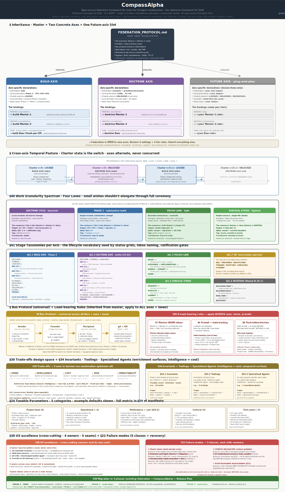

# CompassAlpha

> *"A framework, not a tool. State of the federation = state of git."*

CompassAlpha is a source-available framework for orchestrating multi-tier AI-agent federations on substantial codebases and doctrine work. It is the reference framework for **GitAI** — a category that applies GitOps' coordination patterns to multi-agent AI operations.

> **Say the vision; get a coherent codebase grown from it** — state a component's 60K ideology in plain words, and the federation elaborates it down through 30K mechanics → 10K schema → code, every layer coherent with the doctrine above. [How it works →](00-foundation/codebase-coherence.md)

<small>*The whole framework on one page — inheritance · the two axes + future-axis slot · work-granularity lanes · stage taxonomies · the bus protocol · load-bearing rules · trade-offs · tunables. Click to open full size.*</small>

This portal is the framework's **constitution** + adoption guide. The framework itself is the protocols, conventions, and load-bearing rules documented here. The patterns were proven by a production multi-agent federation that drove every refinement in this document.

---

## Where to start

=== "First time here?"

    Read the Foundation pages in order (~20 minutes):

    1. [**Framework, not tool**](00-foundation/framework-not-tool.md) — what CompassAlpha is, what it's not
    2. [**Origin — why GitAI**](00-foundation/origin-story.md) — the failures that forced the framework
    3. [**The Constitution**](00-foundation/constitution.md) — the 7 invariant axioms + the doctrine model
    4. [**Codebase coherence**](00-foundation/codebase-coherence.md) — the core point of distinction
    5. [**GitAI category**](00-foundation/gitai-category.md) — where CompassAlpha fits
    6. [**Glossary**](00-foundation/glossary.md) — the canonical vocabulary

=== "Evaluating adoption?"

    Jump to **Getting Started**:

    - [**Prerequisites**](05-getting-started/prerequisites.md) — what you need before adopting
    - [**Greenfield setup**](05-getting-started/greenfield-setup.md) — fresh project path
    - [**Brownfield onboarding**](05-getting-started/brownfield-onboarding.md) — pre-AI era project path
    - [**Cutover from a pre-AI project**](05-getting-started/cutover-from-pre-AI-project.md) — step-by-step

=== "Implementing now?"

    Go to **Adoption Patterns** for worked examples:

    - [**Sample doctrine cycle**](06-adoption-patterns/sample-doctrine-cycle.md)
    - [**Sample Phase 3 dispatch**](06-adoption-patterns/sample-phase3.md)
    - [**Sample Day-2 cycles**](06-adoption-patterns/sample-day2-qa.md) (QA · Ops · Compliance)

=== "Looking for reference?"

    The [**Reference**](07-reference/) section has the full manifesto, all templates, and technical specs.

---

## The four-layer mental model

CompassAlpha is structured in four conceptual layers, from most-rigid to most-flexible:

-   :material-shield-check: **AXIOMS** (invariant)

    ---

    7 inviolable rules. Cannot be tuned away. Read once, internalize forever.

    [→ Axioms](01-axioms/)

-   :material-wall: **GUARDRAILS** (protective)

    ---

    What the framework prevents. Failure modes documented with recovery.

    [→ Guardrails](02-guardrails/)

-   :material-tune: **TUNABLES** (configurable)

    ---

    The customization surface. The 5-axis trade-off space. Operating presets.

    [→ Tunables](03-tunables/)

-   :material-toggle-switch: **TOGGLES** (live switches)

    ---

    When each parameter can flip — runtime, cycle-boundary, project-lifecycle.

    [→ Toggles](04-toggles/)

Everything in **Axioms** and **Guardrails** is `[INVARIANT]`. Everything in **Tunables** and **Toggles** is `[TUNABLE]`. This is the constitutional separation.

---

## The five design pillars

!!! abstract "What CompassAlpha believes"

    1. **Protocol-first, tool-agnostic.** The framework specifies how tiers behave; it does not mandate Claude Code, GPT, Cursor, or any specific harness.
    2. **Tiered with mentor/orchestrator/doer hierarchy** to minimize context pollution. Mentors orchestrate; only the doer touches substrate.
    3. **Git as the durability and audit layer.** No specialized databases. State persistence = `git commit + push` to a dedicated state-of-record remote.
    4. **Human-in-the-loop relay**, NOT autonomous agents. The founder is a load-bearing relay (one-liner pings) and lost-and-found backstop — not a per-decision arbiter.
    5. **Doctrine evolution as a first-class concern.** Build cycles AND doctrine cycles, in alternating epochs.

---

## What CompassAlpha defends against

!!! warning "The four pathologies of multi-agent AI work"

    1. **Context pollution** — Agents accumulate detail they shouldn't retain
    2. **Hallucination drift** — Institutional memory diverges from substrate
    3. **Role confusion** — Mentors do labour; doers make decisions
    4. **Trust erosion** — Claims diverge from what's actually on disk

Every axiom and guardrail in the framework exists to prevent one or more of these.

---

## Where the framework came from

CompassAlpha is the abstraction of patterns that emerged from running a real multi-agent AI federation on a substantial production codebase. That federation evolved through multiple doctrine cycles, hitting each of the four pathologies above and engineering solutions cycle by cycle.

The framework is published source-available, structured to be parametric: project-specific values are marked `[TUNABLE]` throughout, with worked examples in the [manifesto](07-reference/manifesto-full.md).

[See worked examples →](06-adoption-patterns/)

---

## Quick reference

| Need to | Go to |
|---|---|
| Understand the framework | [Foundation](00-foundation/) |
| See what's invariant | [Axioms](01-axioms/) |
| See what's protected against | [Guardrails](02-guardrails/) |
| Tune for my project | [Tunables](03-tunables/) |
| Flip switches at runtime | [Toggles](04-toggles/) |
| Start adopting | [Getting Started](05-getting-started/) |
| See worked examples | [Adoption Patterns](06-adoption-patterns/) |
| Look up technical details | [Reference](07-reference/) |
| Contribute or governance | [Community](08-community/) |

---

> **CompassAlpha is a framework, not a tool.** The framework's value lies in its constitution, not in any executable. You bring your own AI agents (Claude Code is the reference); you bring your own git; you bring your own host. The framework guards how they collaborate.
